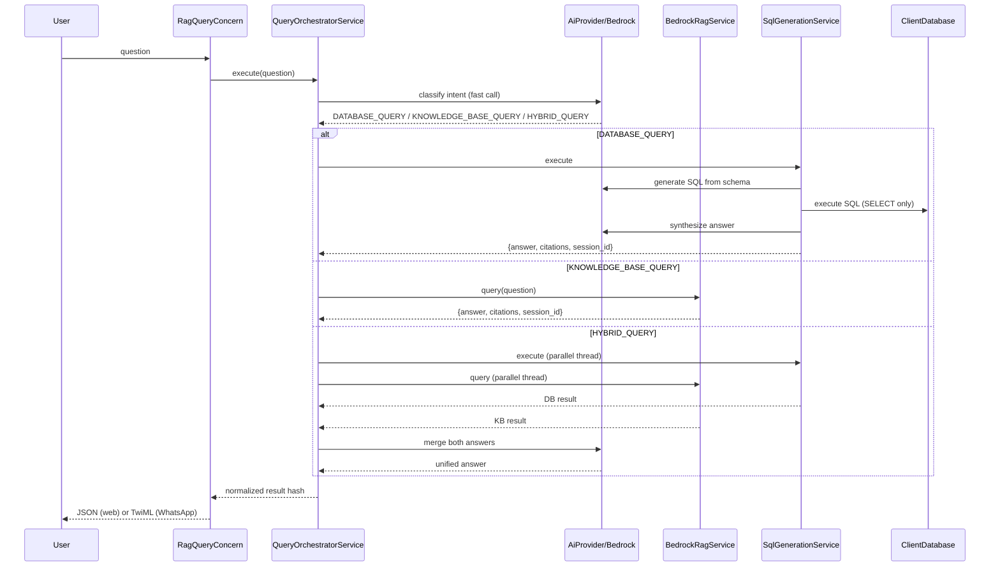

# Danebo RAG

Platform that enables interaction and communication through RAG (Retrieval-Augmented Generation) across different communication channels, facilitating contextualized access to information based on a knowledge base.

## Features

- **User authentication** with Devise
- **Document processing**
- **AI document analysis – RAG** — AWS Bedrock, Knowledge Base, LLMs, embeddings, and prompt templates
- **Hotwire** for DOM updates (Turbo and Stimulus)
- **RAG chat with Knowledge Base integration** — LLMs, embeddings, prompt templates, and custom model configuration, optimized for inference and better results
- **Hybrid Query Orchestrator (RAG + Text-to-SQL)** — intelligent intent classification routes queries to the Knowledge Base, the client's business database, or both in parallel. Supports three modes: `DATABASE_QUERY`, `KNOWLEDGE_BASE_QUERY`, and `HYBRID_QUERY`
- **WhatsApp integration** via Twilio webhook — all query modes available through WhatsApp

## Setup

### Prerequisites

- Ruby (see `.ruby-version`)
- Rails 8.1.2
- SQLite3
- PostgreSQL (for client business database / Text-to-SQL)

### First-time installation

```bash
# 1. Clone the repo
git clone git@github.com:danebo-labs/smart_deal.git && cd smart_deal

# 2. Get the master key from a team member, then:
echo 'THE_MASTER_KEY' > config/master.key

# 3. Run setup (installs deps, creates .env, prepares DB)
bin/setup --skip-server

# 4. Open .env and fill in your AWS keys and other secrets
#    (see .env.sample comments for guidance)

# 5. Start the server
bin/dev
```

Open http://localhost:3000 in your browser.

### Secrets management

ENV vars (`.env`) take priority in development. Rails encrypted credentials are the fallback (used in production where `.env` doesn't exist).

| File | Purpose |
|------|---------|
| `.env` | Your local secrets — loaded automatically, never committed |
| `.env.sample` | Template with all available variables and defaults |
| `config/credentials.yml.enc` | Encrypted secrets for production |
| `config/credentials.example.yml` | Template showing the credentials structure |

To edit encrypted credentials:

```bash
EDITOR="cursor --wait" bin/rails credentials:edit
```

> **Note:** `.env` and `config/master.key` are in `.gitignore`. Never commit them.

For detailed Bedrock configuration, see [BEDROCK_SETUP.md](BEDROCK_SETUP.md).

## Usage

1. Sign up or sign in.
2. Upload a PDF document; the AI will analyze it and generate a summary.
3. Use the RAG chat to ask questions about documents indexed in the Knowledge Base.

## WhatsApp Integration (Twilio + Ngrok)

This section describes how to enable and test the integration between the Rails application and WhatsApp using Twilio (WhatsApp Sandbox) and Ngrok from a local environment.

### Overview

The application is integrated with WhatsApp via Twilio. Incoming WhatsApp messages are received by a webhook and trigger the app's RAG (Retrieval-Augmented Generation) flow, so users can query the knowledge base and get contextual answers through WhatsApp.

### Prerequisites

- Ruby on Rails application running locally
- Twilio account with access to the WhatsApp Sandbox
- Ngrok installed
- Rails server listening on port 3000

### Steps to Enable the Integration Locally

1. **Start the Rails application**

   Start the Rails server so it listens on `http://localhost:3000`:

   ```bash
   bin/dev
   ```

   Ensure the app is reachable at `http://localhost:3000` before continuing.

2. **Expose the application with Ngrok**

   In a new terminal tab, run Ngrok to expose your local server:

   ```bash
   ngrok http 3000
   ```

   Ngrok will display a public URL (e.g. `https://xxxxx.ngrok-free.dev`). This URL may change each time you start Ngrok.

3. **Configure the WhatsApp webhook in Twilio**

   - Open the Twilio Console: [https://console.twilio.com/us1/develop/sms/try-it-out/whatsapp-learn](https://console.twilio.com/us1/develop/sms/try-it-out/whatsapp-learn)
   - Go to **Develop → Messaging → Send a WhatsApp message**
   - In the **"When a message comes in"** section:
     - Paste your Ngrok public URL
     - Set the HTTP method to **POST**
     - Append the Rails webhook path so the full URL points to your app (e.g. `https://xxxxx.ngrok-free.dev/twilio/webhook`)

   Example of a complete webhook URL:

   ```
   https://xxxxx.ngrok-free.dev/twilio/webhook
   ```

   Replace `xxxxx` with your actual Ngrok subdomain.

4. **Add participants to the WhatsApp Sandbox**

   To allow users to interact with the app via WhatsApp:

   - Send a WhatsApp message to **+1 415 523 8886**
   - Send the exact text: `join having-week`

   After that, those users can send messages to the sandbox number and receive RAG responses from the application.

### Important Notes

- **Webhook URL updates:** Every time you restart Ngrok, the public URL changes. You must update the "When a message comes in" URL in the Twilio Console with the new Ngrok URL.
- **Development use:** This setup is intended for local development and testing. For production, use a stable public URL and follow Twilio's production WhatsApp requirements.
- **RAG flow:** Incoming WhatsApp messages hit the `/twilio/webhook` endpoint and trigger the application's RAG flow, which queries the knowledge base and replies via WhatsApp.

## Development

Run `bin/setup` to install dependencies, Git hooks, create `.env`, and prepare the database. The pre-commit hook runs RuboCop with autocorrect on staged Ruby files; fixes are staged automatically, and the commit is blocked if unfixable offenses remain (use `git commit --no-verify` to skip).

## Architecture

### Hybrid Query Orchestrator

The application uses an "orchestration first" pattern: a fast, cheap LLM call classifies the user's intent before any expensive operation (RAG retrieval, database query) runs. This avoids unnecessary work and routes to the optimal data source.



| Component | File | Responsibility |
|-----------|------|----------------|
| **QueryOrchestratorService** | `app/services/query_orchestrator_service.rb` | Intent classification and routing |
| **SqlGenerationService** | `app/services/sql_generation_service.rb` | Text-to-SQL generation, execution, and answer synthesis |
| **BedrockRagService** | `app/services/bedrock_rag_service.rb` | Knowledge Base retrieval and generation (RAG) |
| **ClientDatabase** | `app/models/client_database.rb` | Isolated DB connection to the client's business database |
| **RagQueryConcern** | `app/controllers/concerns/rag_query_concern.rb` | Shared query logic for all channels (web API, WhatsApp) |

For additional architecture details and design decisions, see [ARCHITECTURE.md](ARCHITECTURE.md).
