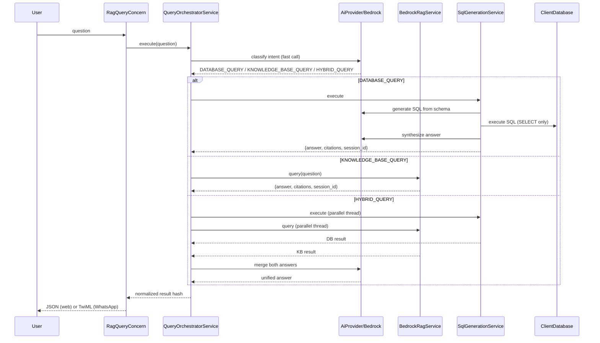

# Danebo RAG

Platform that enables interaction and communication through RAG (Retrieval-Augmented Generation) across different communication channels, facilitating contextualized access to information based on a knowledge base.

## MVP pilot (dry run / *marcha blanca*)

**Stage 0** is a controlled pilot to validate **minimum viable operation (MVO)** with a **single elevator-project knowledge base** and a **small group of field technicians** (WhatsApp and/or web). The goal is not full multi-tenant product behavior yet, but to prove end-to-end flows: uploads, RAG answers, session context, and WhatsApp reliability under real-ish usage.

**Typical MVO setup:** enable [**one shared `conversation_sessions` row**](#mvp-configuration-shared-conversation-session) (`SHARED_SESSION_ENABLED=true`) so the whole squad shares **one thread** of history and `active_entities` while testing one KB. WhatsApp still uses [**R2**](#whatsapp-answer-cache--follow-up-classifier-r2): the **faceted answer cache is per technician phone** (`whatsapp:+…`), not per session, so two phones never share the same in-flight menu or topic card.

For that pilot you can optionally run **one shared conversation session** for everyone: all sandbox WhatsApp numbers and all signed-in web users resolve to the same `conversation_sessions` row (`identifier` + `channel` = shared). That lets the squad **see one continuous thread**—history, active document entities, and procedure state—while they stress-test queries against the same KB. See [MVP configuration: shared conversation session](#mvp-configuration-shared-conversation-session) below.

When shared session is **off**, each WhatsApp number and each web user keeps a **separate** session (per `identifier` + `channel`), which is the default path toward later per-tenant / per-project isolation.

## Features

- **User authentication** with Devise
- **Document processing**
- **AI document analysis – RAG** — AWS Bedrock, Knowledge Base, LLMs, embeddings, and prompt templates
- **Hotwire** for DOM updates (Turbo and Stimulus)
- **RAG chat with Knowledge Base integration** — LLMs, embeddings, prompt templates, and custom model configuration, optimized for inference and better results
- **Hybrid Query Orchestrator (RAG + Text-to-SQL)** — intelligent intent classification routes queries to the Knowledge Base, the client's business database, or both in parallel. Supports three modes: `DATABASE_QUERY`, `KNOWLEDGE_BASE_QUERY`, and `HYBRID_QUERY`
- **WhatsApp integration** via Twilio webhook — all query modes available through WhatsApp

## Setup

### Prerequisites

- Ruby (see `.ruby-version`)
- Rails 8.1.2
- SQLite3
- PostgreSQL (for client business database / Text-to-SQL)
- libvips (for image processing/compression)

### First-time installation

```bash
# 1. Clone the repo
git clone git@github.com:danebo-labs/smart_deal.git && cd smart_deal

# 2. Install libvips for image processing
# macOS:
brew install vips
# Ubuntu/Debian:
# sudo apt-get install libvips-dev

# 3. Get the master key from a team member, then:
echo 'THE_MASTER_KEY' > config/master.key

# 4. Run setup (installs deps, creates .env, prepares DB)
bin/setup --skip-server

# 5. Open .env and fill in your AWS keys and other secrets
#    (see .env.sample comments for guidance)

# 6. Start the server
bin/dev
```

`bin/dev` runs [Foreman](https://github.com/ddollar/foreman) with `Procfile.dev`, which starts:

- **web** — Rails server on port 3000
- **css** — Tailwind CSS watcher (rebuilds styles on change)

Foreman is installed automatically by `bin/dev` if missing.

Open http://localhost:3000 in your browser.

### Secrets management

ENV vars (`.env`) take priority in development. Rails encrypted credentials are the fallback (used in production where `.env` doesn't exist).

| File | Purpose |
|------|---------|
| `.env` | Your local secrets — loaded automatically, never committed |
| `.env.sample` | Template with all available variables and defaults |
| `config/credentials.yml.enc` | Encrypted secrets for production |
| `config/credentials.example.yml` | Template showing the credentials structure |

To edit encrypted credentials:

```bash
EDITOR="cursor --wait" bin/rails credentials:edit
```

> **Note:** `.env` and `config/master.key` are in `.gitignore`. Never commit them.

For detailed Bedrock configuration (models, KB, env vars), see [BEDROCK_SETUP.md](BEDROCK_SETUP.md) and `.env.sample`.

### MVP configuration: shared conversation session

Use these **only for the MVP pilot** when you want a **single shared thread** for all technicians (WhatsApp + web). Values are read at boot from `.env` (see `.env.sample`).

| Variable | Purpose |
|----------|---------|
| `SHARED_SESSION_ENABLED` | Set to `true` to collapse every lookup to one session row. Omit or set to `false` for normal per-number / per-user sessions. |
| `SHARED_SESSION_IDENTIFIER` | Stable DB key for that row (default `mvp-shared`). Change if you need a new shared row without touching data. |
| `SHARED_SESSION_CHANNEL` | Channel value stored on the row (default `shared`). Must stay in sync with app validation (`ConversationSession::CHANNELS`). |
| `SESSION_MAX_ENTITIES` | Optional. Caps **both** the working set (`active_entities`) and how many `technician_documents` rows are **preloaded** into a brand-new session (default **10** in code if unset). |

Example for a pilot box:

```bash
SHARED_SESSION_ENABLED=true
# SHARED_SESSION_IDENTIFIER=mvp-shared
# SHARED_SESSION_CHANNEL=shared
# SESSION_MAX_ENTITIES=10
```

**Web RAG:** When shared mode is on, the web `RAG` controller passes **`user_id: nil`** on that row so the shared session is not “owned” by whichever web user asked last.

On WhatsApp, MVP pilots also benefit from an orthogonal short-term cache ([`Rag::WhatsappAnswerCache`](#whatsapp-answer-cache--follow-up-classifier-r2), per-number, 30-min TTL) that serves follow-up taps (`1`, `riesgos`, `menu`, `nuevo`) without hitting Bedrock again. That cache is **independent** from the shared `conversation_sessions` row: the session keeps durable project memory (`active_entities`, history), while the cache keeps the current faceted answer and menu. See [WhatsApp Answer Cache & Follow-up Classifier (R2)](#whatsapp-answer-cache--follow-up-classifier-r2) for details.

#### MVO pilot: how to enable / disable environment flags

Rails loads `.env` when each process **starts**. After changing any flag, restart the **web** process **and** Solid Queue **workers** (e.g. restart `bin/dev`), or the old `ENV` values remain in memory.

| Variable | Default when unset | Turn **ON** | Turn **OFF** |
|----------|-------------------|-------------|---------------|
| `SHARED_SESSION_ENABLED` | off | `SHARED_SESSION_ENABLED=true` in `.env` | `false` or remove the line |
| `SHARED_SESSION_IDENTIFIER` | `mvp-shared` (only when shared is on) | optional override in `.env` | ignored when shared is off |
| `SHARED_SESSION_CHANNEL` | `shared` (only when shared is on) | optional; must stay in `ConversationSession::CHANNELS` | ignored when shared is off |
| `SESSION_MAX_ENTITIES` | **10** in code | set an integer in `.env` | remove to use default |
| `WA_FACETED_OUTPUT_ENABLED` | **on** | `true` or omit | `false` → `perform_legacy` (no R2 cache / menu) |
| `WA_NANO_CLASSIFIER_ENABLED` | **on** | `true` or omit | `false` → no Haiku nano; ambiguous short follow-ups go to full RAG |
| `WA_PROCESSING_ACK_ENABLED` | **on** | `true` or omit | `false` → no *“Consultando…”* bubble before full RAG |

Use [`.env.sample`](.env.sample) as the checklist; copy lines into `.env` (never commit `.env`).

### Post-MVP session configuration (per-technician isolation)

When moving past the single-thread pilot:

1. Set `SHARED_SESSION_ENABLED=false` or **remove** it from `.env` (default is off).
2. Leave `SHARED_SESSION_IDENTIFIER` / `SHARED_SESSION_CHANNEL` unset unless you have a special reason; they are ignored when shared mode is off.
3. Tune `SESSION_MAX_ENTITIES` if you want a smaller or larger session working set and preload fan-out (still bounded by model / prompt limits).

Each WhatsApp sender and each web user identity again gets **their own** `conversation_sessions` row (same as pre–shared-session behavior).

### Automated tests and `SharedSession`

In **`Rails.env.test?`**, `SharedSession::ENABLED` is **forced to `false` at load time**, even if your local `.env` sets `SHARED_SESSION_ENABLED=true` (dotenv-rails loads `.env` in test). That keeps the suite **deterministic**: examples assume **isolated** sessions unless they explicitly opt into shared behavior.

Specs that need shared mode **temporarily flip** the constant inside the example (e.g. `stub_shared_enabled(true)` in `conversation_session`, `rag_controller`, and `twilio_controller` tests). Do not rely on ENV alone in test for global shared mode.

### Bedrock IAM (quick reference)

1. Copy policy from `docs/bedrock-iam-policy.json`
2. AWS Console → IAM → Roles → `BedrockKnowledgeBaseRole-chat-bot`
3. Add permissions → Create inline policy → Paste JSON
4. Name: `BedrockModelInvokePermissions`
5. Save

See `docs/AWS_IAM_PERMISSIONS.md` for full instructions.

### Image compression

Images uploaded via the UI are automatically compressed before sending to Bedrock to meet the 10MB limit for Custom Data Sources:
- Resizes to max 1024x1024 pixels
- Converts to JPEG (80% quality)
- Skips compression for images < 500KB
- Validates final size doesn't exceed limits

See `docs/IMAGE_COMPRESSION.md` for technical details.

### Multi-tenant architecture (roadmap)

The current architecture uses environment variables for configuration. The tenancy model will evolve in stages:

```
Stage 0 — MVP (current)
  Global shared document pool. All documents uploaded (via WhatsApp or web)
  are visible to all sessions. technician_documents scoped globally (account_id = nil).
  Optional: SHARED_SESSION_ENABLED — one conversation_sessions row for every channel
  identity (pilot / marcha blanca). Default off: one session per WhatsApp number / web user.

Stage 1 — Multi-tenant
  Account (tenant) isolation. Each account has its own KB config, document pool,
  and Bedrock settings. technician_documents scoped by account_id.
  Configuration moves to database (bedrock_configs table).
  Per-tenant cost tracking and quotas.

Stage 2 — Multi-project
  A Project belongs to an Account and groups users across channels.
  Documents are scoped by project_id. A WhatsApp user and a web user
  in the same project share the same document pool.
  technician_documents scoped by [account_id, project_id].
```

`identifier` and `channel` remain on `conversation_sessions` for Twilio/web routing,
but they do **not** drive document deduplication — that is handled at the pool scope level.

See `docs/MULTI_TENANT_ARCHITECTURE.md` for design details.

### WhatsApp integration (Twilio + Ngrok)

This section describes how to enable and test WhatsApp locally using Twilio (WhatsApp Sandbox) and Ngrok.

#### Overview

The application is integrated with WhatsApp via Twilio. Incoming WhatsApp messages are received by a webhook and trigger the app's RAG (Retrieval-Augmented Generation) flow, so users can query the knowledge base and get contextual answers through WhatsApp.

#### Prerequisites

- Ruby on Rails application running locally
- Twilio account with access to the WhatsApp Sandbox
- Ngrok installed
- Rails server listening on port 3000

#### Steps to enable the integration locally

1. **Start the Rails application**

   Start the Rails server so it listens on `http://localhost:3000`:

   ```bash
   bin/dev
   ```

   Ensure the app is reachable at `http://localhost:3000` before continuing.

2. **Expose the application with Ngrok**

   In a new terminal tab, run Ngrok to expose your local server:

   ```bash
   ngrok http 3000
   ```

   Ngrok will display a public URL (e.g. `https://xxxxx.ngrok-free.dev`). This URL may change each time you start Ngrok.

3. **Configure the WhatsApp webhook in Twilio**

   - Open the Twilio Console: [https://console.twilio.com/us1/develop/sms/try-it-out/whatsapp-learn](https://console.twilio.com/us1/develop/sms/try-it-out/whatsapp-learn)
   - Go to **Develop → Messaging → Send a WhatsApp message**
   - In the **"When a message comes in"** section:
     - Paste your Ngrok public URL
     - Set the HTTP method to **POST**
     - Append the Rails webhook path so the full URL points to your app (e.g. `https://xxxxx.ngrok-free.dev/twilio/webhook`)

   Example of a complete webhook URL:

   ```
   https://xxxxx.ngrok-free.dev/twilio/webhook
   ```

   Replace `xxxxx` with your actual Ngrok subdomain.

4. **Add participants to the WhatsApp Sandbox**

   To allow users to interact with the app via WhatsApp:

   - Send a WhatsApp message to **+1 415 523 8886**
   - Send the exact text: `join having-week`

   After that, those users can send messages to the sandbox number and receive RAG responses from the application.

#### Important notes

- **Webhook URL updates:** Every time you restart Ngrok, the public URL changes. You must update the "When a message comes in" URL in the Twilio Console with the new Ngrok URL.
- **Development use:** This setup is intended for local development and testing. For production, use a stable public URL and follow Twilio's production WhatsApp requirements.
- **RAG flow:** Incoming WhatsApp messages hit the `/twilio/webhook` endpoint and trigger the application's RAG flow, which queries the knowledge base and replies via WhatsApp.

## Usage

1. Sign up or sign in.
2. Upload a PDF document; the AI will analyze it and generate a summary.
3. Use the RAG chat to ask questions about documents indexed in the Knowledge Base.

## Development

Run `bin/setup` to install dependencies, Git hooks, create `.env`, and prepare the database. The pre-commit hook runs RuboCop with autocorrect on staged Ruby files; fixes are staged automatically, and the commit is blocked if unfixable offenses remain (use `git commit --no-verify` to skip).

## Architecture

### Hybrid Query Orchestrator

The application uses an "orchestration first" pattern: a fast, cheap LLM call classifies the user's intent before any expensive operation (RAG retrieval, database query) runs. This avoids unnecessary work and routes to the optimal data source.


```mermaid
sequenceDiagram
    participant User
    participant Concern as RagQueryConcern
    participant Orchestrator as QueryOrchestratorService
    participant LLM as AiProvider/Bedrock
    participant RAG as BedrockRagService
    participant SQL as SqlGenerationService
    participant DB as ClientDatabase

    User->>Concern: question
    Concern->>Orchestrator: execute(question)
    Orchestrator->>LLM: classify intent (fast call)
    LLM-->>Orchestrator: DATABASE_QUERY / KNOWLEDGE_BASE_QUERY / HYBRID_QUERY

    alt DATABASE_QUERY
        Orchestrator->>SQL: execute
        SQL->>LLM: generate SQL from schema
        SQL->>DB: execute SQL (SELECT only)
        SQL->>LLM: synthesize answer
        SQL-->>Orchestrator: {answer, citations, session_id}
    else KNOWLEDGE_BASE_QUERY
        Orchestrator->>RAG: query(question)
        RAG-->>Orchestrator: {answer, citations, session_id}
    else HYBRID_QUERY
        Orchestrator->>SQL: execute (parallel thread)
        Orchestrator->>RAG: query (parallel thread)
        SQL-->>Orchestrator: DB result
        RAG-->>Orchestrator: KB result
        Orchestrator->>LLM: merge both answers
        LLM-->>Orchestrator: unified answer
    end

    Orchestrator-->>Concern: normalized result hash
    Concern-->>User: JSON (web) or TwiML (WhatsApp)
```

| Component | File | Responsibility |
|-----------|------|----------------|
| **QueryOrchestratorService** | `app/services/query_orchestrator_service.rb` | Intent classification and routing |
| **SqlGenerationService** | `app/services/sql_generation_service.rb` | Text-to-SQL generation, execution, and answer synthesis |
| **BedrockRagService** | `app/services/bedrock_rag_service.rb` | Knowledge Base retrieval and generation (RAG) |
| **ClientDatabase** | `app/models/client_database.rb` | Isolated DB connection to the client's business database |
| **RagQueryConcern** | `app/controllers/concerns/rag_query_concern.rb` | Shared query logic for all channels (web API, WhatsApp) |

For additional architecture details and design decisions, see [ARCHITECTURE.md](ARCHITECTURE.md).

### Session-Scoped KB Retrieval & Document Memory Architecture

Three interdependent storage layers track document context at different time horizons:

```
kb_documents         → "What exists in S3?"                       (global catalog, 1 row per file, admin dashboard)
technician_documents → "What has this technician used?"           (durable per-technician memory, survives sessions)
active_entities      → "What is the technician working on now?"   (session working set, 30-min TTL)
```

**`kb_documents`** — Global S3 catalog. One row per uploaded S3 key. Created on upload; enriched with `display_name`, `aliases`, and `size_bytes` as the pipeline processes the file. Powers the admin dashboard at `/dashboard`. Not scoped to any technician or session.

**`technician_documents`** — Durable document memory. Written in two stages: immediately after Bedrock ingestion completes (`BedrockIngestionJob` via `ChunkAliasExtractor`), and again after the first RAG response with enriched Haiku-derived aliases (`EntityExtractorService`). Tracks `interaction_count` for future relevance ranking. This is the source of truth that outlives sessions.

> **MVP scope:** The pool is global (`account_id = nil`). Deduplication is by `canonical_name` (or `source_uri`) across all uploaders — a document uploaded via WhatsApp and later via web is stored once. `identifier` and `channel` are preserved for audit but do not drive uniqueness.
> **Stage 1+:** `account_id` will be added; uniqueness becomes `[account_id, canonical_name]`. Stage 2 adds `project_id`.

**`conversation_sessions.active_entities`** — Session-scoped working set (JSONB, **max `ConversationSession::MAX_ENTITIES`** — default **10**, overridable with `SESSION_MAX_ENTITIES`; 30‑minute TTL). Drives session-scoped KB retrieval filters so follow-up queries can narrow to documents already active in the conversation.

**Bootstrap preload (“session memory”):** When `find_or_create_for` **creates a new** session row (first-ever contact for that `identifier`+`channel`, or the previous row had **expired**), it calls `preload_recent_entities`. That loads up to **`MAX_ENTITIES`** rows from **`technician_documents`** (globally **most recently used**, `TechnicianDocument.recent`) into `active_entities`, with metadata such as `source: technician_memory` and `extraction_method: preloaded_from_history`. It is **not** run on every inbound message—only on that fresh row—so it acts as a **short-lived working copy** seeded from the **durable** technician document pool (the same cache/source idea as below). RAG and ingestion keep enriching both layers on subsequent turns.

The relationship is a **cache/source pattern**: `technician_documents` is the durable source; `active_entities` is the ephemeral working copy rebuilt from it on each new session. There is no `expired_at` on `technician_documents` because eviction is by space (FIFO max 20), not by time — a manual may be relevant weeks later when a technician returns to the same building.

#### Data flow: WhatsApp image upload → context

```
WhatsApp upload
  └─ S3 put_object
       └─ kb_documents.ensure_for_s3_key!  (display_name, size_bytes — immediate)
  └─ BedrockIngestionJob (polls until COMPLETE)
       ├─ kb_documents          ← enrich display_name + aliases (ChunkAliasExtractor)
       ├─ technician_documents  ← upsert_from_entity (immediate insert, no RAG query required)
       ├─ active_entities       ← add_entity_with_aliases
       └─ WhatsApp notify       ← canonical name sent back to technician

Technician asks follow-up question
  └─ retrieve_and_generate (session-scoped URI filter)
       └─ EntityExtractorService (doc_refs path)
            ├─ active_entities       ← promote/add entity
            ├─ technician_documents  ← upsert_from_entity (richer Haiku aliases)
            └─ kb_documents          ← merge aliases (up to 15)
```

#### Session-scoped retrieval filter logic

Before each `retrieve_and_generate` call, the system evaluates three conditions in order:

1. No active entities in session → search full KB (no filter).
2. Query ≤ 60 chars → apply URI filter. Short queries are unambiguous follow-ups.
3. Long query contains capitalized words not matching any session document → assume new document, search full KB.
4. Otherwise → apply URI filter.

If the filter returns no results (Bedrock guardrail), the system retries automatically against the full KB.

| Layer | Scope (MVP) | Scope (Stage 1+) | Eviction | Written by |
|---|---|---|---|---|
| `kb_documents` | Global | Global per account | Never | Upload + ingestion + RAG |
| `technician_documents` | Global pool (`account_id = nil`) | Per `[account_id, project_id]` | FIFO max 20 | Ingestion + RAG (EntityExtractor) |
| `active_entities` | Per session (or one shared session in MVP pilot mode) | Per session | 30-min TTL, max `MAX_ENTITIES` (default 10) | Ingestion + RAG; **on new session only**, seeded via `preload_recent_entities` from `technician_documents` |

### WhatsApp Answer Cache & Follow-up Classifier (R2)

A short-lived **conversational UI cache** sits on top of the three storage layers above. Its job is to make WhatsApp replies feel lightweight: the first answer is compact with a numbered menu, and follow-ups (`1`, `riesgos`, `y el voltaje?`, `menu`, `nuevo`, etc.) **expand from cache without re-invoking Bedrock RAG** when the message is still about the same topic. It **does not replace** `ConversationSession`; both coexist.

```
ConversationSession  →  project / entity memory, history, URI-scoped retrieval
Rag::WhatsappAnswerCache  →  last RAG “card” (facets + menu) for menu UX, per recipient
```

| Layer | Time horizon | Scope | Backing store |
|---|---|---|---|
| `conversation_sessions` | Session (30 min, sliding) | `identifier` + `channel` (one shared row in MVP pilot) | PostgreSQL `conversation_sessions` |
| `Rag::WhatsappAnswerCache` | Turn-set | **Per WhatsApp `to` number** (not shared across technicians) | `Rails.cache` (Solid Cache) key `rag_wa_faceted/v3/<whatsapp_to>` — TTL **1800s** (30 min). Bumped v2 → v3 when `document_label` was added to the schema; stale v2 payloads are invalidated as `op=corrupt`. |
| Sticky thread locale | Longer follow-up | Same `to` | `rag_whatsapp_conv/v1/<whatsapp_to>` (written by `RagQueryConcern`; TTL **7 days**) so very short follow-ups can inherit language after the 30 min faceted TTL expires. |

**Why per-number cache even in shared-session MVP?** The pilot may use one `ConversationSession` row for everyone, but two technicians on different phones must not share the same in-progress menu/answer: collision would mix topics and is unsafe. Isolation is by `whatsapp:+…` (cache key), not by shared session.

#### Cache value schema (`Rag::WhatsappAnswerCache`)

`WhatsappAnswerCache` validates a fixed set of keys (`SCHEMA_KEYS` in `app/services/rag/whatsapp_answer_cache.rb`). A typical payload:

```ruby
{
  question:         String,              # last user question that produced this card
  question_hash:    String,              # SHA1 prefix for nano / debug
  faceted: {                             # from Rag::FacetedAnswer#to_cache_hash + :entities
    intent:  Symbol,                    # e.g. :identification, :troubleshooting, :emergency
    facets:  { resumen:, riesgos:, parametros:, secciones:, detalle: },
    menu:    Array,                      # [{ n:, facet_key:, label: }, …]
    raw:     String,
    entities: [String, ...]            # display names of docs tied to this answer
  },
  citations:         Array,             # result citations
  doc_refs:          Array,            # result doc_refs
  locale:            Symbol,            # :es | :en
  entity_signature:  String,         # 12 hex chars: SHA1 of sorted active_entities keys; drift can invalidate
  generated_at:      Integer,          # unix time (age_s in logs = now - generated_at)
  document_label:    String            # short doc name (from active_entities or doc_refs); rendered in facet headers
}
```

- **EMERGENCY** intent is **never written** to cache (`[WA_CACHE] op=skip_write reason=emergency`); safety answers are always full RAG.
- **Corrupt / schema drift (missing keys)** on read: entry deleted, `nil` returned, log line `[WA_CACHE] op=corrupt …`.
- **Entity drift** (cached signature ≠ live `active_entities`): `invalidate` + miss — **skipped** when `SharedSession::ENABLED` (see `SharedSession` in code), because shared pilots mutate the same entity set for unrelated reasons.

#### Components

| Component | File | Role |
|---|---|---|
| `Rag::FacetedAnswer` | `app/services/rag/faceted_answer.rb` | Parses labeled Bedrock output (`[INTENT]`, `[RESUMEN]`, `[RIESGOS]`, …) and renders first message + per-facet bodies. |
| `Rag::WhatsappAnswerCache` | `app/services/rag/whatsapp_answer_cache.rb` | Read/write/invalidation + logs: `op=read|write|corrupt|skip_write` and `op=invalidate` when **entity_drift** is detected (non–shared mode). |
| `Rag::WhatsappFollowupClassifier` | `app/services/rag/whatsapp_followup_classifier.rb` | Cascade: reset → menu redraw → no cache / menu w/o cache → new entity / strong shift → deterministic menu → `mas` → synonym map → long message → optional Haiku nano. Emits `[WA_CLASSIFIER] route=… reason=…`. |
| `Rag::WhatsappPostResetState` | `app/services/rag/whatsapp_post_reset_state.rb` | Short-lived (5 min) Rails.cache state after `:reset_ack`: `picking_source` → `picking_from_list` until the user picks a doc or abandons with free text / `0` / home tokens. |
| `Rag::WhatsappDocumentPicker` | `app/services/rag/whatsapp_document_picker.rb` | Builds numbered lists for **recent** (`TechnicianDocument.recent`) vs **all** (`KbDocument`) and seeds `Describe <name>` into the normal `:new_query` RAG path. |
| `SendWhatsappReplyJob` | `app/jobs/send_whatsapp_reply_job.rb` | `perform_faceted` / `perform_legacy`; post-reset picker short-circuits before the classifier when `WhatsappPostResetState` is present. Orchestrates cache, classifier, RAG, `infer_locale` (cache → sticky conv key → history heuristic → body → `I18n.default_locale`). |
| `ProcessWhatsappMediaJob` | `app/jobs/process_whatsapp_media_job.rb` | After a successful `KbSyncService` upload: `invalidate(whatsapp_to)` and `[WA_CACHE] op=invalidate reason=media_upload` so the next user question runs RAG over the updated KB. |

#### Classifier cascade (order in code; first match wins)

1. **`:user_reset`** — `nuevo`, `nueva`, `new`, `reset`, `inicio`, `start`, `home`, numeric **`6`** (same row as *inicio* in the rendered menu) → invalidate cache, ack with **1=recientes / 2=existentes** sub-menu, arm `WhatsappPostResetState`, **no** RAG.
2. **`:show_menu` / `menu_redraw`** — `menu`, `volver`, `regresar`, `resumen`, `ficha`, `overview`, `summary`, numeric **`5`** when cache is present (same row as *regresar*).
3. **Empty cache + menu-shaped input** — e.g. `1`–`4` or `riesgos`… → `:no_context_help` (`reason=:menu_without_cache`); not a token → see next.
4. **Empty cache, any input** — `:new_query` (`reason=:no_cache`) — RAG.
5. **`:new_entity_detected`** — `KbDocumentResolver` matches a document not listed in the cached `faceted[:entities]`.
6. **`:strong_intent_shift`** — `STRONG_INTENT_PHRASES` in classifier while cached `intent` is not already `emergency` → RAG, no nano.
7. **`:deterministic_token`** — `MENU_TOKEN_RE` after `normalize` maps a digit or `riesgos`/`parametros`/… to a **non-empty** cached facet.
8. **`mas`** — repeat last facet inferred from the last assistant line in `conversation_session` history (`:deterministic_mas_last_facet`).
9. **`:synonym_match`** — e.g. `voltaje` → `parametros` when that facet has content (skipped if the facet is empty or `(—)`). Populates `Decision#matched_token` so the renderer can hoist the matching line (e.g. "Voltaje de operación: …") above the rest of the facet, or emit an explicit *"No hay X documentado en este archivo"* notice if the term is absent.
10. **`:message_too_long`** — `> 120` chars → `:new_query`.
11. **Haiku nano** (`ENV["WA_NANO_CLASSIFIER_ENABLED"]` default `true`) — `facet_hit` vs `new_query` with JSON + threshold; reasons e.g. `nano_decision`, `nano_new_query`, `nano_low_confidence_fallback`, or parse error → fall through.
12. **Default** — `:new_query` (`reason` may be `:nano_disabled_fallback`).

If the model omits faceted labels (`FacetedAnswer#legacy?`), the job does not populate the Whatsapp answer cache; behavior matches pre-R2 formatting.

#### Observability & scripts

- **`bin/wa_dev_sim "<mensaje>"`** — one-off POST to `/twilio/webhook` (needs Rails + Solid Queue worker); logs a marker in `development.log`.
- **`bin/wa_e2e_monitor`** — highlights `[WA_CLASSIFIER]`, `[WA_CACHE]`, `[WA_FACET_DELIVERY]`, and Bedrock lines in `log/development.log`.
- **`bin/wa_e2e_run`** — E2E markers per case (`E2E_CASE_12`, …) for grepping a single run.
- **`bin/wa_metrics_daily`** — rollups of cache ops and classifiers (see script).
- **`bin/wa_dev_clear <whatsapp:+…>`** — deletes `rag_wa_faceted/v3/...`, `rag_wa_post_reset/v1/...`, and `rag_whatsapp_conv/v1/...` for a number. When shared session is on, it does **not** destroy the `mvp-shared` row (prints a one-liner to do that manually if needed).

#### R2-only flags (detail)

The same three WhatsApp R2 flags appear in the [MVO pilot flags](#mvo-pilot-how-to-enable--disable-environment-flags) table above. Summary:

| Variable | Default | Effect |
|---|---|---|
| `WA_FACETED_OUTPUT_ENABLED` | `true` | `false` → `SendWhatsappReplyJob` uses `perform_legacy` (pre-R2 single message, no read-through cache). |
| `WA_NANO_CLASSIFIER_ENABLED` | `true` | `false` → after heuristics, short ambiguous messages go straight to `new_query` (no tiny Haiku call). |
| `WA_PROCESSING_ACK_ENABLED` | `true` | `false` → suppresses the *"🛠 Consultando la base de conocimiento…"* bubble. Ack is sent before **every** full RAG call: faceted `:new_query` **and** `perform_legacy` (rollback path). Cache hits, menu redraws, resets, post-reset picker, and facet follow-ups stay silent. Log line: `[WA_ACK] to=<to> reason=new_query_before_rag`. |

Typical follow-up from cache: **0** Bedrock RAG and **0**–**1** nano call when enabled; `new_query` path runs full `retrieve_and_generate` (7–60s in dev depending on cold KB / network), preceded by the processing ack bubble when the flag is on.

#### Facet rendering (R2 UX)

- **Vertical text-only menu** — first message and facet footers render facet options one per line (`N - <label>`). Emojis from the model’s `[MENU]` labels are stripped in the WhatsApp render (labels come from `rag.wa_menu.default_labels` / parsed text). After a blank line, two **navigation** rows are always appended: **`5 - regresar`** / **`back`** and **`6 - inicio`** / **`home`** (`rag.wa_menu.back_label` / `home_label`). **`5`** / **`regresar`** map to `:show_menu` (redraw first message from cache); **`6`** / **`inicio`** map to `:reset_ack`.
- **Document label in headers** — when `document_label` is cached, facet headers compose as `*Riesgos · PCB Mainboard Orona*`. If the combined header would exceed ~55 chars, it falls back to two lines: `*Riesgos*\n(del documento *PCB Mainboard Orona*)`. The first message adds a `*<doc>* (fuente)` banner above the summary so the technician never loses track of what document is being discussed. Label source: first entity in `conv_session.active_entities` (fallback: first `doc_refs[:short_name|title|filename]`), truncated to 40 chars.
- **Reduced emoji load** — safety markers (`⚠️`, `🛑`) and processing ack stay; facet/menu rows avoid decorative emoji so repeated bubbles stay readable on small screens.
- **Semantic hoist** — when a synonym routed the user to a facet (e.g. `"¿y el voltaje?"` → `:parametros`), the renderer looks for a line in the cached facet containing the matched term (accent/case-insensitive) and surfaces it above the rest:

  ```
  🔎 *Voltaje*
  ⚠️ Voltaje de operación: DATO NO DISPONIBLE

  ──────
  ① Tipo: CR2032
  ② …
  ```

  If no matching line exists, the hoist emits an explicit `No hay <término> documentado en este archivo.` notice before the facet so the user doesn't infer a generic parameter dump as the answer. Zero Bedrock tokens.
- **Reset + file picker** — after `inicio` / `nuevo` / `6`, the ack shows **1 — archivos recientes** (`TechnicianDocument`, per-identifier/channel) and **2 — archivos existentes** (`KbDocument`). Choosing **1** or **2** lists up to nine names; the user replies with a digit to seed **`Describe <name>`** into a normal `:new_query` (then state clears). Free-text after reset clears the picker state so normal RAG applies. **`0`** returns to the 1/2 prompt; home-like tokens re-show the reset ack.

For multi-tenant work later, keep treating **session row** and **per-number faceted cache** as separate concerns: a future `account_id` / `project_id` can scope the session and KB, while the WhatsApp cache key should remain tied to the **recipient address** to avoid cross-user menu bleed.
