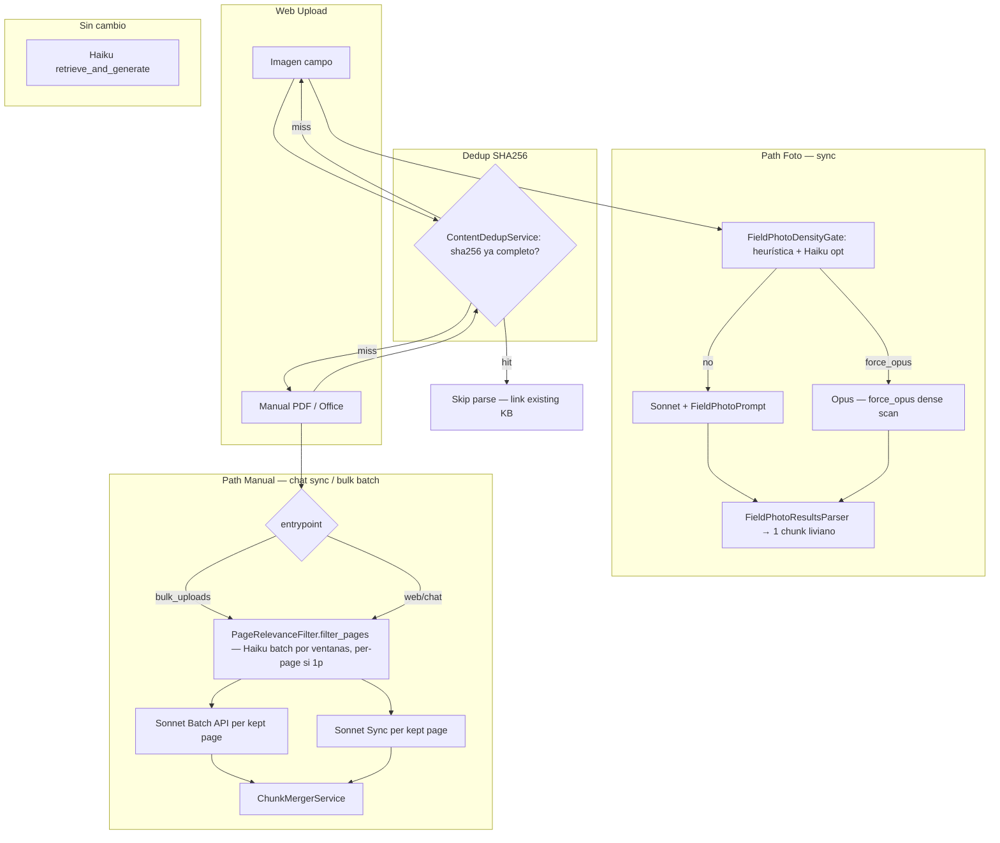

# Ingestion Cost V2 — ADR & Cost Architecture

**Status:** Active production path for web and bulk uploads
**Architecture benchmark:** 2026-05-21
**Cost reconciliation:** 2026-06-18
**Supersedes:** inline routing in `FileMultimodalRouter` (Opus default for images)

> **Current financial source:** [SAAS_COST_MODEL_2026-06-12.md](SAAS_COST_MODEL_2026-06-12.md).
> Recurring variable COGS is ~$9.54 expected / ~$13.27 conservative for 1,000
> queries + 200 photos. A 200-page manual is $5.32 one-time onboarding. This ADR
> documents routing and no longer publishes the superseded May unit estimates.

**Canonical routing reference (file types, page filter, LLM matrix):** [INGESTION_ROUTING.md](INGESTION_ROUTING.md)

---

## 1. Contexto y evidencia

### Benchmark 3-ejes (2026-05-21)

Script: `script/compare_sonnet_vs_opus.rb`  
Dump: `tmp/benchmark_3axes_merged.json`  
Scope: 54 extracciones + 54 judge calls ≈ $5.69

| Eje | Variantes | Hallazgo |
|-----|-----------|---------|
| Modelo | Haiku 4.5, Sonnet 4.6, Opus 4.7 | Δ Sonnet vs Opus = **0.06/20** (empate estadístico) |
| Prompt | monolithic (`SYSTEM_BLOCKS`) vs specialized | +**3.8/20** specialized en foto/diagrama |
| Input | foto campo, diagrama, manual PDF | specialized **empeora** manual (14.7 vs 15.0) |

**Veredictos:**
- Default model: **Sonnet** (quality-equivalent in this benchmark and lower cost)
- Foto: prompt **specialized** (`FieldPhotoPrompt`) → identificación liviana, no S0-S18
- Manual: prompt **monolithic** (`BatchChunkingPrompt::SYSTEM_BLOCKS`) — specialized recortado es peor
- Opus: solo `force_opus` en escaneados densos (heurística `text_layer < 100 && image_ratio > 0.7`)
- Consultas RAG: **sin cambio** (Haiku en `retrieve_and_generate`)

---

## 2. Arquitectura 3 paths (v2 prod)

| Path | Input | Prompt | Modelo | API |
|------|-------|--------|--------|-----|
| Foto | JPEG/PNG campo | `FieldPhotoPrompt::SYSTEM_BLOCKS` | Sonnet 4.6 | Sync direct |
| Manual web/chat corto | PDF dentro del umbral sync + Office | `BatchChunkingPrompt::SYSTEM_BLOCKS` | Sonnet 4.6 (Opus excepción `force_opus`) | Sync direct |
| Manual web/chat largo | PDF sobre `WEB_SYNC_PDF_PAGE_THRESHOLD` | `BatchChunkingPrompt::SYSTEM_BLOCKS` | Sonnet 4.6 (Opus excepción `force_opus`) | Batch async |
| Manual bulk | PDF multipágina + Office en `/bulk_uploads` | `BatchChunkingPrompt::SYSTEM_BLOCKS` | Sonnet 4.6 (Opus excepción `force_opus`) | Batch async |
| Consulta RAG | Texto query | — | Haiku 4.5 | Bedrock `retrieve_and_generate` |

---

## 3. Decisiones de diseño (ADR)

### 3.1 Manual web/chat corto sync; manual largo Batch async automático

**Context:** El path anterior (`SingleFileChunkingService` sync) llamaba Opus de forma bloqueante en la request y mezclaba trabajo largo con latencia interactiva.

**Decision:** PDF/Office corto adjunto desde web/chat pasa por `SingleFileChunkingService` sync cost-v2 (Messages API). PDF largo adjunto desde web/chat se enruta automáticamente a `SubmitManualBatchJob` → `ManualBatchIngestionService` → `IngestManualBatchResultsJob` en `bulk_ingestion`; el usuario no selecciona páginas manualmente. Manuales de carga inicial/backoffice siguen usando `/bulk_uploads` → Anthropic Batch API (Sonnet, ~50% off).

**Consequences:**
- UX web/chat: ACK rápido. Archivos cortos pueden quedar consultables en el ciclo sync; manuales largos avisan procesamiento y quedan consultables completos cuando el Batch termina.
- Costo: manuales largos subidos por emergencia desde chat usan batch pricing para el documento completo sin bloquear al técnico.
- E3b: si el PDF largo llega con pregunta, se procesa un set acotado de páginas urgentes por direct Messages mientras el manual completo sigue por Batch. La selección es automática server-side; el técnico no elige páginas desde la UI.
- Mitigación: `PageRelevanceFilter` descarta portada, índice, separadores y páginas vacías antes de Sonnet/Opus.
- PDFs grandes: `PageRelevanceFilter.call_batch` clasifica en ventanas de hasta 20 páginas y 22 MB, con `max_tokens` dinámico, retry 1x solo ante JSON truncado y fallback keep-all acotado a la ventana.

### 3.2 Foto Sonnet + FieldPhotoPrompt; Haiku gate; Opus `force_opus` only

**Context:** `FileMultimodalRouter` enviaba toda imagen a Opus. El benchmark dio
el mismo score (16.7) a Sonnet y Opus para fotos, por lo que Opus no se justifica
como ruta por defecto.

**Decision:** `:image → MODEL_TEXT` (Sonnet). `FieldPhotoDensityGate` corre una heurística determinística por tamaño para escaneados densos. Opus solo cuando gate retorna `:opus`. El gate emite un evento `field_photo_gate` con `model`, `route`, `correlation_id` (threaded desde el caller — web: `SingleFileChunkingService#correlation_id`; bulk: `asset.sha256`), y desde O5-A también `white_ratio` + `luma_mean` (telemetría de contenido; routing sin cambio). Ver [METRICS.md — Image telemetry](METRICS.md#image-telemetry-event-schemas-o1) para el schema completo y join chains.

**Consequences:**
- El paquete actual estima 200 fotos en ~$3.40 con mezcla 80% Sonnet / 20% Opus;
  sigue pendiente conciliación con una cohorte diversa de producción.
- `FieldPhotoResultsParser` produce 1 chunk liviano (ingestion_path
  `field_photo_v1`) en vez de S0-S18. El chunk conserva evidencia técnica
  explícita, pero no infiere funciones desde siglas o símbolos.
- No hay Haiku gate en producción; la decisión de foto es determinística y sin costo LLM.

### 3.3 Manual monolithic, con evidencia atómica compacta

**Context:** Benchmark mostró que el prompt specialized para manual (SPEC_MANUAL_BLOCKS en el script) produce peor score (14.7 vs 15.0 monolithic).

**Decision:** Manuales siguen usando un solo `BatchChunkingPrompt::SYSTEM_BLOCKS`.
No se crea un prompt specialized recortado. El contrato monolítico incorpora
`field_records` compactos para pruebas, inspecciones, acciones, resultados y
condiciones de detención explícitas.

Claude emite sólo cinco claves obligatorias (`k`, `h`, `a`, `r`, `ev`) y omite
detalles opcionales ausentes (`x`, `sw`, `ra`, `u`). Rails valida el esquema,
genera el ID y expande etiquetas legibles antes de indexar. Así se evita pagar
por campos repetidos con `DATA_NOT_AVAILABLE` y se conserva el esquema completo
para retrieval.

**Consequences:**
- Se mantienen los chunks semánticos S0-S18 y el routing Sonnet/Opus ya validado.
- En parse per-page de PDF, el contrato `field_records_v4` aplica roles O4a:
  `ANCHOR_PAGE` emite S0, `summary` y `companion_offer`; `CONTENT_PAGE`
  omite esa metadata repetida y conserva `document_name` / `aliases` para el
  merge Rails.
- Validacion minima O4a (2026-06-16): batch `msgbatch_01BpMauhuRC7GDePzWQMU27f`
  sobre 2 paginas del manual de referencia, costo USD 0.04736, `passed=true`.
- Auditoria offline O4b (2026-06-16): no se promueve v5 ni shadow pagado. El
  artefacto O4a disponible (`tmp/o4a_min_batch_shadow.json`) muestra que la pagina
  `CONTENT_PAGE` sin S0/summary/companion emitio mas output que la anchor; la
  metadata restante (`document_name` / `aliases`) tiene techo estimado bajo y se
  conserva por fallback/traceability. Solo se aplica limpieza Rails deterministica:
  total de pagina sync post-filtro y descarte defensivo de S0 de identificacion
  accidental en paginas no-anchor.
- No se agrega otra llamada LLM ni otro prompt por tipo de sección.
- La narrativa no duplica procedimientos completos que ya están en `field_records`.
- El baseline histórico de ~500 output tokens/página debe revalidarse con el
  corpus real antes de reindexar; el gate compara mediana, p95 y truncaciones.

### 3.4 Consultas Haiku: retrieval adaptativo validado por calidad

**Decision:** Se mantiene `BedrockClient::QUERY_MODEL_ID` en Haiku 4.5, pero el
payload de retrieval ya no es fijo. `RagRetrievalProfile` usa 3 resultados para
consultas documentales enfocadas, 5 para intención de detener/falla/reparación,
10 para fotos, 8 sin pins y 15 para listas exhaustivas.

El benchmark RAG del 2026-06-09 validó la configuración de calidad. La
reconciliación posterior fija el costo esperado actual en $6.14 por 1,000
consultas; el benchmark conserva valor histórico, no financiero. Ver
[RAG_QUALITY_BENCHMARK_2026-06-09.md](RAG_QUALITY_BENCHMARK_2026-06-09.md).

### 3.5 SHA dedup antes de parse

**Context:** Uploads repetidos (misma foto subida dos veces, manual re-subido) corrían parse completo.

**Decision:** `ContentDedupService.find_completed(sha256:)` consulta `BulkUploadAsset.complete` con `custom_id` truncado (32 chars de SHA-256). Hit → skip parse, reusa `canonical_name`/`aliases`. Seam: `KbDocument.content_sha256` (Stage 1 tenancy migration — guarded by `column_names.include?`).

**Consequences:** Cero parse duplicados para binarios idénticos. Zero-migration hoy.

### 3.6 Web/chat manual largo a Batch automático

**Decision:** `QueryOrchestratorService#upload_and_sync_attachments` conserva `urgent: true` por compatibilidad, pero `CustomChunkingPipeline` ya no usa ese flag para forzar sync en PDFs largos. Si `pdf_page_count > WEB_SYNC_PDF_PAGE_THRESHOLD` (default 2), se encola `SubmitManualBatchJob` automáticamente.

**Consequences:** Un manual PDF largo subido desde chat, con o sin pregunta, sí se acepta; no requiere que el usuario seleccione páginas desde el PDF. El documento completo entra por Batch y se indexa cuando `manual_batch_v1` termina. Si hay pregunta, E3b encola `ProcessManualUrgentTriageJob`: selecciona páginas por scoring local sobre la pregunta/texto del PDF, parsea sólo esas páginas direct con cap 8k→16k→32k, y emite `processing_scope: urgent_pages` para que la UI muestre disponibilidad parcial sin cerrar el estado del manual completo.

### 3.7 Foto de circuito o diagrama tomada en campo

**Decision:** Sigue usando el path compacto `field_photo_v1`; no se crea un
pipeline topológico separado. Sin embargo, el schema conserva texto, funciones,
conexiones, valores y advertencias cuando son explícitos y legibles. Si solo hay
identificadores sin leyenda, sus funciones permanecen `DATA_NOT_AVAILABLE`.

---

## 4. Pricing rates

Money is derived from actual tokens with the versioned table in
`BedrockQuery::BEDROCK_PRICING`; do not estimate calls from fixed token counts.

| Model route | Input / 1K | Output / 1K |
|---|---:|---:|
| Haiku global / direct | $0.001 | $0.005 |
| Sonnet direct | $0.003 | $0.015 |
| Sonnet Batch | $0.0015 | $0.0075 |
| Opus direct | $0.005 | $0.025 |
| Opus Batch | $0.0025 | $0.0125 |
| Titan Text Embeddings V2 | $0.00002 | — |

Cache reads/writes use the model-specific rates in code. Provider invoice and
model-invocation logs override application estimates. Since 2026-06-19 the
invocation-log override is operational for native Bedrock spend:
`bedrock_daily_costs` (via `BedrockInvocationLogReconciler` /
`ReconcileBedrockCostJob`) holds the exact per-UTC-day billed tokens. Note this
covers Bedrock only — `-direct`/`-batch` Anthropic API rows reconcile against the
Anthropic invoice, not the Bedrock logs.

---

## 5. Package cost boundary

| Línea | Frecuencia | Costo vigente |
|---|---|---:|
| 1,000 consultas RAG | mensual | $6.14 esperado |
| 200 fotos de campo | mensual | ~$3.40 estimado |
| **COGS recurrente** | mensual | **~$9.54 esperado / ~$13.27 conservador** |
| Manual de 200 páginas | onboarding único | **$5.32 reconciliado** |

No sumar el manual a cada mes. Para sensibilidad de routing fotográfico,
pricing floors y límites contractuales, usar el modelo SaaS canónico.

---

## 6. Rollout actual

La pipeline custom chunking/cost-v2 ya es el único camino activo para uploads web y bulk. No requiere flags de activación en `deploy.yml`.

**Smoke post-deploy:**
1. Subir una foto de campo y verificar `field_photo_v1`.
2. Subir un PDF corto y verificar parse sync.
3. Subir un manual PDF >2 páginas desde chat, sin pregunta adjunta, y verificar `SubmitManualBatchJob`, `web_batch` y ausencia de sync inmediato del PDF original.
4. Subir un ZIP en `/bulk_uploads` y verificar Batch API + assets completos.

---

## 7. Fuera de scope v2

- Tabla `FieldPhotoIdentification` (AR para structured photo results)
- Nova multimodal sidecar dedicado para fotos
- Path diagrama topológico standalone (components/connections separados del manual)
- Batch API para fotos (el path actual prioriza disponibilidad sync)
- Migración `kb_documents.content_sha256` (dedup vía `BulkUploadAsset` es suficiente hoy)

---

## 8. Changelog vs web_v1

| Componente | Antes (web_v1) | Después (cost_v2) |
|-----------|----------------|-------------------|
| `FileMultimodalRouter` `:image` | `MODEL_MULTIMODAL` (Opus) | `MODEL_TEXT` (Sonnet) |
| Handle image | `BatchChunkingPrompt` monolithic | `FieldPhotoPrompt` specialized + `FieldPhotoResultsParser` |
| `ingestion_path` foto | `"web_v1"` | `"field_photo_v1"` |
| Manual PDF web/chat | `SingleFileChunkingService` sync | `SingleFileChunkingService` sync cost-v2 (Messages API) |
| Manual PDF bulk | Legacy bulk batch | `BulkCostV2RequestBuilder` → Batch API |
| Manual prompt | `BatchChunkingPrompt::SYSTEM_BLOCKS` | Mismo prompt monolítico + `field_records` compactos |
| `ingestion_path` manual chat | `"web_v1"` | `"web_v1"` |
| `ingestion_path` manual bulk | `"batch_v1"` | `"manual_batch_v1"` |
| SHA dedup | No | `ContentDedupService` antes de parse |
| Sync fallback manual | N/A | Chat siempre pasa `urgent: true`; Batch solo `/bulk_uploads` |

---

## Feedback design — validar post-deploy

| Área | Pregunta | Métrica |
|------|----------|---------|
| Costo real | ¿COGS recurrente converge a ~$9.54 esperado / ~$13.27 conservador? | invoice + `bedrock_queries` rollup |
| Dedup hit rate | ¿Cuántos uploads skip parse? | log `ContentDedupService hit` |
| force_opus rate | ¿Opus <15% páginas manual? | count `force_opus` / total pages |
| Chat manual latency UX | ¿Manual grande sync entrega `indexed` en una ventana aceptable? | time upload→indexed Turbo event |
| Foto quality | ¿RAG responde bien con chunk liviano field_photo_v1? | spot-check 10 fotos reales |

## Gate 9R O1′ — Auditoría bytes-only (2026-06-16)

### Decisión: WAIT — no cambiar `should_skip_compression?`

**Cohorte:** 7 imágenes de campo (bulk upload post-cf55444), elevadores/ascensores.

**Flag A rate: 3/7 = 43%** — skip bytes-only dejó pasar dims >1024px sin resize.
**Señal de tokens Flag-A vs no-A: no medible** — input_tokens Sonnet uniforme (~2048); sin par resized para comparar. H1 no falsable en esta cohorte.

**H3 parcialmente válido:** imágenes livianas (130–384KB) caen ≤1024px efectivos, sin coste evitable. El skip no genera impacto real en ese subgrupo.

**Conclusión O1′:** sin señal de tokens que justifique resize, la regla bytes+dims no procede. Acumular n≥50 en producción con diversidad real (especialmente fotos de campo con dims >>1024 y bytes ≤3.75MB).

### H2 confirmado — input para O5/gate (fuera de scope O1′)

`FieldPhotoDensityGate` tiene fallas simétricas detectadas en la cohorte:

| imagen | bytes | dims | gate_route | tipo visual | problema |
|---|---|---|---|---|---|
| 33.png | 2.7MB | 1596×1192 | **opus** | tablero eléctrico real (cableado) | Opus por peso, no por densidad → ruta cara innecesaria |
| pagina_16.png | 1.4MB | 1414×1996 | **sonnet** | esquema hidráulico técnico | justo bajo 1.5MB → Sonnet, pero necesita fidelidad de esquema |

El gate bytes-only (≥1.5MB → Opus) no distingue contenido: un tablero fotográfico pesado va a Opus igual que un diagrama técnico denso. Y un esquema técnico liviano (<1.5MB) va a Sonnet aunque requeriría Opus para preservar líneas y anotaciones finas.

**O5-A (2026-06-17):** instrumentar señal de contenido barata en `field_photo_gate` — `white_ratio` (fracción de píxeles con luma >240 sobre thumbnail ≤256px) y `luma_mean` (promedio de luma en escala de grises). Descartado el proxy PNG vs JPEG (correlación débil con diagramas técnicos en la cohorte O1′). **Routing sin cambio** — umbral bytes-only (≥1.5 MB → Opus) se mantiene.

**Acción futura O5-B:** diseñar gate híbrido bytes + `white_ratio`/`luma_mean` para corregir las fallas simétricas de la tabla anterior. Acumular telemetría n≥50 en producción antes de cambiar routing.

---

## Riesgos documentados

- **Bulk ZIP path** migrado a cost-v2 (2026-05-22): `BulkCostV2RequestBuilder` aplica el mismo routing que el chat web — fotos Sonnet + `FieldPhotoDensityGate`, PDFs → `PageRelevanceFilter.filter_pages` (Haiku `call_batch` por ventanas para multipágina, per-page para 1p), Office→PDF vía `OfficeToPdfConverter`.
- **Filtro unificado (2026-05-22):** `PageRelevanceFilter.filter_pages` reemplaza la lógica triplicada `office_origin && pages.size > 1`. Todos los PDFs nativos ≥2p ahora usan Haiku `call_batch` (igual que PPT/Office).
- **Windowing del filtro (2026-06-05):** `call_batch` divide por páginas+bytes para evitar truncamiento y payloads >32 MB; si una ventana falla, solo esa ventana cae a keep-all.
- Manual muy escaneado puede subir costo Opus. Monitorear `force_opus` y derivar
  costo desde tokens reales; no usar unitarios fijos por página.
- SHA dedup sin `kb_documents.content_sha256` indexed puede ser O(n) si hay muchos `BulkUploadAsset.complete`. Indexar en Stage 1 tenancy migration.
