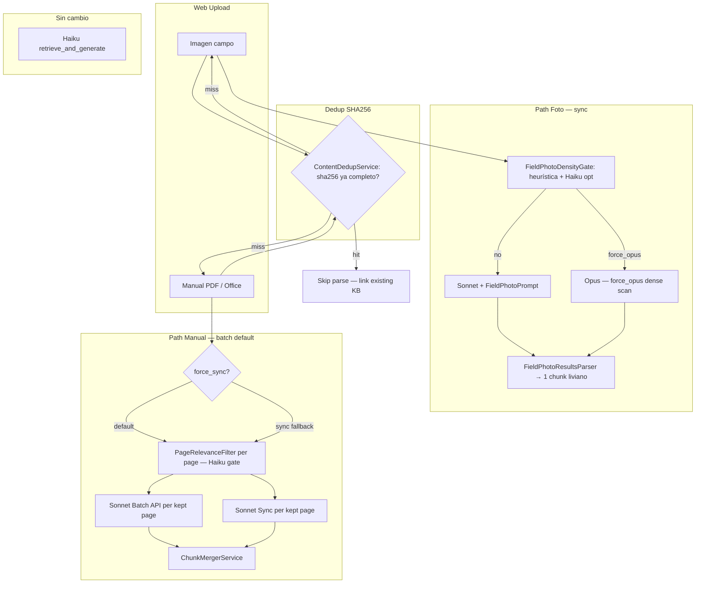

# Ingestion Cost V2 — ADR & Cost Architecture

**Status:** Production-ready behind `CUSTOM_CHUNKING_COST_V2_ENABLED`  
**Benchmark date:** 2026-05-21  
**Supersedes:** inline routing in `FileMultimodalRouter` (Opus default for images)

---

## 1. Contexto y evidencia

### Benchmark 3-ejes (2026-05-21)

Script: `script/compare_sonnet_vs_opus.rb`  
Dump: `tmp/benchmark_3axes_merged.json`  
Scope: 54 extracciones + 54 judge calls ≈ $5.69

| Eje | Variantes | Hallazgo |
|-----|-----------|---------|
| Modelo | Haiku 4.5, Sonnet 4.6, Opus 4.7 | Δ Sonnet vs Opus = **0.06/20** (empate estadístico) |
| Prompt | monolithic (`SYSTEM_BLOCKS`) vs specialized | +**3.8/20** specialized en foto/diagrama |
| Input | foto campo, diagrama, manual PDF | specialized **empeora** manual (14.7 vs 15.0) |

**Veredictos:**
- Default model: **Sonnet** (equivalente a Opus, 5× más barato)
- Foto: prompt **specialized** (`FieldPhotoPrompt`) → identificación liviana, no S0-S18
- Manual: prompt **monolithic** (`BatchChunkingPrompt::SYSTEM_BLOCKS`) — specialized recortado es peor
- Opus: solo `force_opus` en escaneados densos (heurística `text_layer < 100 && image_ratio > 0.7`)
- Consultas RAG: **sin cambio** (Haiku en `retrieve_and_generate`)

---

## 2. Arquitectura 3 paths (v2 prod)

| Path | Input | Prompt | Modelo | API |
|------|-------|--------|--------|-----|
| Foto | JPEG/PNG campo | `FieldPhotoPrompt::SYSTEM_BLOCKS` | Sonnet 4.6 | Sync direct |
| Manual | PDF multipágina + Office | `BatchChunkingPrompt::SYSTEM_BLOCKS` | Sonnet 4.6 (Opus excepción `force_opus`) | Batch async (default) / sync fallback |
| Consulta RAG | Texto query | — | Haiku 4.5 | Bedrock `retrieve_and_generate` |

---

## 3. Decisiones de diseño (ADR)

### 3.1 Manual default = Batch async + PageRelevanceFilter per-page Sonnet

**Context:** El path anterior (`SingleFileChunkingService` sync) llamaba Opus de forma bloqueante en la request. ~$60/técnico/mes.

**Decision:** PDF adjunto sin query urgente → `SubmitManualBatchJob` → `ManualBatchIngestionService` → Anthropic Batch API (Sonnet, ~50% off). Resultado llega vía `IngestManualBatchResultsJob` + poll.

**Consequences:**
- UX: ACK rápido para el técnico; indexación en background (~minutos).
- Costo: ~$0.66/mes vs ~$40/mes anterior (5 manuales × 10 págs filtradas).
- Riesgo: si el técnico necesita el manual de inmediato, no puede usarlo hasta que el batch complete.
- Mitigación: sync fallback automático cuando hay query adjunta.

### 3.2 Foto Sonnet + FieldPhotoPrompt; Haiku gate; Opus `force_opus` only

**Context:** `FileMultimodalRouter` enviaba toda imagen a Opus. Benchmark: Sonnet score 16.7 vs Opus 16.7 en fotos — empate, 5× diferencia de precio.

**Decision:** `:image → MODEL_TEXT` (Sonnet). `FieldPhotoDensityGate` corre heurística (tamaño) + optional Haiku 1-call (`FIELD_PHOTO_HAIKU_GATE_ENABLED=true`) para escaneados densos. Opus solo cuando gate retorna `:opus`.

**Consequences:**
- Costo foto: ~$0.009/foto → ~$1.86/mes (200 fotos) vs ~$8/mes anterior.
- `FieldPhotoResultsParser` produce 1 chunk liviano (ingestion_path `field_photo_v1`) en vez de S0-S18.
- Haiku gate es opt-in (`FIELD_PHOTO_HAIKU_GATE_ENABLED`), deshabilitado por defecto.

### 3.3 Manual monolithic (NO specialized recortado)

**Context:** Benchmark mostró que el prompt specialized para manual (SPEC_MANUAL_BLOCKS en el script) produce peor score (14.7 vs 15.0 monolithic).

**Decision:** Manuales usan `BatchChunkingPrompt::SYSTEM_BLOCKS` sin cambios. `SPEC_MANUAL_BLOCKS` queda en el script de benchmark como referencia histórica; NO se mueve a producción.

**Consequences:** Ningún cambio de prompt para manuales. Mayor coherencia con los chunks S0-S18 ya indexados.

### 3.4 Consultas Haiku sin cambio

**Decision:** `BedrockClient::QUERY_MODEL_ID` (Haiku) no se toca. El benchmark solo validó ingesta; el retrievar con Haiku está bien calibrado.

### 3.5 SHA dedup antes de parse

**Context:** Uploads repetidos (misma foto subida dos veces, manual re-subido) corrían parse completo.

**Decision:** `ContentDedupService.find_completed(sha256:)` consulta `BulkUploadAsset.complete` con `custom_id` truncado (32 chars de SHA-256). Hit → skip parse, reusa `canonical_name`/`aliases`. Seam: `KbDocument.content_sha256` (Stage 1 tenancy migration — guarded by `column_names.include?`).

**Consequences:** Cero parse duplicados para binarios idénticos. Zero-migration hoy.

### 3.6 Sync fallback manual

**Decision:** Triggers para sync inmediato:
1. `ENV["MANUAL_FORCE_SYNC"] = "true"` (ops)
2. `@force_sync: true` en `CustomChunkingPipeline` — QOS lo activa cuando `@query.present?` (técnico adjunta y pregunta simultáneamente)

**Consequences:** Técnico que adjunta un manual Y hace una pregunta recibe parse sync (más caro pero la respuesta llega en la misma sesión).

### 3.7 Diagrama suelto fuera de scope v1

**Decision:** Diagramas JPEG raros en obra van dentro del PDF manual; no se optimizan como path separado. El campo `subsystem: "UNKNOWN"` en `FieldPhotoPrompt` cubre el caso.

---

## 4. Matriz costo unitario

Pricing de `BedrockQuery::BEDROCK_PRICING` ($/1K tokens):

| Recurso | Modelo | API | Input $/1K | Output $/1K | ~tokens/call | ~$/call |
|---------|--------|-----|-----------|------------|-------------|---------|
| Foto campo | Sonnet 4.6 direct | Sync | $0.003 | $0.015 | ~2.000 in / ~300 out | ~$0.0105 |
| Pág. manual | Sonnet 4.6 batch | Batch | ~$0.0015 | ~$0.0075 | ~3.000 in / ~500 out | ~$0.008 |
| Pág. manual Opus | Opus 4.7 batch | Batch | ~$0.0075 | ~$0.0375 | ~3.000 in / ~500 out | ~$0.041 |
| Haiku filter | Haiku 4.5 direct | Sync | $0.0008 | $0.004 | ~1.000 in / ~10 out | ~$0.00084 |
| Query RAG | Haiku 4.5 via Bedrock | `retrieve_and_generate` | ~$0.0008 | ~$0.004 | ~4.000 in / ~500 out | ~$0.005 |

---

## 5. Proyección mensual — 1 técnico

Volumen: **1.000 consultas**, **200 fotos**, **5 manuales × 10 pág** (PageRelevanceFilter ~75% kept → 38 págs reales)

| Línea | Stack | ~$/mes |
|-------|-------|--------|
| Consultas RAG | Haiku `retrieve_and_generate` | ~$5.00 |
| Haiku page filter | Haiku 4.5 batch (38 págs) | ~$0.03 |
| Fotos campo | Sonnet 4.6 direct sync | ~$2.10 |
| Manuales | Sonnet 4.6 batch per-page | ~$0.30 |
| **Total v2** | | **~$7.43** |

**HOY (pre-v2):** Fotos → Opus sync (~$40), Manuales → ningún parse web batch → **~$60/técnico/mes estimado**.

Ahorro: **~87%** en costo de ingesta.

---

## 6. Flags y rollout

| Flag | Default | Propósito |
|------|---------|-----------|
| `CUSTOM_CHUNKING_WEB_ENABLED` | `false` | Activa toda la pipeline direct-Claude (v1 + v2) |
| `CUSTOM_CHUNKING_COST_V2_ENABLED` | `false` | Activa routing v2: batch manual + foto Sonnet |
| `MANUAL_FORCE_SYNC` | `false` | Fuerza sync para todos los manuales (ops override) |
| `FIELD_PHOTO_HAIKU_GATE_ENABLED` | `false` | Activa Haiku pre-gate en fotos (opt-in) |
| `CUSTOM_CHUNKING_NO_FALLBACK` | `false` | Dev/staging only — sin fallback OWRPGSX6XK |

**Orden de deploy:**
1. Deploy con todos OFF → smoke-test legacy.
2. `CUSTOM_CHUNKING_WEB_ENABLED=true` → smoke-test v1 sync.
3. `CUSTOM_CHUNKING_COST_V2_ENABLED=true` → smoke 1 manual 10p + 1 foto → verificar batch_id en logs.
4. `CUSTOM_CHUNKING_COST_V2_ENABLED=true` en prod.

---

## 7. Fuera de scope v2

- Tabla `FieldPhotoIdentification` (AR para structured photo results)
- Nova multimodal sidecar dedicado para fotos
- Path diagrama topológico standalone (components/connections separados del manual)
- Batch API para fotos (innecesario: sync foto ~$0.009/foto, latencia < 5s)
- Migración `kb_documents.content_sha256` (dedup vía `BulkUploadAsset` es suficiente hoy)

---

## 8. Changelog vs web_v1

| Componente | Antes (web_v1) | Después (cost_v2) |
|-----------|----------------|-------------------|
| `FileMultimodalRouter` `:image` | `MODEL_MULTIMODAL` (Opus) | `MODEL_TEXT` (Sonnet) |
| Handle image | `BatchChunkingPrompt` monolithic | `FieldPhotoPrompt` specialized + `FieldPhotoResultsParser` |
| `ingestion_path` foto | `"web_v1"` | `"field_photo_v1"` |
| Manual PDF default | `SingleFileChunkingService` sync | `ManualBatchIngestionService` → Batch API (async) |
| Manual prompt | `BatchChunkingPrompt::SYSTEM_BLOCKS` | Sin cambio (mismo) |
| `ingestion_path` manual | `"web_v1"` | `"manual_batch_v1"` |
| SHA dedup | No | `ContentDedupService` antes de parse |
| Sync fallback manual | N/A | `force_sync:` param + `MANUAL_FORCE_SYNC` env |

---

## Feedback design — validar post-deploy

| Área | Pregunta | Métrica |
|------|----------|---------|
| Costo real | ¿Footer Haiku+Sonnet batch ≈ $7-10/técnico/mes? | `bedrock_queries` rollup 7d |
| Dedup hit rate | ¿Cuántos uploads skip parse? | log `ContentDedupService hit` |
| force_opus rate | ¿Opus <15% páginas manual? | count `force_opus` / total pages |
| Batch latency UX | ¿Técnicos toleran indexación async manuales? | time upload→indexed Turbo event |
| Foto quality | ¿RAG responde bien con chunk liviano field_photo_v1? | spot-check 10 fotos reales |

## Riesgos documentados

- **Bulk ZIP path** migrado a cost-v2 (2026-05-22): `BulkCostV2RequestBuilder` aplica el mismo routing que el chat web — fotos Sonnet + `FieldPhotoDensityGate`, PDFs per-page + `PageRelevanceFilter`, Office→PDF vía `OfficeToPdfConverter`. Flag `CUSTOM_CHUNKING_COST_V2_ENABLED` (default `false`) activa ambos caminos (web + bulk) simultáneamente.
- Manual muy escaneado puede subir costo Opus: un manual de 50 páginas con 30 páginas escaneadas → 30 × $0.041 ≈ $1.23 en ese manual solo. Monitorear `force_opus` count.
- SHA dedup sin `kb_documents.content_sha256` indexed puede ser O(n) si hay muchos `BulkUploadAsset.complete`. Indexar en Stage 1 tenancy migration.
