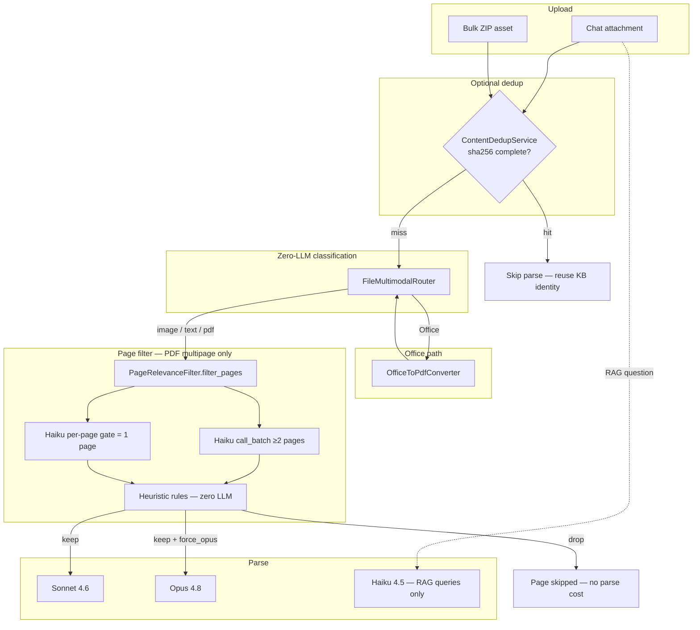

# Ingestion routing — file type, page filter, LLM selection

How the app decides **what to parse**, **which pages to keep**, and **which Claude model** to use when a technician uploads a file from **chat** or **bulk ZIP**.

**Related:** [Web custom chunking](WEB_CUSTOM_CHUNKING.md) · [Bulk ZIP](BULK_INGESTION.md) · [Cost v2 ADR](INGESTION_COST_V2.md) · [Metrics channels](METRICS.md)

---

## Entry points

| Entry | Route | Job queue | Parse API |
|-------|-------|-----------|-----------|
| **Chat attachment** | Home RAG → `UploadAndSyncAttachmentsJob` → `QueryOrchestratorService#upload_and_sync_attachments` | `default` + `bulk_ingestion` for long PDFs | Sync Messages for short files; Anthropic Message Batches for long PDFs |
| **Bulk ZIP** | `/bulk_uploads` → `ProcessBulkUploadJob` → … → `SubmitClaudeBatchJob` | `bulk_ingestion` | Anthropic Message Batches (always async) |

Both paths share the same **classification**, **page filter**, and **model routing** services. No feature flags gate these paths — `CustomChunkingPipeline` and `BulkCostV2RequestBuilder` are the only active code paths.

---

## End-to-end flow



---

## Step 1 — File type classification

`FileMultimodalRouter` (`app/services/file_multimodal_router.rb`) inspects MIME type and extension. **No LLM calls.**

| Input | `mode` | Initial model hint | Next step |
|-------|--------|-------------------|-----------|
| Plain text (.txt, .md, .csv, .html, …) | `:text` | Sonnet | Single Claude call |
| Image (JPEG/PNG/GIF/WebP) | `:image` | Sonnet (cost v2) / router default | `FieldPhotoDensityGate` → Sonnet or Opus |
| PDF, 1 page | `:pdf_text_only` | Sonnet | Single call on whole PDF |
| PDF, ≥2 pages | `:pdf_mixed` | Per-page (see below) | Split → `PageRelevanceFilter` → N calls on kept pages |
| Office (.docx, .xlsx, .pptx, …) | `:office` | — | `OfficeToPdfConverter` → re-classify as PDF |

**Per-page model selection** (inside `:pdf_mixed`, via `route_page` in `FileMultimodalRouter`):

- **Default: Sonnet** (`MODEL_TEXT`) for all pages.
- **Opus** (`MODEL_MULTIMODAL`) only when the page is scanned/rasterized: `text_layer_chars < 100` **and** `image_area_ratio > 0.7`. Same threshold used by `PageRelevanceFilter#scanned_dense?` and `BatchFilter#scanned_dense?`.
- Pages with images but sufficient text or moderate image coverage use Sonnet — no longer upgraded to Opus.

Parallelism: up to **`MAX_PARALLEL_PAGES=8`** concurrent page requests on the sync path.

---

## Step 2 — Page relevance filter

`PageRelevanceFilter` (`app/services/page_relevance_filter.rb`) drops **boilerplate pages** before expensive Sonnet/Opus parse calls. Applied to **multi-page PDFs** (native or converted from Office).

### Routing mode

| Pages in document | Filter mode | LLM cost |
|-------------------|-------------|----------|
| **1** | Per-page cascade: heuristics → optional Haiku gate | 0–1 Haiku calls |
| **≥2** | **`filter_pages` → `call_batch`**: Haiku classifies bounded windows of pages | 1+ Haiku calls by page/byte windows |

Unified routing (2026-05-22): native PDFs and Office/PPT decks use the same `filter_pages` entry point. The old `office_origin && pages.size > 1` branch is removed.

### Heuristic drops (zero LLM)

Applied first on single-page path; batch mode delegates classification to Haiku for multi-page docs.

| Reason | Rule |
|--------|------|
| `cover_slide` | Page 1, text layer `< 10` chars, image ratio `> 0.7`, visible text `< 50` chars |
| `title_page` | Page 1, text `< 400` chars, matches title pattern (`manual`, `guide`, `guía`, …) |
| `boilerplate` | Text `< 600` chars, matches copyright / preface / index / `índice` / `table of contents` / … |
| `repeated_artifact` | Same text on ≥3 pages (running header/footer) |
| `blank` | Text `< 50` chars, no images |
| `table_of_contents` | ≥10 lines and ≥30% of lines end with a page number |

### Heuristic keeps

| Reason | Rule |
|--------|------|
| `scanned_image` | `text_layer < 100` and `image_ratio > 0.7` → **keep** + **`force_opus: true`** |
| `high_confidence_content` | Text `> 800` chars, or images with ratio `≥ 0.25` |

### Ambiguous pages (single-page path only)

Text 50–800 chars, no clear signal → **Haiku 4.5 gate** (one page PDF in the message). Returns `{keep, reason}`. On error → **keep** (safe default).

### Batch classifier (`call_batch`)

Haiku messages are split into windows capped at **20 pages** and **22 MB raw PDF bytes**. A single oversized page is sent alone. Prompt instructs aggressive drops:

- **Drop:** cover, title, agenda, index, table of contents, section divider, blank, preface, copyright
- **Keep:** wiring diagrams, procedures, specs, data tables, component photos

Each window uses `max(256, 64 + pages_in_window * 32)` output tokens. If the response is malformed JSON after markdown-fence stripping, the same window retries once at 2x `max_tokens`; API/payload errors do not retry. Any fallback keeps all pages only for that failed window, preserving successful window classifications.

Tracking: `page_filter_batch: <filename> <window_min>..<window_max>/<total_pages>` in `bedrock_queries`. `PageRelevanceFilter` also logs `windows_count`, `window_ranges`, `window_bytes`, and `fallback_windows`.

Typical yield: ~**75%** of pages kept on 10-page manuals (see [INGESTION_COST_V2.md](INGESTION_COST_V2.md) cost projection).

---

## Step 3 — LLM and prompt matrix

Models (`BatchChunkingPrompt`):

- **Sonnet 4.6** — `MODEL_TEXT` — default parse
- **Opus 4.8** — `MODEL_MULTIMODAL` — dense scans, large field photos
- **Haiku 4.5** — page filter + optional photo gate only (not chunk generation)

| File type | Filter | Parse model | Prompt | API mode (chat) | API mode (bulk) |
|-----------|--------|-------------|--------|-----------------|-----------------|
| **Field photo** | `FieldPhotoDensityGate` (size ≥1.5 MB → Opus) | Sonnet (default) or Opus | `FieldPhotoPrompt` compact explicit-evidence schema (Sonnet) / `BatchChunkingPrompt` (Opus) | Sync | Batch |
| **Text file** | — | Sonnet | `BatchChunkingPrompt` | Sync | — |
| **PDF** | `filter_pages` → Haiku batch for ≥2 pages | Sonnet per kept page; Opus if `force_opus` | `BatchChunkingPrompt` | Sync when ≤ `WEB_SYNC_PDF_PAGE_THRESHOLD` pages; Batch when longer | Batch per kept page |
| **Office** | Convert → same as PDF | Same as PDF | Same | Sync (handle_office converts) | Batch (after convert in ZIP extract) |

**Ingestion path metadata** (sidecar / metrics):

| Path | `ingestion_path` |
|------|------------------|
| Sync web parse | `web_v1` |
| Field photo Sonnet | `field_photo_v1` |
| PDF page batch (bulk ZIP / web long manual batch) | `manual_batch_v1` |
| Bulk ZIP legacy | `batch_v1` |
| SHA dedup hit | `content_dedup` |

---

## Chat upload — path selection

```
UploadAndSyncAttachmentsJob
  → CustomChunkingPipeline (per file)
      → ContentDedupService (skip parse on hit)
      → image                              → SingleFileChunkingService (sync)
      → office (.docx/.pptx/…)            → SingleFileChunkingService (sync, handle_office converts)
      → pdf <= WEB_SYNC_PDF_PAGE_THRESHOLD → SingleFileChunkingService (sync cost-v2)
      → pdf >  WEB_SYNC_PDF_PAGE_THRESHOLD → SubmitManualBatchJob (async Batch)
  → BulkKbSyncService → BedrockIngestionJob only for chunks ready now
```

Long manual routing is automatic. A technician can still upload a long PDF from web/chat; the app acknowledges the upload, submits the manual to Batch on `bulk_ingestion`, and indexes it only after `IngestManualBatchResultsJob` writes `manual_batch_v1` chunks under `bulk_chunks/`. The original PDF under `uploads/` is not indexed directly.

**Office failure:** user sees `rag.office_parse_failed` via `KbSyncBroadcaster.failed`. No legacy OWRPGSX6XK fallback — errors propagate to `UploadAndSyncAttachmentsJob`, which broadcasts failed and lets Solid Queue retry.

Detail: [WEB_CUSTOM_CHUNKING.md](WEB_CUSTOM_CHUNKING.md).

---

## Bulk ZIP — path selection

```
ProcessBulkUploadJob → BatchIngestionService#process! (extract, S3, dedup)
  → SubmitClaudeBatchJob → BatchIngestionService#submit!
      → BulkCostV2RequestBuilder (photos + per-page PDF)
  → PollClaudeBatchJob → IngestBatchResultsJob → BulkKbSyncService
```

Office files in ZIP: `ZipExtractionService` sets `office_origin`; `BatchIngestionService` may convert via LibreOffice before batch build. Page filter uses the same `filter_pages` as chat (no separate Office branch).

Detail: [BULK_INGESTION.md](BULK_INGESTION.md).

---

## SHA dedup

`ContentDedupService.find_completed(sha256:)` checks `BulkUploadAsset` rows with status `complete`. On hit:

- Skip all Claude parse calls
- Reuse `canonical_name` and `aliases`
- Chat: populate `web_v1_metadata` from dedup record
- Bulk: mark asset `complete` immediately

---

## Cost telemetry

Parse rows land in `bedrock_queries` with `source: ingestion_parse`. Classified by `LlmUsageChannel` into dashboard footer channels (Haiku direct, Sonnet/Ops direct vs batch). See [METRICS.md](METRICS.md).

Example `user_query` labels:

| Label | Meaning |
|-------|---------|
| `web_parse: manual.pdf p3/12` | Sync page parse |
| `web_batch: manual.pdf p3/12` | Web long-manual async Batch page parse |
| `page_filter: manual.pdf p2/12` | Single-page Haiku gate |
| `page_filter_batch: deck.pdf 21..40/55` | Multi-page Haiku batch window classify |
| `bulk_batch: …` / `bulk_parse: …` | Bulk ZIP paths |

---

## Source files (implementation map)

| Concern | Service / job |
|---------|---------------|
| Chat orchestration | `CustomChunkingPipeline`, `QueryOrchestratorService` |
| Single-file sync parse | `SingleFileChunkingService`, `ClaudeChunkingClient` |
| Web long-manual async batch | `WebManualBatch`, `SubmitManualBatchJob`, `ManualBatchIngestionService`, `IngestManualBatchResultsJob` |
| Bulk batch | `BatchIngestionService`, `BulkCostV2RequestBuilder`, `ClaudeBatchClient` |
| Classification | `FileMultimodalRouter` |
| Page filter | `PageRelevanceFilter` |
| Photo routing | `FieldPhotoDensityGate`, `FieldPhotoPrompt`, `FieldPhotoResultsParser` |
| Office convert | `OfficeToPdfConverter` |
| Merge multi-page | `ChunkMergerService`, `BatchResultsParserService` |
| KB sync | `BulkKbSyncService`, `BedrockIngestionJob` |
| Dedup | `ContentDedupService` |

## Retrieval-oriented chunk identity

Ingestion produces two alias levels:

- **Document aliases:** identify the complete source; deduplicated and capped at 15.
- **Chunk aliases:** identify only the current page/section; capped at 8 and written
  into that chunk's `SEARCH_ALIASES` header.

Chunk aliases prevent a code found on one page from being copied into every chunk
of the manual. Exact identifiers such as `P41` remain available to HYBRID search
without adding unrelated aliases to generation context.

Manual parsing can also emit structured `field_records` for atomic inspections,
tests, expected results, stop-work pairs, repair authority, and documented
schematic labels. `BatchResultsParserService` renders those records into canonical
`FIELD_RECORD` blocks with deterministic IDs inside the same semantic chunk.
This improves lexical and semantic retrieval without depending on Sonnet/Opus
Markdown formatting. The Claude response uses five required short keys and omits
absent optional fields; Rails expands them after validation to control output-token
cost. Existing KB chunks gain these records only after reingestion.

For field photos, the compact chunk may include `Visible text`, `Documented
functions`, `Documented connections`, `Documented values`, and `Documented
warnings`, but only when the image explicitly supports them. Conventional
schematic symbols or acronym meanings are not evidence.
