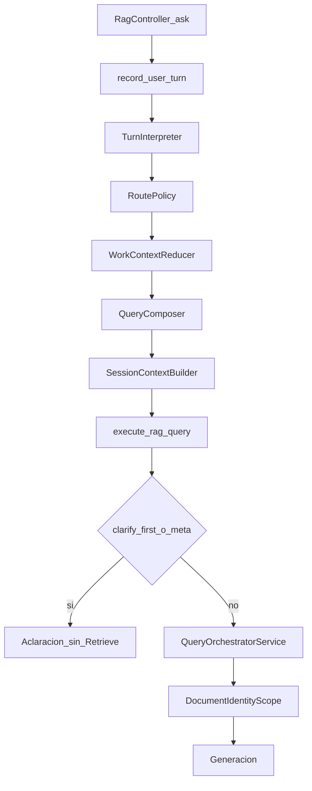

# Field Companion: de la consulta a la respuesta

**Estado:** VIGENTE desde 2026-10-07. Etapa 1 no empezada.

**Pregunta rectora:** ¿Este trabajo ayuda a Danebo a comprender la consulta, encontrar el manual pertinente y acompañar al técnico hasta una respuesta útil?

Este documento es la cola de ejecución del companion. Sustituye, como trabajo siguiente, Section O del [plan de continuidad del 6 de octubre](PLAN_FIELD_COMPANION_MVP_CONTINUITY_RECOVERY_2026-10-06.md). Ese archivo conserva sus registros, SHA y conteos. O-P1 no se ejecutó: en `3ecd61c` no existen `architecture_faithful_s3.yml`, `architecture_faithful_s3.rb` ni `architecture_faithful_score.rb`.

Este commit no cambia producto, no despliega y no llama a Bedrock. La etapa 1 espera la frase «ejecuta la etapa 1».

## Objetivo

Danebo comprende una consulta técnica natural, conserva el caso, busca documentación con lo que ya sabe y acompaña al técnico hasta una respuesta o la aclaración mínima que distingue documentos o el siguiente paso.

Fabricante, modelo, controlador, tarea, componente y código son dimensiones para comprender el problema y reducir la búsqueda. No son campos obligatorios ni una secuencia fija.

El contrato ya está en [PRODUCT_ROADMAP.md](PRODUCT_ROADMAP.md) y en [AGENTS.md](../AGENTS.md): evidencia recuperada, identidad desconocida que puede usar un manual como referencia con descargo, pin de sesión que no prueba aplicabilidad y que el sistema no suelta solo. El desvío estuvo en la cola de ejecución, no en ese contrato.

## Dónde estamos

HEAD de la auditoría: `3ecd61c` (`docs: correct Section O benchmark contract`).

Camino owner, con `HAIKU_QUERY_ANALYSIS_MODE=owner` y los flags de episodio y turno:

`RagController#ask` → `ConversationSession#record_owner_turn!` / `apply_owner_perception!` → `Rag::TurnInterpreter` → `Rag::RoutePolicy#call` → `Rag::WorkContextReducer#apply!` → `Rag::QueryComposer#call` → `SessionContextBuilder.build` → `RagQueryConcern#execute_rag_query` → `QueryOrchestratorService#execute`.

### Funciona y tiene evidencia

- El lifecycle owner persiste identidad, goal, observaciones, pending y rechazos. Lo cubren los tests del reducer, de `RoutePolicy` y de `QueryComposer`. El harness longitudinal con percepción scriptada, sin Bedrock, quedó en PASS el 6 de octubre: Journey A L1, L2 y L3, Journey B L1, contrato `longitudinal-expectation-scope.1`. Eso demuestra adquisición cuando la percepción ya viene escrita.
- `QueryComposer#observations` mete las observaciones aceptadas en la query de retrieval. Test: `retained observations stay in the retrieval string`.
- Corrección en el reducer: `apply_negations`, `write_replacement_fault_code`, `supersede_retracted_observations`. Caso T-F en [test/fixtures/files/field_companion/cases.yml](../test/fixtures/files/field_companion/cases.yml): Fuji Yida pasa a KONE y el goal queda.
- `DocumentIdentityScope.applicable?` exige identidad conocida. El pin acota URIs. Tests de scope y de preparación de piloto.
- `clarify_first` y `meta` no llaman al orquestador. Si el turno trae observación, fact o identificador, `RoutePolicy#clarify_first?` no corta la búsqueda.

### Implementado y todavía no validado en conversación real

- `TurnInterpreter` real sobre los textos de Journey A y B. [script/field_companion/longitudinal_journeys.rb](../script/field_companion/longitudinal_journeys.rb) inyecta `ScriptedClient`.
- Journeys en vivo de F3. El plan del 6 de octubre los deja sin correr.
- Multimodal N1–N6: código local, sin verificación de producción. [PLAN_MULTIMODAL_COMPANION_SAFE_RETRIEVAL_2026-10-02.md](PLAN_MULTIMODAL_COMPANION_SAFE_RETRIEVAL_2026-10-02.md).
- R1B: el boundary de sesión está en código. El smoke de producción no se hizo.

### Falla o falta

La proyección de observaciones sigue abierta. `WorkContextReducer#write_observations` guarda hasta 12 textos de 180 caracteres. `QueryComposer` los usa para buscar. `SessionContextBuilder#render_field_problem` proyecta facts, identificadores, foto, conflictos y el `goal`. No recorre `episode.observations`. El goal se asigna una vez, en el primer turno que sí busca (`assign_goal_if_needed`).

El efecto depende del carril:

- Identidad desconocida: `BedrockRagService#unknown_identity_guidance` pone en `Question` el turno crudo (`raw_turn`). Las observaciones llegan a generación si caben en el goal o en los últimos 3 mensajes de usuario (`EPISODE_MAX_USER_MESSAGES`). `CompanionGuidanceContext#technician_turns` lee esas líneas `User:`, no el almacén del episodio.
- Identidad conocida sin manual compatible: el guidance recibe la query compuesta como `question`. El texto de la observación puede aparecer mezclado con la búsqueda. El bloque de problema sigue sin listarlo.
- `clarify_first` retorna antes de `write_observations`. Un primer turno clasificado así no guarda el síntoma.
- `ask_controller?` busca y, con `ask_when: :always`, agrega «¿Qué controlador o modelo estás revisando?» cuando hay fabricante y síntoma y faltan modelo y controlador (`append_turn_clarification`).

Todavía no hay una conversación con el interpreter real que mida si la respuesta pierde una observación usada en la búsqueda, o si el controlador se pide por rutina.

### Problema del instrumento

A‴ no mide esta conversación. [script/field_companion/f1_calibration_runner.rb](../script/field_companion/f1_calibration_runner.rb) llama `BedrockRagService#query` o la ruta estructurada con un hit congelado. No crea sesión y no corre interpreter, reducer ni `SessionContextBuilder`.

El registro de Section N queda como historia: útil 28/68, S3 4/44, inseguro humano confirmado 0. Los registros 17, 27, 24 y 40 también quedan. Section N bajó el útil desde 40. Un FAIL de A‴ no declara roto al companion. Un PASS del longitudinal scriptado no lo declara listo.

## Desvío

F0–F2b arreglaron continuidad bajo percepción scriptada. F3 y las secciones L, M y N convirtieron A‴ en la compuerta. Section O diseña otro benchmark de 18 fixtures, otro harness y otro scorer antes de mirar el lifecycle con el interpreter real. O-P4, la única reparación de producto de esa sección, queda detrás de O-P1–O-P3.

## Qué queda de Section O

Se conserva en el plan del 6 de octubre, sin reescribir la historia:

- A‴ no recorre el lifecycle.
- El pin no demuestra aplicabilidad.
- `clarify_first` no busca y no guarda observaciones.
- No se inventan cuerpos de manual. Si el corpus autorizado no tiene el pasaje, el resultado es un hueco de adquisición.
- SHA y conteos ya escritos.

Se deja de ejecutar:

- O-P1, el freeze de 18 fixtures. Los textos ya están en Journey A, Journey B y T-F.
- O-P2 y O-P3, harness y scorer nuevos.
- O-P5, la evaluación pagada de ese roster con retrieve stub.
- La compuerta 44/68 y cualquier rerun de A‴ para perseguirla.
- F3b y F4 de ese plan.
- La prohibición de tocar `RoutePolicy` dentro de O-P1–O-P5. Si la sonda muestra la pregunta rutinaria de controlador, el arreglo entra en la etapa 2.

O-P4 no es una fase. Proyectar observaciones aceptadas en `render_field_problem`, dentro de `MAX_PROBLEM_CHARS = 400`, sin columna nueva y sin otra llamada, es un candidato de la etapa 2. Entra solo si la sonda muestra que una observación usada en retrieval falta en el contexto de generación y eso cambia la respuesta.

## Inventario

### Resuelto y verificado

- Discovery F0–F8. [PLAN_FIELD_COMPANION_DISCOVERY_2026-09-29.md](PLAN_FIELD_COMPANION_DISCOVERY_2026-09-29.md). El pin lo pone el técnico.
- Evidencia visual F1–F3. [PLAN_VISUAL_EVIDENCE_HARDENING_2026-10-02.md](PLAN_VISUAL_EVIDENCE_HARDENING_2026-10-02.md). Cerrado en producción.
- R1A de corpus. Cerrado en el recovery del 30 de septiembre.
- Continuidad con percepción scriptada, F2b, scope.1. PASS local. No se reabre.
- Aplicabilidad por identidad conocida. El pin no autoriza el procedimiento. Código y tests actuales.

### Parcialmente resuelto

- Proyección de observaciones. Retrieval sí. Bloque de generación no. El impacto lo comprueba la etapa 1. Dueño posible: `SessionContextBuilder#render_field_problem`. Origen: fila `Episode observation projection` del plan del 6 de octubre, y el Master Plan del 5 de octubre sobre pregunta compuesta versus turno actual. En el carril desconocido el turno crudo ya es `Question`. El faltante es el almacén de observaciones.
- Precedencia del turno actual. `raw_question` ya entra al guidance de identidad desconocida. El guidance de identidad conocida sin manual compatible sigue recibiendo la query compuesta. La etapa 1 anota cuál string es `Question` en cada carril.

### Duplicado o sustituido

- O-P1, O-P2, O-P3 y O-P5. Los sustituyen las etapas 1 y 3 de este plan.
- R2 del [recovery del 30 de septiembre](PLAN_FIELD_COMPANION_RECOVERY_2026-09-30.md). Su objetivo lo absorbe esta sonda. Query KONE sobre un episodio Elemont, MonoSpace que no suelta el pin y `AM-01.01.046` → 515 no se reabren como fase. Si aparecen en la traza, se reparan. Si no aparecen, quedan pospuestos.
- Hilo de consulta del 21 de septiembre en el camino web owner. `QueryComposer` compone la búsqueda. `FollowupQueryRewriter` sigue fuera de owner.
- F9 del refactor de focus, en lo que pedía soltar pines. FC-D17 y el código actual conservan el pin. El cleanup de helpers muertos queda fuera de estas cuatro etapas.

### Obsoleto para esta validación

- Perseguir A‴ 44/68, S3 24/44, otro scorer y el roster de 18.
- T3 del Turn Interpreter. El camino bajo prueba es owner. Borrar el intérprete duplicado no es esta validación.
- R3 de UX y rótulos, y CG-D19, salvo que la etapa 3 muestre una respuesta que el técnico no pueda usar por la forma.
- CS-P01–P03 del plan asistente del 21 de septiembre. La disciplina de hipótesis ya está en AGENTS.md.

### Incierto

Lo decide la etapa 1:

- Si un primer mensaje con síntoma y sin identidad busca, o si `clarify_first` o el fallback piden el controlador antes. Textos: turno 1 de Journey B y el primer turno de T-F.
- Si `ask_controller?` agrega la pregunta de controlador cuando la búsqueda ya puede avanzar.
- Si la corrección 8→18, planta 1→2, «por arriba»→«por debajo» y Fuji Yida→KONE se sostiene con el interpreter real, y el dato negado no vuelve.
- Si una observación fuera de la ventana de 3 mensajes sigue en la query y falta en el contexto de generación.

### Pospuesto

Siguen abiertos y no bloquean la etapa 1:

- Smoke de producción de R1B.
- Verificación de producción de N1–N6. En Journey B el turno 5 usa el payload de foto ya escrito. No hay llamada nueva a Vision.
- G5 humano del refactor de focus (F9 y F10).
- Presentación de la respuesta.

## Cuatro etapas

Cada etapa usa el resultado de la anterior. No se agrega scorer, tabla, máquina de estados ni una segunda llamada de modelo. El techo de interpretación es 35 turnos Haiku. No hay reintentos.

### Etapa 1 — Observar el lifecycle real

Resultado: una traza por turno, sin cambio de producto y sin Retrieve ni generación. Cada hallazgo queda como falla de producto, instrumento, ninguno o incierto.

Se reutilizan los textos de [test/fixtures/files/field_companion/longitudinal_journeys.yml](../test/fixtures/files/field_companion/longitudinal_journeys.yml) y T-F de `cases.yml`, y el host de `longitudinal_journeys.rb` (`record_user_turn!` + `execute_rag_query`). Un script corto, `script/field_companion/conversation_probe.rb`, se escribe solo si ese runner no puede soltar `ScriptedClient`. El harness F1 y el hash del fixture no se reescriben. Retrieve y generación quedan en stub de captura. El interpreter es el de producción.

Escenarios, sin textos nuevos:

- Smoke, 1 turno. Journey B turno 1. Equipo desconocido, desnivel en planta 3.
- Conversación 1, desconocido. Journey B turnos 1–10. La identidad llega por el payload de foto ya fijado y por la frase de Orona PBCM-V3. Nadie elige un manual. El turno 3 pregunta por el manual BLT. Eso no es un pin.
- Conversación 2, conocido y continuidad. Journey A turnos 1–14. Elemont MH CEA15 en el primer mensaje. Código 8 y luego 18. La ventana de 3 mensajes se agota en el turno 11. Corrección de planta en el turno 13.
- Conversación 3, corrección de identidad. T-F. Resortes de la fijación de cables, Fuji Yida, modelo desconocido, «No, no es Fuji Yida. Es KONE».

Por turno se guarda: move y observaciones del interpreter, decisión, aclaración, pending, facts, goal, observations, rejected, query compuesta, bloque Active Field Problem, ventana de conversación, si cada observación almacenada está en la query y en el contexto visible, y si se habría llamado Retrieve.

Evidencia: `docs/evidence/field_companion_conversation_probe_2026-10-07/`. Costo: una llamada Haiku de interpretación por turno de técnico. Si no hay credenciales Bedrock locales, la etapa se detiene. No se simula el interpreter.

Condición para seguir: la traza está completa, o una excepción de producto está registrada. Si no hay falla de producto, la etapa 2 escribe «sin cambio» y se pide la etapa 3.

### Etapa 2 — Reparar solo lo observado

Resultado: el diff mínimo que corrige una falla clasificada como producto en la etapa 1, con test Minitest. Si la etapa 1 no trae esa falla, no hay diff.

Candidatos, no autorizados de antemano:

- Observación ausente del contexto de generación y presente en la query: proyectarla en `render_field_problem`, presupuesto 400. Las líneas de identidad se conservan antes que el texto de observación. Tests en [test/services/session_context_builder_test.rb](../test/services/session_context_builder_test.rb). Si `CompanionGuidanceContext` pierde esa proyección, el arreglo es ese lector, no un prompt nuevo.
- Síntoma explícito que no se guarda, o búsqueda que no ocurre: `RoutePolicy#clarify_first?` o el fallback. Test en `route_policy_test.rb`.
- Pregunta de controlador agregada siempre tras un fabricante: `ask_when` de `ask_controller?`. La aclaración queda para un discriminador que separe documentos o el siguiente paso.
- Corrección que no pega, o valor negado que vuelve: `WorkContextReducer`.

Fuera de esta etapa: tablas, scorer, fixture de 18, rerun de A‴, rama por id de caso, otra llamada de modelo.

Condición para seguir: los tests del comportamiento tocado pasan y la misma sonda, todavía sin Retrieve ni generación, muestra la falla corregida. Un sí del fundador autoriza el gasto de la etapa 3.

### Etapa 3 — Búsqueda y respuesta reales

Resultado: las mismas cuatro conversaciones con Retrieve y generación Haiku, una vez, sin segundo modelo y sin reintento. Se corre la secuencia del fixture porque incluye correcciones y la salida de la ventana de historial. No se inventan turnos ni códigos. Si el índice no tiene el manual, se registra el hueco: la respuesta dice que falta documentación y ofrece un paso útil. El chunk [test/fixtures/files/elemont/chunk_p1_2_current.txt](../test/fixtures/files/elemont/chunk_p1_2_current.txt) no se inyecta para forzar un acierto.

Lectura de la traza:

- Sin error de ejecución.
- Identidad, problema y observaciones se conservan. La corrección pega. El dato descartado no vuelve.
- Hay búsqueda cuando el caso ya tiene síntoma.
- El documento pertinente se usa cuando el índice lo devuelve.
- Un pin no convierte ese documento en el procedimiento del equipo.
- No se repite una pregunta ya respondida.
- Cada respuesta avanza. Resolver antes es mejor que alargar el caso.
- Se distingue evidencia documental, observación del técnico e hipótesis Danebo.
- No aparecen valores ni procedimientos que no estén en el turno, la foto aceptada o el chunk.

Evidencia junto a la de la etapa 1, con correlación y costo. Techo: los mismos turnos de la etapa 1.

Condición para seguir: la lectura está escrita. Un fallo de producto entra a una sola reparación. Un fallo de A‴ no cuenta.

### Etapa 4 — Una reparación si hace falta, y cierre

Resultado: si la etapa 3 falla por una causa de producto ya vista en la traza, un diff mínimo y una sola repetición del escenario fallido. Si pasa, este plan registra el resultado y se detiene.

A‴, su corpus y su scorer quedan como regresión secundaria. No se vuelven a correr para aceptar el companion. Los tests locales de `CompanionGuidanceContext` y `DocumentIdentityScope` se corren solo si el diff los toca.

## Primer paso

Ejecutar la etapa 1. Hace falta la frase del fundador porque gasta Haiku de interpretación. Hasta esa frase no hay llamada, ni cambio de producto, ni etapa 3.

## Intervenciones

- «ejecuta la etapa 1».
- «ejecuta la etapa 3», después de la etapa 2, si la sonda local quedó coherente.
- Parada si la etapa 1 no tiene credenciales, si la falla exige una tabla o una segunda llamada de modelo, o si la etapa 3 sigue fallando después de la única reparación.

## Incertidumbres

Las cierra la sonda, no otro documento:

- Si el interpreter real extrae el síntoma, la identidad y la corrección en esos textos.
- Si la ausencia de observaciones en `render_field_problem` cambia una respuesta, o si el goal y los tres mensajes bastan en estos escenarios.
- Si el índice vivo devuelve un manual pertinente para Elemont MH / CEA15 y para el caso de nivelación, o si lo correcto es declarar el hueco.
- Si la pregunta de controlador aparece en un turno que ya puede buscar.
