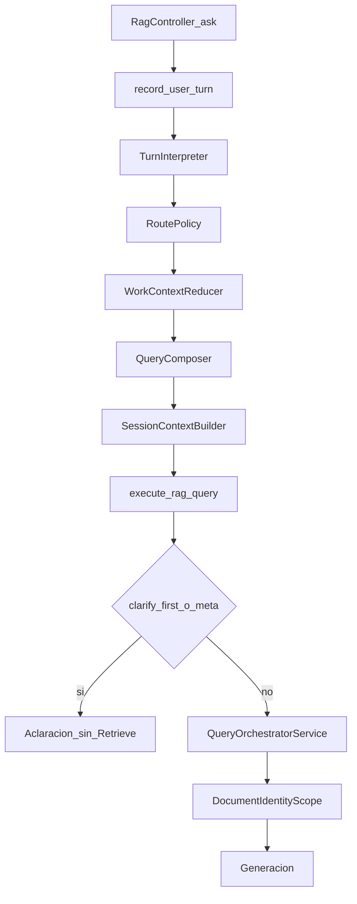

# Field Companion: de la consulta a la respuesta

**Estado:** VIGENTE. Revisión de principal engineer incorporada el 2026-10-07. Los dos bloqueantes de esa revisión quedan cerrados en este contrato. Etapa 1 no empezada. «Ejecuta la etapa 1» autoriza implementar y correr solo esa etapa.

**Pregunta rectora:** ¿Este trabajo ayuda a Danebo a comprender la consulta, encontrar el manual pertinente y acompañar al técnico hasta una respuesta útil?

Este documento es la cola de ejecución del companion. Sustituye, como trabajo siguiente, Section O del [plan de continuidad del 6 de octubre](PLAN_FIELD_COMPANION_MVP_CONTINUITY_RECOVERY_2026-10-06.md). Ese archivo conserva sus registros, SHA y conteos. O-P1 no se ejecutó: en `3ecd61c` no existen `architecture_faithful_s3.yml`, `architecture_faithful_s3.rb` ni `architecture_faithful_score.rb`.

Este commit no cambia producto, no despliega y no llama a Bedrock. La etapa 1 espera la frase «ejecuta la etapa 1».

## Objetivo

Danebo comprende una consulta técnica natural, conserva el caso, busca documentación con lo que ya sabe y acompaña al técnico hasta una respuesta o la aclaración mínima que distingue documentos o el siguiente paso.

Fabricante, modelo, controlador, tarea, componente y código son dimensiones para comprender el problema y reducir la búsqueda. No son campos obligatorios ni una secuencia fija.

Si el primer mensaje ya dice a qué equipo se refiere y ese equipo coincide con un manual, se busca en ese turno. No se pide otra evidencia para poder consultar. La evidencia se pide cuando, sin ella, no se sabe qué manual consultar. Mientras esa evidencia no está, la respuesta no trae un procedimiento técnico. Con evidencia, un paso rudimentario y general puede entrar. El dato del manual entra cuando el manual coincide con el equipo y la respuesta de la consulta está ahí.

El contrato ya está en [PRODUCT_ROADMAP.md](PRODUCT_ROADMAP.md) y en [AGENTS.md](../AGENTS.md): evidencia recuperada, identidad desconocida que puede usar un manual como referencia con descargo, pin de sesión que no prueba aplicabilidad y que el sistema no suelta solo. El desvío estuvo en la cola de ejecución, no en ese contrato.

## Dónde estamos

HEAD de la auditoría: `3ecd61c` (`docs: correct Section O benchmark contract`).

Camino owner, con `HAIKU_QUERY_ANALYSIS_MODE=owner` y los flags de episodio y turno:

`RagController#ask` → `ConversationSession#record_owner_turn!` / `apply_owner_perception!` → `Rag::TurnInterpreter` → `Rag::RoutePolicy#call` → `Rag::WorkContextReducer#apply!` → `Rag::QueryComposer#call` → `SessionContextBuilder.build` → `RagQueryConcern#execute_rag_query` → `QueryOrchestratorService#execute`.



### Funciona y tiene evidencia

- El lifecycle owner persiste identidad, goal, observaciones, pending y rechazos. Lo cubren los tests del reducer, de `RoutePolicy` y de `QueryComposer`. El harness longitudinal con percepción scriptada, sin Bedrock, quedó en PASS el 6 de octubre: Journey A L1, L2 y L3, Journey B L1, contrato `longitudinal-expectation-scope.1`. Eso demuestra adquisición cuando la percepción ya viene escrita.
- `QueryComposer#observations` mete las observaciones aceptadas en la query de retrieval. Test: `retained observations stay in the retrieval string`.
- Corrección en el reducer: `apply_negations`, `write_replacement_fault_code`, `supersede_retracted_observations`. Caso T-F en [test/fixtures/files/field_companion/cases.yml](../test/fixtures/files/field_companion/cases.yml): Fuji Yida pasa a KONE y el goal queda.
- `DocumentIdentityScope.applicable?` exige identidad conocida. El pin acota URIs. Tests de scope y de preparación de piloto.
- `clarify_first` y `meta` no llaman al orquestador. Si el turno trae observación, fact o identificador, `RoutePolicy#clarify_first?` no corta la búsqueda.

### Implementado y todavía no validado en conversación real

- `TurnInterpreter` real sobre los textos de Journey A y B. [script/field_companion/longitudinal_journeys.rb](../script/field_companion/longitudinal_journeys.rb) inyecta `ScriptedClient`.
- Journeys en vivo de F3. El plan del 6 de octubre los deja sin correr.
- Multimodal N1–N6: código local, sin verificación de producción. [PLAN_MULTIMODAL_COMPANION_SAFE_RETRIEVAL_2026-10-02.md](PLAN_MULTIMODAL_COMPANION_SAFE_RETRIEVAL_2026-10-02.md).
- R1B: el boundary de sesión está en código. El smoke de producción no se hizo.

### Falla o falta

La proyección de observaciones sigue abierta. `WorkContextReducer#write_observations` guarda hasta 12 textos de 180 caracteres. `QueryComposer` los usa para buscar. `SessionContextBuilder#render_field_problem` proyecta facts, identificadores, foto, conflictos y el `goal`. No recorre `episode.observations`. El goal se asigna una vez, en el primer turno que sí busca (`assign_goal_if_needed`).

El efecto depende del carril:

- Identidad desconocida: `BedrockRagService#unknown_identity_guidance` pone en `Question` el turno crudo (`raw_turn`). Las observaciones llegan a generación si caben en el goal o en los últimos 3 mensajes de usuario (`EPISODE_MAX_USER_MESSAGES`). `CompanionGuidanceContext#technician_turns` lee esas líneas `User:`, no el almacén del episodio.
- Identidad conocida sin manual compatible: el guidance recibe la query compuesta como `question`. El texto de la observación puede aparecer mezclado con la búsqueda. El bloque de problema sigue sin listarlo.
- `clarify_first` retorna antes de `write_observations`. Un primer turno clasificado así no guarda el síntoma.
- `ask_controller?` busca y, con `ask_when: :always`, agrega «¿Qué controlador o modelo estás revisando?» cuando hay fabricante y síntoma y faltan modelo y controlador (`append_turn_clarification`).

Todavía no hay una conversación con el interpreter real que mida si la respuesta pierde una observación usada en la búsqueda, o si el controlador se pide por rutina.

### Problema del instrumento

A‴ no mide esta conversación. [script/field_companion/f1_calibration_runner.rb](../script/field_companion/f1_calibration_runner.rb) llama `BedrockRagService#query` o la ruta estructurada con un hit congelado. No crea sesión y no corre interpreter, reducer ni `SessionContextBuilder`.

El registro de Section N queda como historia: útil 28/68, S3 4/44, inseguro humano confirmado 0. Los registros 17, 27, 24 y 40 también quedan. Section N bajó el útil desde 40. Un FAIL de A‴ no declara roto al companion. Un PASS del longitudinal scriptado no lo declara listo.

## Desvío

F0–F2b arreglaron continuidad bajo percepción scriptada. F3 y las secciones L, M y N convirtieron A‴ en la compuerta. Section O diseña otro benchmark de 18 fixtures, otro harness y otro scorer antes de mirar el lifecycle con el interpreter real. O-P4, la única reparación de producto de esa sección, queda detrás de O-P1–O-P3.

## Qué queda de Section O

Se conserva en el plan del 6 de octubre, sin reescribir la historia:

- A‴ no recorre el lifecycle.
- El pin no demuestra aplicabilidad.
- `clarify_first` no busca y no guarda observaciones.
- No se inventan cuerpos de manual. Cero chunks es `RETRIEVAL_EMPTY`. No demuestra que el manual falte en el índice. `CORPUS_GAP` exige un inventario local que muestre que ese documento no fue ingerido. Si ese inventario no está, el hueco queda sin clasificar y la corrida no es PASS.
- SHA y conteos ya escritos.

Se deja de ejecutar:

- O-P1, el freeze de 18 fixtures. Los textos ya están en Journey A, Journey B y T-F.
- O-P2 y O-P3, harness y scorer nuevos.
- O-P5, la evaluación pagada de ese roster con retrieve stub.
- La compuerta 44/68 y cualquier rerun de A‴ para perseguirla.
- F3b y F4 de ese plan.
- La prohibición de tocar `RoutePolicy` dentro de O-P1–O-P5. Si la sonda muestra la pregunta rutinaria de controlador, el arreglo entra en la etapa 2.

O-P4 no es una fase. Proyectar observaciones aceptadas sigue siendo un candidato de la etapa 2, sin columna nueva y sin otra llamada. La etapa 1 puede demostrar que una observación usada en retrieval falta en el prompt final. Eso autoriza reparar el contrato de contexto. No demuestra que la respuesta cambie. Ese efecto lo lee la etapa 3.

## Inventario

### Resuelto y verificado

- Discovery F0–F8. [PLAN_FIELD_COMPANION_DISCOVERY_2026-09-29.md](PLAN_FIELD_COMPANION_DISCOVERY_2026-09-29.md). El pin lo pone el técnico.
- Evidencia visual F1–F3. [PLAN_VISUAL_EVIDENCE_HARDENING_2026-10-02.md](PLAN_VISUAL_EVIDENCE_HARDENING_2026-10-02.md). Cerrado en producción.
- R1A de corpus. Cerrado en el recovery del 30 de septiembre.
- Continuidad con percepción scriptada, F2b, scope.1. PASS local. No se reabre.
- Aplicabilidad por identidad conocida. El pin no autoriza el procedimiento. Código y tests actuales.

### Parcialmente resuelto

- Proyección de observaciones. Retrieval sí. `render_field_problem` no recorre el almacén. La etapa 1 mide si el prompt final de la ruta tomada las pierde. La etapa 3 mide el efecto en la respuesta. El bloque de 400 caracteres no garantiza conservarlas: cabecera y pie ocupan 269 caracteres (`PROBLEM_HEADER` 79, `PROBLEM_FOOTER` 188, más los dos saltos de `assemble_problem`). `fit_problem` recorta primero el goal. El guidance de identidad conocida (`CompanionGuidanceContext#turn_block`) no lee todas las líneas del bloque: usa el goal, la identidad y los dos últimos `User:`. El guidance desconocido sí lee `problem_projection_lines`. Verificar solo `SessionContextBuilder` no basta.
- Precedencia del turno actual. `raw_question` ya entra al guidance de identidad desconocida. El guidance de identidad conocida sin manual compatible sigue recibiendo la query compuesta. La etapa 1 anota cuál string es `Question` en cada carril.

### Duplicado o sustituido

- O-P1, O-P2, O-P3 y O-P5. Los sustituyen las etapas 1 y 3 de este plan.
- R2 del [recovery del 30 de septiembre](PLAN_FIELD_COMPANION_RECOVERY_2026-09-30.md). Su objetivo lo absorbe esta sonda. Query KONE sobre un episodio Elemont, MonoSpace que no suelta el pin y `AM-01.01.046` → 515 no se reabren como fase. Si aparecen en la traza, se reparan. Si no aparecen, quedan pospuestos.
- Hilo de consulta del 21 de septiembre en el camino web owner. `QueryComposer` compone la búsqueda. `FollowupQueryRewriter` sigue fuera de owner.
- F9 del refactor de focus, en lo que pedía soltar pines. FC-D17 y el código actual conservan el pin. El cleanup de helpers muertos queda fuera de estas cuatro etapas.

### Obsoleto para esta validación

- Perseguir A‴ 44/68, S3 24/44, otro scorer y el roster de 18.
- T3 del Turn Interpreter. El camino bajo prueba es owner. Borrar el intérprete duplicado no es esta validación.
- R3 de UX y rótulos, y CG-D19, salvo que la etapa 3 muestre una respuesta que el técnico no pueda usar por la forma.
- CS-P01–P03 del plan asistente del 21 de septiembre. La disciplina de hipótesis ya está en AGENTS.md.

### Incierto

Lo decide la etapa 1:

- Si un primer mensaje con síntoma y sin identidad busca, o si `clarify_first` o el fallback piden el controlador antes. Textos: turno 1 de Journey B y el primer turno de T-F.
- Si `ask_controller?` agrega la pregunta de controlador cuando la búsqueda ya puede avanzar.
- Si la corrección de código 8→18 y la de fabricante Fuji Yida→KONE se sostienen, y el valor negado no vuelve.
- Si la corrección de una observación se sostiene. Journey A turno 13 («planta 2, no de planta 1») y Journey B turno 9 («por debajo», no «por arriba») necesitan la observación nueva. El prompt del intérprete dice `A correction has empty observations` (`TurnInterpreter::PROMPT`). `TurnPerception#adjust_move` convierte `correct` sin una negación de slot reconocido en `unclear` y vacía las observaciones. Esas dos capas son dueños posibles. El reducer entra solo si la percepción normalizada ya traía el dato y el episodio lo perdió.
- Si una observación fuera de la ventana de 3 mensajes sigue en la query y falta en el prompt final de la ruta tomada. Eso es pérdida de contexto. No es, por sí solo, un cambio de respuesta.

### Pospuesto

Siguen abiertos y no bloquean la etapa 1:

- Smoke de producción de R1B.
- Verificación de producción de N1–N6. En Journey B el turno 5 usa el payload de foto ya escrito. No hay llamada nueva a Vision.
- G5 humano del refactor de focus (F9 y F10).
- Presentación de la respuesta.

## Contrato de ejecución

La sonda es un proceso local. No corre en el contenedor de producción: `script/` no está en la imagen desplegada. No declara validación de producción, ni de Vision, ni del pin. Estos escenarios no fijan un pin. Un pin ausente no prueba el comportamiento del pin.

Arranque. El árbol git está limpio. El manifiesto escribe `git rev-parse HEAD`. El ancestro mínimo es `a218169`. Un árbol sucio detiene la corrida antes de cualquier llamada.

Comando, desde la raíz del repositorio, contra la base local de desarrollo:

```text
PROBE_RUN_ID=<id> PROBE_STAGE=1 bin/rails runner script/field_companion/conversation_probe.rb
```

`PROBE_STAGE` es `1` o `3`. `PROBE_SCENARIOS` vale `smoke,b,a,tf` si se omite. La etapa 2 y la etapa 4 pueden pasar un subconjunto. Cada `PROBE_RUN_ID` escribe en `tmp/field_companion_probe/<PROBE_RUN_ID>/` y no pisa otra corrida.

Entrada. El script nuevo elige los escenarios. No llama a `LongitudinalJourneys::Runner#run`. Ese `run` ejecuta Journey A dos veces, añade L3 y ejecuta B: 42 interpretaciones si el intérprete fuera real. También instala `BEDROCK_KNOWLEDGE_BASE_ID=mvp-journey-stub`, devuelve el chunk congelado de Elemont y crea documentos auxiliares. Reutilizar `record_user_turn!` y `execute_rag_query` es válido. Reutilizar `Runner#run` sin esa selección incumple este plan. El hash del fixture longitudinal y el harness F1 no se reescriben.

Flags del proceso, restaurados al salir. Se toman de `LongitudinalJourneys::FLAGS` con estos cambios:

- `HAIKU_QUERY_ANALYSIS_MODE=owner`
- `FIELD_COMPANION_EPISODE_ENABLED=true`
- `FIELD_COMPANION_TURN_ENABLED=true`
- `DOCUMENT_IDENTITY_SCOPE_ENABLED=true`
- `SHARED_SESSION_ENABLED=false`
- `RAG_STRUCTURED_EVIDENCE_ROUTE_ENABLED=true`
- `PHOTO_QUESTION_RAG_ENABLED=true`
- `BEDROCK_MODEL_ID` sigue en el Haiku global ya usado por el intérprete
- `RAG_EPISODE_SCOPE_ENABLED` y `RAG_THREAD_MENU_ENABLED` se quitan solo durante el proceso
- Etapa 1: `BEDROCK_KNOWLEDGE_BASE_ID=probe-no-retrieve`, solo en el proceso. `BedrockRagService#query` lanza `MissingKnowledgeBaseError` si el id está vacío, antes de llegar al stub. Ese valor no es un knowledge base vivo y no es `mvp-journey-stub`. No se inyecta `chunk_p1_2_current.txt`.
- Etapa 3: se usan el knowledge base y el modelo que el entorno local ya tiene. No se apuntan al stub. No se edita `deploy.yml`. Los reintentos internos de producción siguen activos.

Costura de la etapa 1. Se reutilizan `QueryHost`, `record_assistant_turn!(pending_question:)` y el patrón de `LongitudinalJourneys::Seams`, que rechaza por defecto. No se escriben costuras nuevas.

- `retrieve_with_retry` registra la petición y devuelve cero chunks.
- `retrieve_and_generate_with_retry` se rechaza.
- Se cortan `document_identity_generator` y `UnknownIdentityPublication`. Su texto no sale hacia el modelo.
- El intérprete llama `BedrockClient#converse` por un `interpreter_client` que envuelve el cliente real y graba el tool input. Ese `#converse` no se sustituye. `TurnInterpreter::Result` no trae la salida cruda.
- `AiProvider#converse`, `BedrockClient#query`, `BedrockClient#converse_message` y Vision se rechazan. Cualquier otra llamada a Bedrock también se rechaza, para que el ledger no deje una llamada sin contar.

Historial de la etapa 1. Se persiste la respuesta que esa ruta produjo: `clarify_first`, `meta` u `open_reference_no_results`. No se persiste el prompt contrafactual ni un placeholder de generación. Esta historia no es la línea base de la etapa 3. Tampoco lo es `document_identity_generation_prompt`, que la etapa 1 no llega a ver. `follow_up?` y la línea `Assistant:` de la etapa 1 corresponden a la ruta de cero chunks.

Aislamiento. Hace falta una cuenta local ya existente. Si no hay ninguna, la corrida se detiene. Se usa un usuario dedicado `conversation-probe@localhost` en esa cuenta. Cada escenario abre una sesión web con identificador `probe:<PROBE_RUN_ID>:<escenario>`. Al empezar, se borran solo las sesiones de ese usuario con ese prefijo de corrida. No se tocan otras sesiones. No se usa `accounts(:legacy)` fuera del entorno de test.

El turno 5 de Journey B puede aplicar el payload de foto ya escrito en el fixture. La traza lo marca `scripted_photo: true`. No hay llamada a Vision. Cualquier otra intervención que no sea el texto del técnico lleva `scripted: true`.

### Presupuesto

Una repetición del experimento es otra corrida autorizada. Un reintento interno de `BedrockRagService` (`retrieve_with_retry`, el segundo retrieve del corpus abierto, `UnknownIdentityPublication` y después el guidance) es comportamiento de producción. No se apaga para cumplir el techo. Se anota como intento dentro del turno.

Techos de llamadas al intérprete, una por turno de técnico, sin repetir el experimento dentro de la etapa:

| Etapa | Qué corre | Techo de interpretaciones | Generación |
|---|---|---|---|
| 1 | smoke y, solo si su intérprete responde `ok`, B + A + T-F | 29 | 0 |
| 2 | solo los escenarios cuya traza mostró la falla reparada. Si el arreglo está en prompt o contexto compartido, los cuatro | 29 | 0 |
| 3 | los mismos cuatro, una vez, con Retrieve y generación | 29 | una ruta de respuesta por turno. Los intentos internos cuentan en el ledger y no suman otra corrida |
| 4 | solo el escenario fallido | 14 | la misma regla, limitada a ese escenario |

El techo de todo el plan es 101 interpretaciones (29+29+29+14). El antiguo tope de 35 queda retirado: no cubría una repetición ni las etapas 3 y 4.

El ledger de cada corrida anota `interpreter_calls`, `generation_calls`, `retrieve_attempts`, `publication_attempts`, `input_tokens` y `output_tokens`. Si una llamada de intérprete supera el techo de la etapa, la corrida se detiene. Si los intentos internos de un turno de la etapa 3 o 4 superan tres llamadas de generación, ese turno queda `INCONCLUSIVE` y la corrida se detiene. No se lanza otra corrida para reemplazarlo.

`smoke` es la compuerta. Si el `status` del intérprete en ese turno no es `ok`, la corrida se detiene y no gasta las otras 28 interpretaciones. `timeout`, `throttle` y `transport_error` son `INCONCLUSIVE`. En esos casos `fallback: true` es el camino de `RoutePolicy.fallback` después de un fallo de transporte. No se clasifica como fallback de producto.

### Traza

La percepción del YAML es `fixture_perception`. Sirve de referencia. No se copia a `interpreter_move`. El runner longitudinal hace eso en `finish_turn` y además guarda `recent_user` con `last(2)`. Esta sonda no hereda esos dos campos.

Por turno se guardan por separado:

- tool input crudo, grabado por el `interpreter_client` antes de `TurnPerception.build`
- `status`, `fallback`, tokens y modelo de `TurnInterpreter::Result`
- percepción normalizada y decisión que devuelve `record_user_turn!`
- aclaración y pending
- facts, goal, observations y rejected del episodio
- query compuesta
- bloque Active Field Problem, con `context_truncated` y las longitudes reales
- `episode_user_messages`, hasta tres
- `route_real` y `prompt_real` de la ruta que el turno tomó
- si Retrieve se habría llamado (etapa 1) o cuántos chunks volvieron (etapa 3)

Prompt que se mide. Con identidad desconocida, cero chunks y sin pin, `unknown_identity_reference_result` devuelve `open_reference_no_results` y no llama a `unknown_identity_guidance`. `prompt_real` queda null. La traza registra esa ruta. Aparte construye `unknown_identity_guidance` con el mismo `raw_turn` y el mismo `session_context`, marcado `counterfactual: true`, y no lo envía al modelo. La pérdida de contexto se mide sobre `prompt_real` cuando existe, y si no existe, sobre ese contrafactual. La ausencia de `prompt_real` no es pérdida y no arranca la etapa 2.

Identidad conocida y cero chunks. Qué devuelve `DocumentIdentityScope.apply([])`, `:no_compatible` o `:unavailable`, no está verificado. No se inventa ese prompt. El turno queda `known_empty_scope: unverified` y no dispara la etapa 2 por un prompt que la ruta no armó.

### Escenarios

Textos existentes. No se agregan turnos.

- `smoke`. Journey B turno 1, sesión propia. Equipo desconocido, desnivel en planta 3.
- `b`. Journey B turnos 1–10, otra sesión. La identidad llega por el payload de foto marcado como scripted y por la frase de Orona PBCM-V3. Nadie elige un manual. El turno 3 pregunta por el manual BLT. Eso no crea un pin.
- `a`. Journey A turnos 1–14, una sola vez, sin variante con focus y sin L3. Elemont MH CEA15 en el primer mensaje. Código 8 y luego 18. La ventana de tres mensajes se agota en el turno 11. El turno 13 corrige la planta.
- `tf`. Los cuatro mensajes del técnico de T-F, en orden. No se insertan las preguntas de asistente escritas en el fixture («¿Qué marca y modelo es el equipo?», «¿Sabes el modelo?»). Se conservan la respuesta y el pending que el sistema produzca. En una nota aparte se registra si ese pending permite leer «el modelo no lo sé» como respuesta al slot. Si el sistema preguntó otra cosa, el hallazgo es ese pending, no una razón para inyectar la pregunta del fixture.

Dos clases de corrección:

- Identidad o código. `correct` exige el span que niega el valor guardado y el span que afirma el reemplazo. Las observaciones van vacías. Cubre el código 8→18 y Fuji Yida→KONE.
- Observación. La frase nueva es la observación de reemplazo. El turno 13 de A y el turno 9 de B son de esta clase. El fixture ya los escribe como `report` con la observación nueva. Si el intérprete real los emite como `correct` con observaciones vacías, o si `adjust_move` los convierte en `unclear` y las borra, el dueño es esa capa.

### Aceptación

Cada turno lleva una clase, y pueden coexistir: `corpus`, `retrieval`, `product`, `instrument`.

Invariantes obligatorios. Uno solo que falle impide el PASS de la corrida:

- Sin excepción no capturada.
- En un turno de corrección, el valor descartado no está en facts, goal ni observations del episodio. El reemplazo sí está.
- El prompt se mira sin el texto literal del turno actual. Ese texto puede decir «no de planta 1» o «no es Fuji Yida». En un `report`, `QueryComposer#current_turn` no quita esa frase.
- Una línea `User:` anterior que todavía contiene el valor descartado es el hallazgo `prior_user_line_retains_discarded`. No es FAIL en la etapa 1. En T-F turno 4, `technician_turns` puede traer «Fuji Yida» del turno 2 y queda en ese hallazgo. En las etapas 3 y 4 es FAIL si la respuesta publicada trata ese valor como vigente.
- La respuesta no enseña un procedimiento de otro manual como instrucción de este equipo. Aplica cuando hay respuesta, en las etapas 3 y 4.
- La respuesta no contiene un valor o un procedimiento que no esté en el turno, en el payload de foto marcado como scripted, o en el texto de un chunk recuperado. Aplica en las etapas 3 y 4.
- No se repite una pregunta cuya respuesta ya está en el episodio.
- Si el primer mensaje ya identifica el equipo y la decisión puede buscar, no se pide fabricante, modelo ni controlador antes de esa búsqueda. Pedir evidencia queda para cuando el equipo no alcanza para saber qué manual consultar. En las etapas 3 y 4, una respuesta con procedimiento técnico sin evidencia de equipo ni de manual es FAIL.

`PASS`: todos los turnos evaluados cumplen los invariantes, ninguno está `INCONCLUSIVE`, y las clases `corpus` y `retrieval` no se usaron para tapar un invariante roto.

`FAIL`: un invariante obligatorio no se cumple.

`INCONCLUSIVE`: faltan credenciales, el `status` del intérprete es `timeout`, `throttle` o `transport_error`, o el turno se detuvo por el techo de intentos internos. Cero chunks es `RETRIEVAL_EMPTY`, no `CORPUS_GAP` y no PASS. No demuestra que el manual no esté en el índice. Si la respuesta dice que falta documentación, eso se lee como el texto publicado. La causa de los cero chunks queda en `retrieval`.

Un fallo de A‴ no entra en estas clases.

## Cuatro etapas

Cada etapa usa el resultado de la anterior. No se agrega scorer, tabla, máquina de estados ni una segunda llamada de modelo de producto.

### Etapa 1 — Observar el lifecycle real

Resultado: la traza del contrato, sin cambio de producto, sin Retrieve vivo y sin generación. Una observación presente en la query y ausente del prompt medido (`prompt_real` o, si no existe, el contrafactual) es pérdida de contexto. No es evidencia de que la respuesta cambie. `open_reference_no_results` sin prompt no cuenta como esa pérdida.

Condición para seguir: el manifiesto está completo dentro del techo, o una excepción de producto está registrada. Si no hay falla de producto con dueño identificado, la etapa 2 escribe «sin cambio». La etapa 3 sigue esperando su frase.

### Etapa 2 — Reparar solo lo observado

«Ejecuta la etapa 1» no autoriza esta etapa. Empieza sin otra frase solo si la traza nombra un dueño y el arreglo está en esta lista. Si el dueño es ambiguo, se detiene.

- Pérdida de contexto, no efecto en la respuesta: el prompt medido no contiene una observación que sí está en la query. La ausencia de `prompt_real` en `open_reference_no_results` no entra. La reparación mantiene, dentro de los 400 caracteres, este orden: cabecera, pie y facts de identidad; la observación aceptada más reciente que no esté ya en el turno actual; después el goal. Una observación más vieja puede caer. La traza anota cuáles cayeron y `context_truncated`. El test mira el prompt final de `turn_block` y de `unknown_turn_block`, no solo el string de `SessionContextBuilder`. Una línea que el guidance no lee no cuenta como reparación.
- El intérprete o `adjust_move` vacía una corrección de observación, o no niega el valor en una corrección de identidad o código. Se repara esa capa. El reducer no es el destino por defecto.
- La percepción normalizada ya traía el dato y el episodio lo perdió: `WorkContextReducer`.
- Síntoma explícito que no se guarda, o búsqueda que no ocurre. `clarify_first?` no corta cuando la percepción trae observaciones. Esa pérdida llega por `unclear`, por el fallback, o por observaciones vacías del intérprete. El dueño es la capa que la traza muestre: intérprete, `RoutePolicy#clarify_first?` o el fallback.
- Pregunta de controlador agregada siempre tras un fabricante: `ask_when` de `ask_controller?`.

Fuera de esta etapa: tablas, scorer, fixture de 18, rerun de A‴, rama por id de caso, otra llamada de modelo, apagar reintentos internos.

Condición para seguir: los tests del comportamiento tocado pasan y la repetición autorizada de la etapa 1, todavía sin Retrieve ni generación, muestra el invariante de estado corregido. La frase «ejecuta la etapa 3» autoriza el gasto de generación.

### Etapa 3 — Búsqueda y respuesta reales

Resultado: una corrida de los cuatro escenarios con Retrieve y generación, dentro del presupuesto. El chunk de Elemont no se inyecta. Cero chunks quedan como `RETRIEVAL_EMPTY`. La respuesta puede decir que falta documentación y ofrecer un paso útil. Eso no convierte el vacío en prueba de que el manual no existe.

Condición para seguir: el veredicto es `PASS`, `FAIL` o `INCONCLUSIVE` según las reglas de aceptación. Un `FAIL` de producto ya visto en la traza entra a una sola reparación. Un `INCONCLUSIVE` se detiene.

### Etapa 4 — Una reparación si hace falta, y cierre

Si la etapa 3 es `FAIL` por una causa de producto ya vista, un diff mínimo y una sola repetición del escenario fallido, dentro del techo de 14 interpretaciones. Si esa repetición cumple los invariantes, el plan registra `PASS` de los escenarios evaluados y se detiene. Si no los cumple, el cierre es `FAIL` o `BLOCKED`. No se escribe como validado.

A‴, su corpus y su scorer quedan como regresión secundaria. No se vuelven a correr para aceptar el companion. Los tests locales de `CompanionGuidanceContext` y `DocumentIdentityScope` se corren solo si el diff los toca.

El resultado cubre estas conversaciones locales. No cubre producción, Vision ni un pin que la corrida no haya fijado.

## Primer paso

Ejecutar la etapa 1 con el contrato de arriba. Los dos bloqueantes de la revisión ya están cerrados aquí. Hace falta la frase del fundador porque gasta Haiku de interpretación y escribe el script de la sonda. Hasta esa frase no hay llamada ni cambio de producto.

## Intervenciones

- «ejecuta la etapa 1». Autoriza una corrida de 29 interpretaciones. No autoriza la etapa 2 ni la 3.
- La etapa 2 sigue sola cuando la traza nombra un dueño de la lista. Un dueño ambiguo, una tabla o una segunda llamada de modelo detienen el trabajo.
- «ejecuta la etapa 3». Una corrida con Retrieve y generación.
- La etapa 4 sigue sola para una reparación y una repetición del escenario fallido. Si sigue fallando, el cierre queda `FAIL` o `BLOCKED`.

## Incertidumbres

Las cierra la sonda, no otro documento:

- Si el intérprete real extrae el síntoma y la identidad, y en qué capa se pierde una corrección.
- Si el prompt medido, el real o el contrafactual, pierde observaciones que la query sí usó. El efecto sobre la respuesta queda para la etapa 3. La etapa 1 no mide la ruta con manual compatible.
- Si el retrieve devuelve chunks para Elemont MH / CEA15 y para la nivelación. Cero chunks no cierran el hueco de corpus.
- Si la pregunta de controlador aparece en un turno que ya puede buscar.
- Si el pending real de T-F permite interpretar «el modelo no lo sé».
