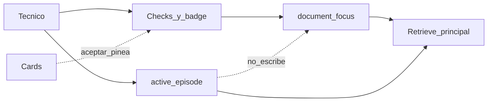

# Field Companion — Document Focus refactor (2026-10-01)

**Estado:** plan. Implementación no empezada.
**Canal:** web autenticado. WhatsApp sigue dormido.
**No reabre:** R1A (`CLOSED — PASS`).

Este plan separa tres cosas que hoy comparten estado:

```text
Work Context  ≠  Document Focus  ≠  Document Discovery
```

El técnico pregunta, ve cuántos manuales tiene seleccionados, y decide él si esa selección cambia. Danebo puede sugerir. No puede cambiar la selección en silencio.

## Cómo se ejecuta

La última vez el comportamiento era consistente con el código y distinto de lo que el técnico esperaba. Este plan no se implementa entero y después se mira en producción.

Hay cinco compuertas. Cada una es un deploy chico y un smoke que una persona hace en [https://danebo.ai](https://danebo.ai) mirando la pantalla. No hace falta abrir logs para decir PASS o FAIL.

| Compuerta | Fases que entran en ese deploy | Qué se comprueba en producción | Si falla |
|---|---|---|---|
| G1 | F1 | Corregir el equipo no cambia los manuales seleccionados | Revertir ese deploy. No se despliega G2 |
| G2 | F2 + F3 + F4 | El número visible es la selección real, y pin/unpin llegan antes de la pregunta | Revertir ese deploy. G1 tiene que seguir pasando |
| G3 | F5 | La respuesta usa exactamente los manuales de ese número | Revertir ese deploy. G1 y G2 siguen pasando |
| G4 | F6 + F7 | Un manual de afuera se ofrece y no se usa hasta que el técnico lo acepta; al aceptar, la misma pregunta se vuelve a hacer | Revertir ese deploy |
| G5 | F8 + F9 + F10 | Monarch / NICE3000 se reconoce desde el catálogo, y el smoke completo sigue pasando | Revertir ese deploy |

Reglas de ejecución:

1. Grok implementa sólo las fases de la compuerta abierta. Una fase, un commit, tests de esa fase, `git diff --check`.
2. Al cerrar la compuerta, se despliega sólo ese corte. No se adelantan fases de la compuerta siguiente en la imagen de producción.
3. Grok se detiene. Una persona hace el smoke de esa compuerta y responde sólo `PASS` o `FAIL`, más lo que vio en pantalla.
4. `FAIL` no abre la compuerta siguiente. Se corrige ese corte o se revierte.
5. Dentro de una fase no hay review de diff como paso rutinario. La revisión humana es el smoke de producto.

F2, F3 y F4 viajan juntas porque la columna nueva no se ve sola. F6 y F7 viajan juntas porque una sugerencia que no se puede aceptar no se puede juzgar. F8 viaja con el cierre porque G4 ya tiene que mostrar el manual Monarch; G5 comprueba que eso no dependió de agregar la marca a una lista de código.

---

## 1. Executive diagnosis

Danebo mezcla en un solo lugar el problema del técnico, los manuales que él ve seleccionados, y la continuidad de la conversación. El lugar es `conversation_sessions.active_entities`, y `ActiveEpisode` lo escribe.

La premisa equivocada está escrita como contrato vigente:

- [docs/ACTIVE_ARCHITECTURE.md](ACTIVE_ARCHITECTURE.md): los pins pertenecen al caso; una corrección de fabricante suelta el pin cuyo nombre contiene la marca vieja.
- [docs/SESSION_AND_RETRIEVAL.md](SESSION_AND_RETRIEVAL.md): “Pins are case state”.
- [app/controllers/pinned_documents_controller.rb](../app/controllers/pinned_documents_controller.rb): los pins se sueltan en un boundary de caso.

Eso produjo el incidente de producción. El técnico tenía Elemont y VF5 seleccionados. Dijo que no era Elemont, que era KONE. El episodio pasó a KONE. R1B sacó el pin Elemont porque el nombre contenía Elemont y no KONE. VF5 no contenía ninguna de las dos palabras, así que quedó. El retrieve siguió en `pin_only` sobre VF5. VF5 es Fermator. La respuesta habló de Fermator.

El fix cumplió el contrato de R1B. El técnico no había pedido soltar Elemont ni quedarse sólo con VF5.

El segundo fallo es de identidad. `config/document_identities.yml` ya tiene el manual Monarch con designators `NICE3000` y `NICE3000new`, confirmado. El ranker de sugerencias sólo arranca si el texto contiene una marca de `ActiveEpisodeTurn::MANUFACTURERS`. Monarch no está en esa lista. La sugerencia no nace. El técnico escribe el controlador que ve en el manual y Danebo no lo conecta con el archivo que ya está en la biblioteca.

Lo que sí está bien y no se tira:

- El episodio como memoria del trabajo: fabricante, modelo, código, objetivo, foto, conflictos, follow-up.
- `expected_episode_id` para que una respuesta o una foto tardía no pisen otro trabajo.
- El piso de historial del episodio.
- R1A: corpus autorizado, `KnowledgeScopePolicy`, un pin que no es un permiso de lectura.
- La sugerencia que no pinea sola, y el aviso de conflicto que hoy dice que el manual sigue enfocado (`rag.pin_conflict`).
- El retrieve con pins no reabre el corpus en silencio cuando no encuentra nada. Eso se conserva. Lo que cambia es quién decide ampliar la selección.

## 2. Current-state evidence

### Quién escribe `active_entities`

| Writer | Dónde | Qué hace |
|---|---|---|
| Click de pin | `PinnedDocumentsController#create` → `ConversationSession#pin_kb_document!` | Alta o refresco de un `user_pin` |
| Click de sugerencia | El mismo `create`, con `document_uid` | Igual, más log `manual_focus_confirmed` |
| Unpin | `destroy` → `unpin_kb_document_id!` | Borra la entrada de esta sesión |
| Upload indexado | `BedrockIngestionJob#auto_pin_document!` | Pinea si `expected_episode_id` sigue siendo el episodio vivo |
| Turno de usuario | `record_user_turn!` mezcla `case_boundary_changes` en el mismo `UPDATE` del episodio | Puede vaciar o filtrar pins |
| Foto sin episodio usable | `ensure_case_for_photo_submission!` | `invalid_state` vacía pins; `expired` aplica el corte de `added_at` |
| Caso nuevo explícito | `start_new_case!` | Vacía pins. No tiene ruta |
| WhatsApp | `SendWhatsappReplyJob` → `EntityExtractorService` | Escribe entidades desde citas. El web no llama a ese servicio |

`case_boundary_changes` en [app/models/conversation_session.rb](../app/models/conversation_session.rb):

- `invalid_state` y decisión `:new_episode`: `active_entities = {}`.
- Episodio expirado: se quedan sólo los pins con `added_at` posterior a `updated_at + 4 horas`.
- Decisión `:corrected`: `pins_after_manufacturer_correction` borra el pin cuyo label contiene el fabricante anterior como palabra y no contiene el nuevo.

Elemont cae en esa última regla. VF5 no. El retrieve de después ve sólo VF5.

### Quién borra pins sin un click

Los cuatro caminos de arriba: `:new_episode`, expiry, `invalid_state`, corrección de fabricante, más `start_new_case!` y el branch de foto. No hay otro delete en el path web.

`FocusNotice` no borra. Lee pins y arma un mensaje.

### Cómo llega el pin de la UI

`rag_chat_controller.js#toggleDocSelection`:

1. Cambia `data-selected` enseguida (optimistic).
2. Mete o saca el nombre del manual en el textarea.
3. `POST /pinned_documents` o `DELETE /pinned_documents/:id`.
4. Si el server falla, revierte check y textarea.

El pin de biblioteca responde `204`. La card responde JSON. Los dos escriben la misma fila de sesión.

La card (`confirmManualFocus`) pinea y cambia el texto del botón. No vuelve a enviar la pregunta.

### Carrera con `/rag/ask`

`sendMessage` no espera el `fetch` del pin. `/rag/ask` lee `active_entities` del servidor. El DOM no viaja en el body.

Secuencias reales:

- Pin y enviar antes de que el POST termine: la UI muestra seleccionado; el ask todavía no lo tiene.
- Unpin y enviar antes del DELETE: la UI ya no lo muestra; el ask todavía lo filtra.
- Corrección de fabricante: el server suelta el pin; la lista en pantalla sigue marcada hasta un reload.
- Auto-pin de upload: el pin existe antes de que `refreshDocuments` vuelva a pintar el check.

### Cómo se mezclan pins, historial y episodio

`SessionContextBuilder.build` arma tres bloques de prompt: Session Focus (los pins), Recent Conversation (piso del episodio si las flags están on), y Session Discipline si hay pins e historial. Después antepone `## Active Field Problem` desde `active_episode`. Ese bloque dice que no es evidencia documental. El filtro de retrieval no lo lee: lo lee `entity_s3_uris`, que saca `source_uri` de `active_entities` sin mirar el episodio.

### Cómo `resolve_retrieval_scope` usa los pins

En [app/controllers/concerns/rag_query_concern.rb](../app/controllers/concerns/rag_query_concern.rb):

- Cero URIs → `reason: open`, sin filtro de documento.
- Una o más → `reason: pin_only`, `force_entity_filter: true`, esas URIs.

Antes de eso, `resolve_pinned_scope` puede dejar una sola URI si `PinnedEntityScopeResolver` encuentra un único ganador entre varios pins. Un badge de 2 puede consultar 1. El técnico no ve ese recorte.

`selection_turn?` es verdadero cuando el texto de la pregunta, normalizado, es igual al nombre o a un alias de un pin. `selection_gate?` entonces no llama al modelo y responde `rag.selection_turn_prompt`. Eso existe porque el toggle escribe el nombre en el textarea.

`inherit_episode_scope` y `auto_scope_uris_from` ya devuelven vacío. El auto-scope viejo de WhatsApp no es el bug actual.

### Paths de auto-pin

1. Upload, `BedrockIngestionJob`, condicionado al episodio.
2. No hay auto-pin desde una cita, una sugerencia, ni un match de `KbDocumentResolver`. El comentario del concern lo dice: un match de catálogo no es un pin.

### Cards, textarea, badge

- Card: `ManualCandidateRanker` sobre `DocumentIdentityCatalog`. No retrieve. No escribe pins. Máximo 3 cards. Si no hay marca en `MANUFACTURERS`, `chat_payload` es nil.
- Textarea: `_updateTextareaWithDocName`.
- Badge: `updateSourcesBadge` cuenta `[data-selected="true"]` únicos. Si el conteo es 0, `display: none` y el texto queda vacío. El único nodo es el tab móvil Archivos en [app/views/home/_chat_box.html.erb](../app/views/home/_chat_box.html.erb). El panel desktop ([app/views/home/_documents_summary_box.html.erb](../app/views/home/_documents_summary_box.html.erb)) no tiene número. El conteo es DOM, no el server. Home pinta el check inicial desde `SessionContextBuilder.entity_s3_uris`.

### Discrepancias posibles

| Lo que ve el técnico | Lo que usa `/rag/ask` | Causa en el código actual |
|---|---|---|
| Seleccionado | No seleccionado | Pin todavía en vuelo; o el server soltó el pin y la lista no se recargó |
| No seleccionado | Seleccionado | Unpin en vuelo; auto-pin de upload antes del refresh |
| Un manual que no ve como filtro | Ese manual en `pin_only` | Corrección que deja VF5; o estrechamiento N→1 que no se dibuja |

### Identidad hardcodeada y catálogo reusable

- `ActiveEpisodeTurn::MANUFACTURERS`: fuji yida, thyssenkrupp, thyssen, tke, otis, kone, schindler, mitsubishi, orona, hyundai, fermator, blt, elemont. Sirve para detectar corrección y para el ranker.
- `KbDocumentResolver::BRANDS`: otis, kone, thyssen, tke, blt, mitsubishi, fuji, yida, schindler, fermator, hyundai, orona. Sirve para no tratar una marca pelada como token específico. No incluye Monarch ni Elemont.
- `DocumentIdentityCatalog`: YAML versionado, no se consulta para armar el filtro. La entrada Monarch ya está: `display_name: Manual_monarch_Español_3000+`, brands `MONARCH`, designators `NICE3000` y `NICE3000new`, `confirmed: true`, `evidence_text: Suzhou MONARCH Control Technology Co., Ltd.`
- `KbDocument` ya tiene `display_name` y `aliases`. El resolver matchea eso en SQL. Hoy ese match no ofrece el manual ni escribe el episodio si la marca no está en la lista.
- `ActiveEpisode` guarda `manufacturer`, `model`, `fault_code`. No hay hecho `controller`.
- `NoHardcodedEquipmentTest` congela los literales. Este plan no agrega Monarch a una lista de código.

## 3. Product contract

El técnico no tiene que entender sesiones, episodios, scopes ni flags.

**Work Context** es lo que Danebo entendió del trabajo: fabricante, modelo, controlador, código, componente, mediciones, observaciones, foto, problema actual. Cambia cuando el técnico habla o manda una foto. Sirve para “¿y después?”, “K1”, “esa placa”. No modifica Document Focus.

**Document Focus** es exactamente los documentos con check en la lista. Cero documentos: la búsqueda principal va a todo el KB autorizado. Uno: sólo ese. N: sólo esos N. Pin y unpin son clicks visibles. No hay pin oculto. Ni un episodio nuevo, ni una corrección, ni un expiry, ni un `invalid_state` cambian el focus.

**Document Discovery** puede encontrar manuales fuera del focus. No los usa como evidencia de la respuesta. Los ofrece. Si el técnico acepta, el check aparece, el número cambia, y Danebo repite sola la misma pregunta con el focus nuevo.

Subir un archivo propio es un acto del técnico. Cuando termina de indexarse puede quedar seleccionado, porque él lo mandó, y el check tiene que verse antes de la siguiente pregunta. Si el refresh de la lista falla, esa pregunta no sale hasta que la selección en pantalla coincida con el server.

## 4. Target architecture

### Work Context

- Responsabilidad: continuidad del trabajo.
- Autoridad: lo que el técnico dijo y lo que se leyó en la foto, con la misma distinción de fuente que ya tiene el episodio.
- Quién lo modifica: `ActiveEpisodeTurn` en el turno web, la observación de foto, el turno del asistente. Los dos últimos siguen exigiendo `expected_episode_id`.
- Persistencia: `conversation_sessions.active_episode`. Se agrega el hecho `controller` en ese JSON. No hay tabla nueva.
- No puede modificar: `document_focus`, los checks, ni el badge.

### Document Focus

- Responsabilidad: el filtro principal de retrieval y el número que se ve.
- Autoridad: la pantalla. El server persiste lo que el click ya confirmó.
- Quién lo modifica: `PinnedDocumentsController` (lista y card), y el auto-pin de un upload de este técnico, seguido del refresh de la lista.
- Persistencia: columna jsonb nueva `conversation_sessions.document_focus`. Un array de `{ kb_document_id, source_uri, display_name, added_at }`. Tope: el mismo `MAX_ENTITIES` (10).
- No puede modificarlo: `record_user_turn!`, `case_boundary_changes`, expiry, corrección, `start_new_case!`, `ensure_case_for_photo_submission!`, `EntityExtractorService`.

### Document Discovery

- Responsabilidad: candidatos fuera del focus, con nombre de manual visible.
- Autoridad: nadie, hasta el click. El click entra por Document Focus.
- Quién lo modifica: nadie lo persiste como selección. El payload de la respuesta trae las cards. Aceptar llama al pin.
- Persistencia: ninguna columna. El episodio no guarda “sugeridos” como si estuvieran seleccionados.
- No puede modificar: la evidencia citada, el prompt de generación, ni el focus.



El episodio puede componer la pregunta de follow-up, como hoy. Esa composición no agrega URIs.

## 5. State ownership matrix

| State | Source of truth | Writer | Reader | Visible to technician |
|---|---|---|---|---|
| manufacturer | `active_episode.facts.manufacturer` | Turno del técnico o foto | Prompt de Work Context, sugerencias | Sólo si Danebo lo usa para hablar del equipo o para ofrecer manuales. No es un control |
| model | `active_episode.facts.model` | Turno del técnico o foto | Igual | Igual |
| controller | `active_episode.facts.controller` | Turno, cuando el catálogo reconoce un designator de controlador | Sugerencias e identidad | Igual |
| fault_code | `active_episode.facts.fault_code` | Turno del técnico | Follow-up y prompt | En la conversación, no como estado interno |
| goal | `active_episode.goal` | Turno del técnico | Follow-up | La conversación |
| active_photo | `active_episode.active_photo` | Foto con `expected_episode_id` | Respuesta de foto | La foto y el botón de reutilizarla |
| pinned documents | `document_focus` | Pin, unpin, aceptar card, auto-pin de upload propio | Lista, badge, `resolve_retrieval_scope` | Checks |
| suggested documents | Payload de esa respuesta. No se guardan como pins | Ranker / discovery | La burbuja | Cards con nombre del manual |
| recent conversation | `conversation_history` con piso del episodio | Turnos | Prompt | El chat |
| selected count | `document_focus.length` | El mismo writer del focus | Badge desktop y mobile | El número, siempre, incluido 0 |

`active_entities` deja de ser el focus del web. La columna puede quedar hasta F9 para no romper el job de WhatsApp dormido. El web no la lee para retrieval ni para pintar checks.

## 6. Human journeys

El número de cada paso es el badge. El texto de Danebo es el copy objetivo, no el copy viejo de `selection_turn_prompt`.

### Journey A — 0 pins, respuesta global, ofrecer focus

1. El técnico abre el chat. No hay checks. Badge `0` en el tab Archivos y en el panel de documentos de desktop.
2. Escribe: “¿Qué reviso si no nivela?” y envía.
3. Danebo busca en el KB autorizado y responde con fuentes. El badge sigue `0`.
4. Si hay manuales claramente más útiles para seguir, Danebo agrega: “Encontré que estos manuales parecen especialmente relevantes para seguir trabajando. ¿Quieres que los deje seleccionados?” y muestra los nombres. Esos manuales no están checkeados.
5. Si acepta uno, ese check aparece, el badge pasa a `1`, y Danebo repite sola “¿Qué reviso si no nivela?” usando ese manual.

### Journey B — N pins, respuesta, y un manual extra

1. Badge `2`. Elemont y otro manual están checkeados.
2. Pregunta: “¿Cómo ajusto estos resortes?”
3. Danebo responde con lo que está en esos dos. Las fuentes son de esos dos.
4. Si afuera hay algo útil: “En los manuales seleccionados encontré X. Además, hay información potencialmente útil en `Manual Y`. ¿Quieres que lo agregue para ampliar?”
5. `Manual Y` no aparece como fuente de esa respuesta. Badge sigue `2` hasta el click.

### Journey C — N pins, no alcanza, discovery, agregar, retry

1. Badge `1`. El manual seleccionado no trae el dato.
2. Danebo dice: “No encontré la respuesta en los manuales seleccionados. Encontré información relacionada en `Manual Y`. ¿Quieres que lo agregue y vuelva a buscar?”
3. No rellena el hueco con `Manual Y` en esa misma respuesta.
4. Si acepta: check de `Manual Y`, badge `2`, y la misma pregunta sale sola. La respuesta nueva puede citar `Manual Y`.

### Journey D — “No es Elemont, es KONE”

1. Badge `2`: Elemont y VF5 checkeados.
2. Escribe: “No, no es Elemont. Es KONE.”
3. Danebo actualiza el trabajo a KONE. Los dos checks siguen. Badge `2`.
4. Puede decir: “Ahora indicas que el equipo es KONE, pero tienes documentos de otro equipo seleccionados. Encontré documentación KONE relevante. ¿Quieres que cambie o amplíe la selección?”
5. Si no toca nada, la siguiente pregunta sigue usando Elemont y VF5.
6. “Cambiar” deja sólo los KONE que aceptó. “Ampliar” los suma. El badge cambia cuando el click terminó, y la pregunta se repite.

### Journey E — Monarch / NICE3000 con Elemont pineado

1. Badge `1`: Elemont checkeado.
2. Escribe: “Es Monarch / NICE3000.”
3. Elemont sigue checkeado. Badge `1`.
4. Danebo reconoce esa identidad porque el catálogo ya tiene brand `MONARCH` y designator `NICE3000` en `Manual_monarch_Español_3000+`. No porque alguien haya agregado Monarch a `MANUFACTURERS`.
5. Ofrece ese manual por su nombre visible: “Encontré un manual de Monarch NICE3000. ¿Quieres que lo agregue para ampliar?”
6. Hasta el click, la respuesta no se apoya en ese manual.

### Journey F — pin y pregunta inmediata

1. Badge `0`.
2. Toca un manual. El check aparece. El textarea no recibe el nombre del archivo.
3. El envío no sale hasta que el POST del pin respondió bien.
4. Escribe “¿Dónde está este parámetro?” y envía. Badge `1` antes de la respuesta.
5. La respuesta usa ese manual. No aparece “Seleccionaste ese documento. ¿Seguimos con tu consulta anterior…?”.

### Journey G — unpin y pregunta inmediata

1. Badge `1`.
2. Toca el mismo manual. El check se va.
3. El envío espera al DELETE.
4. Pregunta enseguida. Badge `0`. La respuesta no filtra por ese manual.

### Journey H — mobile

El mismo pin y unpin, en el tab Archivos. El badge del tab es el mismo número que desktop para la misma sesión. Un pin hecho en el teléfono se ve al recargar en desktop, y al revés.

## 7. Architecture options and chosen approach

### Opción A — seguir en `active_entities` y quitarle el caso

Se borran los writes de `case_boundary_changes`, foto y `start_new_case!`. Los clicks siguen en el hash actual.

- Complejidad baja. El primer incidente se puede corregir en un diff corto.
- Migración nula.
- Tests: hay que invertir los que hoy exigen soltar pins.
- UX correcta mientras nadie vuelva a escribir el hash desde el episodio.
- El riesgo es estructural: `record_user_turn!` ya mete el boundary en el mismo `UPDATE` que el episodio. El bug fue ese método, no la falta de una tabla.
- Multi-usuario futuro: el hash sigue atado a la fila de sesión. Igual que hoy. No mejora ni empeora un hilo nuevo.

### Opción B — `document_focus` jsonb, aparte del episodio

Columna nueva en `conversation_sessions`. El episodio no tiene un argumento para escribirla. Backfill: cada entrada de `active_entities` con `source == "user_pin"` y `kb_document_id`.

- Complejidad media. Una migración, lectores nuevos, el pin deja de escribir el hash viejo.
- Riesgo de migración: un pin sin `kb_document_id` no se copia. Esos pins no se pueden pintar ni filtrar con seguridad; el backfill los deja fuera y el smoke de G2 los cuenta como no seleccionados. No se inventa un id.
- Tests: el focus se asserta en la columna, y un test de arquitectura impide que `case_boundary_changes` asigne esa columna.
- UX: el número, el check y el filtro leen el mismo array.
- Multi-hilo: no hace falta. Una fila de sesión, un focus. Una tabla join sería un segundo modelo sin un segundo hilo que lo use.

### Elección

Opción B.

La opción A corrige el incidente y deja el mismo método que lo causó a un `merge!` de distancia. No hay clientes activos. Una columna jsonb es el corte más chico que hace falso “el caso escribe los pines” sin abrir multi-thread.

F1 igual se hace primero sobre el hash actual, y se despliega sola (G1). Así el incidente se juzga antes de la migración. F2 mueve el almacenamiento. Si G1 falla, no se construye la columna.

## 8. Refactor map

| Archivo | Hoy | Objetivo | Acción |
|---|---|---|---|
| `ConversationSession` | Pins y episodio en el mismo update | `document_focus` sólo por pin/unpin/upload | Cambiar en F1 y F2 |
| `ActiveEpisode` / `ActiveEpisodeTurn` | Hechos manufacturer/model/fault_code; marcas en constante; `:new_episode` y `:corrected` disparan release | Sigue clasificando el trabajo. `controller` en F8. No toca focus | Conservar, cambiar identidad en F8 |
| `SessionContextBuilder` | Focus de prompt y URIs desde `active_entities` | URIs y bloque “manuales seleccionados” desde `document_focus`. El bloque de problema sigue saliendo del episodio y no lista pines | Cambiar en F2 y F5 |
| `RagQueryConcern` | `pin_only`, estrechamiento N→1, `selection_gate` | Filtro igual al focus. Sin gate de “seleccionaste ese documento” | Cambiar en F3 y F5 |
| `RagController` | Arma sugerencia y `pin_conflict` | Sugerencia fuera del focus; copy de ampliar o cambiar; no cita al candidato | Cambiar en F6 y F7 |
| `PinnedDocumentsController` | Escribe `active_entities` | Escribe `document_focus`. Misma autorización | Cambiar en F2 |
| `rag_chat_controller.js` | Optimistic, textarea, badge oculto en 0, card sin retry | Espera al pin, no toca el textarea, badge siempre, retry al aceptar | Cambiar en F3, F4, F7 |
| `home/_chat_box.html.erb`, `_documents_summary_box.html.erb`, filas de docs | Check desde URIs; badge sólo mobile | Mismo número en los dos layouts | Cambiar en F4 |
| `HomeController#pinned_uris_for_current_session` | URIs de `active_entities` | Ids/URIs de `document_focus` | Cambiar en F2 |
| `ManualCandidateRanker` | Exige `MANUFACTURERS` | Marcas y designators del catálogo, más display_name/aliases | Cambiar en F6 |
| `DocumentIdentityCatalog` | Identidad versionada, fuera del filtro | Sigue siendo la fuente de brand/designator. No se duplica en código | Conservar, consultar en F6 y F8 |
| `FocusNotice` | Avisa y no suelta el pin | El aviso ofrece cambiar o ampliar, con el manual encontrado | Cambiar copy en F6 |
| `BedrockIngestionJob` | Auto-pin al episodio | Auto-pin al `document_focus` del upload de este técnico, y la UI lo muestra | Cambiar en F2 |
| `EntityExtractorService`, `SendWhatsappReplyJob` | Escriben `active_entities` | Intactos. El web no los lee | Conservar |
| `QueryOrchestratorService` / `BedrockRagService` | Filtro por URIs que le pasan | Sin cambio de embeddings ni de Bedrock. Siguen recibiendo las URIs del focus | Conservar contrato, no rehacer |
| Tests de caso, pin, concern, ranker, controller, JS si existen | Varios fijan el release de pins | Fijan el contrato nuevo | Cambiar en la fase que toca el comportamiento |
| `R1B_CASE_PROBE` | Loguea `pins_before` / `pins_after` | Sigue. `pin_release_reason` deja de ocurrir por corrección o boundary | Conservar el log |

`current_procedure` se sigue limpiando con el boundary. No tiene lector de producto. No se usa para focus.

## 9. Removal / deprecation map

| Pieza | Decisión | Por qué |
|---|---|---|
| Release de pins en `:new_episode` | Quitar en F1 | Un trabajo nuevo no es un unpin |
| Release por corrección de fabricante | Quitar en F1 | Es el incidente Elemont / VF5 |
| Release por expiry del episodio | Quitar en F1 | El focus no caduca con las 4 horas. La fila de 30 días, al destruirse, se lleva el focus entero: al volver, badge `0`. Eso es fin de workspace, visible |
| Release por `invalid_state` | Quitar en F1 | Un episodio ilegible no borra checks |
| `start_new_case!` vaciando pins | Dejar de vaciar focus en F1. El método puede seguir abriendo episodio | No tiene UI. Un botón futuro tiene que preguntar |
| `_updateTextareaWithDocName` | Quitar en F3 | El check no es una frase |
| `selection_gate?` / prompt de selección | Quitar en F3 | Existía por el textarea. Nombrar un manual pineado es una pregunta, no un rechazo |
| `resolve_pinned_scope` en el camino principal | Quitar en F5 | N visibles son N en el retrieve |
| `active_entities` como focus web | Dejar de leer y escribir en el web en F2. Columna y writer de WhatsApp se quedan | WhatsApp dormido no se migra en este plan |
| `MANUFACTURERS` como puerta del ranker | Dejar de usarla para sugerir en F6 | El catálogo ya tiene Monarch |
| `MANUFACTURERS` como detector del episodio | En F8 pasa a semilla de respaldo. Las marcas del catálogo también cuentan. No se borra la constante en este plan | Los tests de corrección KONE/Elemont siguen teniendo esas palabras en código. No se agregan marcas nuevas |
| `EntityExtractorService` | Conservar | No corre en el web |
| Auto-pin de upload | Migrar a `document_focus` | El técnico subió ese archivo. Tiene que verse seleccionado |
| `FocusNotice` | Migrar el copy | Sigue sin escribir pins |
| R1A, piso de historial, `expected_episode_id`, foto | Conservar | No son el foco de este plan |

## 10. Discovery design

El retrieve principal obedece al focus.

- Badge `0`: corpus autorizado de hoy (`account_filter` / R1A). Las citas de esa respuesta pueden ser de cualquier manual autorizado. Eso no es contaminación: no hay focus.
- Badge `N`: sólo las URIs de `document_focus`. Un miss sigue siendo ausencia en esos manuales. No se reabre el corpus dentro de la misma generación.

Discovery no mete texto de chunks en el prompt ni en las citas.

Cuándo corre:

- Con badge `0`, después de una respuesta que sí encontró evidencia: ranking de catálogo, sin segundo `Retrieve`. Ofrece dejar seleccionados sólo si hay un designator exacto o una sola marca clara. Si no, calla.
- Con badge `N` y respuesta útil: ranking de catálogo, sin segundo `Retrieve`. Ofrece ampliar sólo si el candidato no está en el focus y el match es designator exacto, o la marca del trabajo contradice los manuales seleccionados.
- Con badge `N` y la respuesta primaria se abstiene (el mismo criterio de abstención que ya usa el controller): un `Retrieve` directo, no `RetrieveAndGenerate`, `top_k` 3, filtro de cuenta, excluyendo las URIs del focus. Los hits se traducen a `KbDocument` autorizados. Si no hay candidato, se dice que no alcanzó y no se inventa un manual.

Cuántos: máximo 2 cards. Un empate muestra las dos y no elige. No hay retry hasta que el técnico toca una.

Dedup: por `kb_document_id`. Lo ya seleccionado no se ofrece.

No sugerir:

- marca genérica cuando el focus ya cubre esa marca y no hay designator;
- un documento que no pasa `KnowledgeScopePolicy`;
- más de un candidato débil para “llenar” la burbuja.

Conflicto entre el trabajo y los checks: el texto ofrece cambiar o ampliar. Cambiar, en la card, reemplaza el focus por el manual aceptado. Ampliar lo agrega. Las dos acciones son botones distintos. Ninguna corre sola.

Costo: el `Retrieve` extra existe sólo en la abstención con focus no vacío. El resto es el ranker que ya corre, sin Bedrock.

## 11. Identity / catalog strategy

No se amplía `MANUFACTURERS` para Monarch.

Orden de reconocimiento, determinista, sin llamada de modelo:

1. Designators del `DocumentIdentityCatalog` contra el texto (`NICE3000` matchea la entrada Monarch).
2. Brands de ese mismo YAML (`MONARCH`).
3. `display_name` y `aliases` de `KbDocument` autorizados, vía el resolver que ya existe.

Si un designator apunta a una sola entrada confirmada, eso es controlador o modelo según el designator, y la brand de esa entrada es el fabricante. `NICE3000` escribe `controller`. `MONARCH` escribe `manufacturer`. Los dos pueden coexistir.

Si varias entradas empatan, no se elige una identidad. Se muestran hasta 2 manuales.

`find_brands` del episodio, en F8, usa las brands del catálogo además de la constante actual. Así “es Monarch” puede corregir el hecho `manufacturer` sin estar en la lista. La constante no crece. `NoHardcodedEquipmentTest` no gana filas.

Un manual nuevo con metadata de ingesta (display_name, aliases, y una fila de catálogo cuando el documento es del corpus general) se reconoce sin un deploy de código. Una fila de catálogo sigue siendo necesaria para una brand que no aparece en el nombre ni en los aliases. Eso es dato, no Ruby.

No se reindexa Aurora ni se cambian embeddings para este plan.

## 12. Acceptance contract

Cada regla tiene un test o un paso de smoke. El smoke está en la sección 15.

1. Badge `0`: el retrieve principal no manda filtro de `source_uri`.
2. Badge `2`: el retrieve principal usa esas dos URIs y ninguna otra.
3. Pin y enviar enseguida incluye el manual nuevo.
4. Unpin y enviar enseguida no lo incluye.
5. `ActiveEpisode` no escribe `document_focus`. Un test lee el método de boundary y falla si asigna esa columna o `active_entities`.
6. “No, no es Elemont. Es KONE.” no quita ni agrega pins.
7. Un candidato de discovery no está en `citations` ni en el contexto de generación de esa respuesta.
8. Aceptar una card actualiza check y badge antes de repetir la pregunta.
9. El número desktop y el número mobile son `document_focus.length` después de reload.
10. Reload muestra los mismos checks.
11. `NICE3000` ofrece el manual Monarch ya catalogado sin editar `MANUFACTURERS` ni `BRANDS`.
12. Con varios pins, nombrar uno en la pregunta no reduce el filtro a ese uno.
13. Escribir sólo el nombre de un manual pineado no dispara el prompt “Seleccionaste ese documento…”.
14. El textarea no cambia al pin ni al unpin.
15. Un episodio expirado o inválido no cambia el focus.
16. `:new_episode` no cambia el focus.
17. Subir un archivo y esperar el indexado lo deja checkeado, o la siguiente pregunta no sale si el check no está.
18. Un pin de otro tenant `tenant_private` sigue rechazado.
19. `danebo_general` pineado por la cuenta A no aparece seleccionado en la cuenta B.
20. WhatsApp no se vuelve a cablear al focus web.

## 13. Phased implementation plan

Cada fase: tests, `git diff --check`, un commit, rollback = revert de ese commit. Al terminar la compuerta, deploy y stop.

### F1 — El caso ya no toca los pines

**Compuerta:** G1. Se despliega sola.

**Objective.** Corregir el equipo, abrir otro episodio, expirar o invalidar el episodio no cambia `active_entities`.

**Files.** [app/models/conversation_session.rb](../app/models/conversation_session.rb). Tests en `test/models/conversation_session_case_boundary_test.rb`, `test/models/conversation_session_case_ownership_test.rb`, y los de foto que esperen pins vaciados.

**Changes.** `case_boundary_changes` sigue pudiendo limpiar `current_procedure`. Deja de asignar `active_entities`. `ensure_case_for_photo_submission!` y `start_new_case!` igual. El episodio nuevo se sigue escribiendo. `expected_episode_id` no se toca.

**Tests.** Corrección Elemont→KONE conserva Elemont y VF5. `:new_episode`, expiry e `invalid_state` conservan los pins. El episodio sí cambia cuando el test de episodio lo exige.

**Production-safe verification.** G1, abajo. No incluye badge nuevo: en este deploy el badge viejo puede seguir oculto en 0. Se juzgan los checks.

**Exit.** Tests de F1 verdes. G1 `PASS`.

**Commit.** `fix: keep document pins when the field case changes`

### F2 — Columna `document_focus`

**Compuerta:** G2, junto con F3 y F4. No se despliega al cerrar F2.

**Objective.** El focus web vive en la columna nueva. El episodio no la escribe.

**Files.** Migración, `ConversationSession`, `PinnedDocumentsController`, `HomeController`, `SessionContextBuilder`, `BedrockIngestionJob`, lectores de URIs en el concern.

**Changes.** jsonb `document_focus`, default `[]`, null false. Backfill de `user_pin` con `kb_document_id`. Pin/unpin/upload escriben sólo esa columna en el web. Lectores de filtro y de checks leen esa columna. `active_entities` queda para WhatsApp.

**Tests.** Backfill. Pin no cambia `active_episode`. Corrección de F1 sigue sin cambiar el focus, ahora en la columna. Upload auto-pin escribe `document_focus`.

**Production-safe verification.** Antes del deploy de G2, en local: una sesión con dos pins viejos los muestra después de migrar. En producción, el primer paso de G2 es reload sin tocar nada: los checks que había siguen.

**Exit.** Tests de F2 verdes. Sin deploy propio.

**Commit.** `feat: store document focus apart from the field episode`

### F3 — Pin y pregunta sin carrera ni textarea

**Compuerta:** G2.

**Objective.** El ask sale cuando el pin o unpin ya está guardado. El nombre del manual no entra al textarea.

**Files.** [app/javascript/controllers/rag_chat_controller.js](../app/javascript/controllers/rag_chat_controller.js), `RagQueryConcern` (`selection_gate?` y el merge de selection intent).

**Changes.** Una cola de promesas de pin/unpin. `sendMessage` la espera. Si el pin falla, no se envía la pregunta y el check vuelve atrás. Se borra `_updateTextareaWithDocName`. Se borra el gate que respondía con `selection_turn_prompt`.

**Tests.** Concern: una pregunta que es sólo el nombre del pin llama al orquestador, no al gate. Si hay test de sistema del JS, pin pendiente bloquea el POST de ask; si no hay harness JS, el test de servidor cubre el gate y el smoke G2 cubre la carrera.

**Production-safe verification.** G2, pasos de pin inmediato y unpin inmediato.

**Exit.** Tests verdes. Sin deploy propio.

**Commit.** `fix: apply document pin before the next question`

### F4 — Badge único

**Compuerta:** G2. Este deploy es el de G2.

**Objective.** Desktop y mobile muestran siempre el entero `document_focus.length`, incluido 0.

**Files.** `_chat_box.html.erb`, `_documents_summary_box.html.erb` o el header del panel desktop, `rag_chat_controller.js#updateSourcesBadge`, el partial de filas si hace falta un `data-focus-count` server-rendered.

**Changes.** El 0 no se oculta. Un solo método actualiza los dos nodos. Después de `refreshDocuments`, se recalcula. El número no es un cálculo distinto por layout.

**Tests.** El HTML de home con 0 pins contiene el texto `0` en mobile y en desktop. Con 2 pins, ambos nodos dicen `2`.

**Production-safe verification.** G2 completo.

**Exit.** G2 `PASS`. Si falla, revert de F2+F3+F4 en producción. F1 permanece.

**Commit.** `feat: show the selected document count on desktop and mobile`

### F5 — El retrieve principal es el focus

**Compuerta:** G3. Deploy propio.

**Objective.** Cero URIs: abierto. N URIs: esas N. Sin recorte silencioso.

**Files.** `RagQueryConcern`, `PinnedEntityScopeResolver` (deja de ser llamado por el camino principal; el archivo se queda hasta que no tenga callers), tests del concern.

**Changes.** `resolve_retrieval_scope` lee `document_focus`. Se quita la llamada a `resolve_pinned_scope` antes del scope. El prompt de “manuales seleccionados” lista los mismos nombres que el filtro.

**Tests.** 0 pins → `reason: open` y URIs vacías. 2 pins y una pregunta que nombra sólo uno → las dos URIs y `force_entity_filter: true`. 1 pin → esa URI.

**Production-safe verification.** G3.

**Exit.** G3 `PASS`.

**Commit.** `fix: retrieve only the documents selected on screen`

### F6 — Discovery fuera del focus

**Compuerta:** G4, junto con F7.

**Objective.** Sugerir manuales que no están seleccionados, sin citarlos. Monarch / NICE3000 sale del YAML.

**Files.** `ManualCandidateRanker`, `RagController#attach_manual_suggestion`, `FocusNotice`, locales `rag.es.yml` / `rag.en.yml`, un servicio chico de discovery si el `Retrieve` de abstención no cabe en el controller. El controller sigue delgado.

**Changes.** El ranker matchea brands y designators del catálogo y, si no hay marca de lista, igual puede puntuar un designator único. Cards sólo si el documento no está en el focus. Copy de ampliar, y de cambiar cuando el trabajo contradice los checks. Abstención con focus: un `Retrieve` acotado, resultados como cards, chunks fuera del prompt. Tope 2.

**Tests.** Texto “Monarch NICE3000” con el YAML actual produce la card de ese `document_id`, sin modificar `MANUFACTURERS`. Una card no aparece en las citas del doble de respuesta de test. Elemont pineado + texto KONE no vacía el focus y sí puede ofrecer un manual KONE del catálogo de test.

**Production-safe verification.** Se juzga en G4, no en un deploy de F6 solo.

**Exit.** Tests verdes. Sin deploy propio.

**Commit.** `feat: suggest manuals outside the selected set`

### F7 — Aceptar, ver el check, repetir la pregunta

**Compuerta:** G4. Deploy de F6+F7.

**Objective.** Aceptar pinea, mueve badge y checks, y reenvía la última pregunta del técnico.

**Files.** `rag_chat_controller.js` (`confirmManualFocus` y el render de las dos acciones), `PinnedDocumentsController` si cambiar vs ampliar necesita un parámetro `mode`.

**Changes.** “Ampliar” hace POST pin. “Cambiar” reemplaza el focus por ese documento en una sola escritura (transacción: los ids nuevos quedan, los viejos salen) y responde cuando ya está guardado. Después el cliente repite el texto de la última burbuja de usuario. Si el pin falla, no hay retry y el badge no cambia.

**Tests.** Mode ampliar agrega un id. Mode cambiar deja sólo ese id. El JSON de ask puede incluir la card; el test de controller no marca el documento como pin hasta el POST.

**Production-safe verification.** G4.

**Exit.** G4 `PASS`.

**Commit.** `feat: retry the question after the technician adds a manual`

### F8 — Identidad de catálogo en el trabajo

**Compuerta:** G5, junto con F9 y F10.

**Objective.** Fabricante y controlador se pueden guardar desde el catálogo, sin una marca nueva en código.

**Files.** `ActiveEpisode` (`FACT_KEYS` incluye `controller`), `ActiveEpisodeTurn#find_brands` y el extract de hechos, `SessionContextBuilder` (una línea Controller si el hecho existe), tests de episodio y de `no_hardcoded_equipment_test.rb` (el techo no sube).

**Changes.** Un designator único confirmado escribe `controller`. La brand de esa entrada escribe `manufacturer` si el turno la nombra o si el designator la implica con una sola brand. `MANUFACTURERS` sigue existiendo y no gana elementos.

**Tests.** “Es Monarch / NICE3000” con el catálogo de test deja `manufacturer=MONARCH` y `controller=NICE3000`, y no modifica `document_focus`.

**Production-safe verification.** G5 incluye el paso Monarch. G4 ya exigió la card; G5 exige que el trabajo quede entendido y que los pines sigan quietos.

**Exit.** Tests verdes. Sin deploy propio.

**Commit.** `feat: resolve controller identity from the document catalog`

### F9 — Quitar lo muerto y alinear docs de arquitectura

**Compuerta:** G5.

**Objective.** Borrar métodos de release de pins que ya no se llaman. Corregir los docs que todavía dicen que el pin es estado del caso.

**Files.** Métodos muertos en `ConversationSession` (`pins_after_manufacturer_correction`, `pins_after_expiry` si quedó sin caller, helpers de label sólo usados por eso). [docs/ACTIVE_ARCHITECTURE.md](ACTIVE_ARCHITECTURE.md), [docs/SESSION_AND_RETRIEVAL.md](SESSION_AND_RETRIEVAL.md), una nota corta al frente de [docs/PLAN_FIELD_COMPANION_RECOVERY_2026-09-30.md](PLAN_FIELD_COMPANION_RECOVERY_2026-09-30.md) y de [docs/PLAN_R1B_SESSION_CORRECTNESS_2026-09-30.md](PLAN_R1B_SESSION_CORRECTNESS_2026-09-30.md): la parte de pins quedó superada por este plan; el resto de R1B sigue. [docs/README.md](README.md): este archivo pasa a ser el plan vigente de focus. No se reescribe la historia dentro de R1B.

**Tests.** El test de arquitectura de la regla 5 sigue verde. La suite de sesión no referencia los métodos borrados.

**Exit.** Sin deploy propio.

**Commit.** `docs: record document focus as independent of the field case`

### F10 — Regresión de los journeys

**Compuerta:** G5. Deploy de F8+F9+F10.

**Objective.** Un test de integración por journey A–H en lo que el server puede fijar, más el smoke humano.

**Files.** `test/controllers` o `test/integration` nuevo, mínimo, sin fixtures enormes. Dobles de Bedrock donde el proyecto ya los use.

**Tests.** Ver sección 14.

**Production-safe verification.** G5, que repite G1–G4 en corto y agrega Monarch.

**Exit.** G5 `PASS`.

**Commit.** `test: cover field companion document focus journeys`

## 14. Automated verification plan

Por fase, la suite enfocada de los archivos tocados. Al cerrar cada compuerta, la suite de sesión + concern + ranker + controller de pin.

Comandos de cierre de compuerta:

```text
bin/rails test test/models/conversation_session_case_boundary_test.rb test/models/conversation_session_case_ownership_test.rb test/controllers/pinned_documents_controller_test.rb test/controllers/concerns/rag_query_concern_test.rb test/services/rag/manual_candidate_ranker_test.rb test/services/session_context_builder_test.rb test/architecture/no_hardcoded_equipment_test.rb
git diff --check
```

F10 agrega los journeys de servidor:

- A: focus vacío, scope `open`, card opcional, focus intacto.
- B: dos ids en el filtro, card de un tercero que no está en citas.
- C: abstención no agrega el candidato al filtro.
- D: corrección KONE, los dos ids siguen.
- E: texto Monarch / NICE3000, card del document_id del YAML, focus de Elemont sigue.
- F y G: el scope que el controller calcularía después de pin y después de unpin.
- H: el HTML trae el mismo número en los dos nodos.

No se exige system test de browser en CI. La carrera y el retry se ven en G2 y G4.

## 15. Production smoke

La persona no abre logs. Anota badge, checks y si la respuesta citó un manual que no estaba checkeado. Host: la web de producción que ya usa el piloto. Misma cuenta antes y después del deploy.

Si un paso falla, la compuerta es `FAIL`. No se “arregla a ojo” siguiendo con la compuerta siguiente.

### G1 — después de desplegar F1

Preparación: dos manuales checkeados. Uno con Elemont en el nombre. Otro que no sea KONE ni Elemont (VF5 / Fermator si está en la lista). Anotar los dos nombres.

1. Escribir: `No, no es Elemont. Es KONE.`
2. PASS si los dos checks siguen. FAIL si Elemont se fue o si sólo queda el otro.
3. Escribir: `¿Qué reviso si no nivela?`
4. PASS si la respuesta se apoya en lo que sigue checkeado, o dice que ahí no está. FAIL si habla de un solo manual de los dos como si el otro se hubiera soltado solo.
5. Recargar.
6. PASS si los mismos dos siguen checkeados.

El badge puede seguir desapareciendo en 0. No es un fallo de G1.

### G2 — después de desplegar F2+F3+F4

Hacerlo en el teléfono y, si hay una pantalla ancha, repetir el badge en desktop.

1. Recargar sin pinchar nada. PASS si los checks de antes del deploy siguen, y el badge es ese número en mobile y en desktop. FAIL si el deploy soltó pines.
2. Dejar la selección en cero, recargar. Badge `0` visible. No hace falta adivinar: el número está en pantalla.
3. Pinchar un manual. El textarea no gana el nombre. Badge `1`. Escribir `¿Dónde está este parámetro?` y enviar enseguida. PASS si las fuentes son de ese manual. FAIL si responde como si no hubiera ninguno, o si pide “¿seguimos con tu consulta anterior o querés un resumen?”.
4. Despinchar. Badge `0`. Enviar enseguida `¿Qué significa K1?`. PASS si no queda limitado al manual que se acaba de quitar. El síntoma de fallo es una respuesta que sólo existe en ese manual y el badge ya es 0, presentada como si siguiera seleccionado.
5. Repetir el paso 1–2 de G1. Los checks no se mueven solos.

### G3 — después de desplegar F5

1. Badge `0`. Preguntar algo que se sepa que está en un manual concreto de la biblioteca. PASS si puede citar ese manual. El badge sigue `0`.
2. Pinchar un manual distinto, que no sea ese. Badge `1`. Hacer la misma pregunta. PASS si dice que en el manual seleccionado no está, y no cita el otro. FAIL si la respuesta trae el manual no seleccionado como fuente.
3. Pinchar un segundo manual. Badge `2`. Preguntar usando el nombre de uno solo. PASS si el badge sigue `2` y los dos checks siguen. FAIL si uno se apaga solo o si entra un tercero como fuente.

### G4 — después de desplegar F6+F7

1. Dejar sólo Elemont. Badge `1`. Escribir: `Es Monarch / NICE3000.`
2. PASS si Elemont sigue checkeado y aparece una card con el manual Monarch NICE3000 (el nombre que se ve en la lista, aunque el archivo se llame `Manual_monarch_...`). FAIL si no hay card, o si esa respuesta ya cita ese manual.
3. Elegir ampliar. PASS si el badge pasa a `2`, los dos checks están, y Danebo hace sola la misma pregunta. La respuesta nueva puede citar el manual Monarch.
4. Si se ofrece cambiar, probarlo en otra pasada: el badge queda en `1` y el check de Elemont se va sólo porque se tocó Cambiar.

### G5 — después de desplegar F8+F9+F10

Smoke corto, en orden. Es el guion que tiene que poder hacer alguien sin acceso a logs.

1. Badge `0`.
2. Preguntar `¿Qué reviso si no nivela?`
3. Pinchar un manual. Badge `1` antes de la siguiente pregunta.
4. Preguntar `¿Dónde está este parámetro?`
5. Despinchar. Badge `0`.
6. Preguntar `¿Qué significa K1?`
7. Pinchar Elemont y otro manual que no sea KONE. Badge `2`.
8. Escribir `No, no es Elemont. Es KONE.`
9. PASS si el badge sigue `2` y los mismos checks siguen.
10. Aceptar una sugerencia KONE, ampliar o cambiar, lo que la pantalla ofrezca.
11. PASS si el badge y los checks coinciden con esa elección y la pregunta se repite sola.
12. Recargar. PASS si badge y checks son los de después del click, no los de antes.

Repetir 3 y 5 en el teléfono (Journey H). El número tiene que ser el mismo al recargar en desktop.

Monarch, si G4 ya pasó en esta misma cuenta, no hace falta repetir el catálogo salvo que G5 haya desplegado F8: una frase `Es Monarch / NICE3000` con Elemont pineado no mueve el check, y la card sigue apareciendo.

## 16. Rollback strategy

Cada compuerta es un grupo de commits reversible.

- G1 falla: revert del commit de F1. Producción vuelve al release de pins de R1B. Incómodo, pero conocido.
- G2 falla: revert de F4, F3 y F2, en ese orden. La migración `document_focus` se revierte con su `down` (drop column). `active_entities` no se borró en F2, así que los pins de clicks hechos después de G2 que sólo vivían en `document_focus` se pierden al volver atrás. Por eso G2 se prueba enseguida y no se acumulan días de pins nuevos antes de decidir. Si el backfill estuvo mal y G2 suelta pins viejos, el revert restaura la lectura de `active_entities`.
- G3 falla: revert de F5. El focus y el badge de G2 quedan.
- G4 falla: revert de F7 y F6. El retrieve de G3 queda.
- G5 falla: revert de F10, F9 y F8. G4 queda.

No hay feature flag nuevo. El corte de deploy es la compuerta. Un flag escondido volvería a crear comportamiento que la pantalla no explica.

`kamal app rollback` de la imagen anterior es el revert operativo si el revert de git todavía no está buildeado. La migración de F2, si ya corrió, necesita el `down` antes de arrancar la imagen vieja, porque la imagen vieja ignora la columna pero el `down` sólo hace falta si se quiere dejar el schema igual. La imagen de F1 puede convivir con la columna sobrante. No hace falta bajarla para volver a G1.

## 17. Risks

- **G1 se siente igual que antes** si en esa cuenta el pin de Elemont no tiene la palabra en el nombre y el bug no se reproduce. Elegir a propósito un manual cuyo nombre visible contiene Elemont.
- **Backfill incompleto** en G2. Mitigación: el primer paso del smoke es reload, antes de pinchar.
- **Dos writes** durante G2 si un cliente viejo cacheado sigue pegándole al pin mientras el server ya escribe la columna. El deploy de web es un corte. No hay app nativa vieja.
- **El `Retrieve` de abstención** agrega latencia sólo en el caso “no está en lo seleccionado”. Si se dispara de más, G4 se siente lento y se baja a catálogo-only en un commit de corrección de G4, sin tocar G3.
- **Catálogo YAML incompleto** para una marca que no está ni en el nombre. El plan no promete adivinarla. Promete usar la metadata que ya existe, Monarch incluido.
- **Follow-up compuesto** puede meter “KONE” en la pregunta de retrieval aunque el focus siga siendo Elemont. Eso es Work Context ayudando a buscar dentro de los manuales seleccionados, no un cambio de filtro. Si en G1 la respuesta ignora los manuales checkeados por culpa del texto compuesto, es `FAIL` de producto y se ajusta la composición en un fix de G1, sin adelantar F5.
- **Upload auto-pin** puede seleccionar un archivo que el técnico ya no quiere. Sigue siendo visible. G2 no lo exige; si molesta, se anota y no se esconde.

## 18. Explicit non-goals

- Rehacer el pipeline RAG, los embeddings, Aurora o el modelo de Bedrock.
- Rediseñar la UI más allá del número y de las dos acciones de la card.
- Implementar R2 o R3 que no sean este focus.
- Multi-hilo, multi-usuario sobre el mismo focus, o un botón “nuevo trabajo”.
- Migrar WhatsApp.
- Borrar `active_entities` o `MANUFACTURERS` en este plan.
- Agregar fabricantes al código para pasar un caso.

## 19. Definition of Done

Hecho cuando:

1. G1–G5 están en `PASS`, anotados con fecha y con lo que se vio en pantalla.
2. Las 20 reglas de la sección 12 tienen test o paso de smoke que las cubre.
3. `ACTIVE_ARCHITECTURE.md`, `SESSION_AND_RETRIEVAL.md` y `docs/README.md` describen `document_focus` como la selección visible, y dicen que el episodio no la escribe.
4. R1B y el recovery siguen en el repo como historia. Su sección de pins apunta a este plan en una nota al frente, sin reescribir el resto.
5. Ningún path web escribe el focus salvo pin, unpin, aceptar card, y auto-pin de upload.

Hasta que G1 exista en producción, el contrato vigente de pins sigue siendo el de R1B. Este archivo no cambia producción por el hecho de estar mergeado.

## Document status

| Documento | Después de este plan | Cuándo se edita |
|---|---|---|
| Este archivo | Plan vigente del focus | Ahora. El estado de cada compuerta se anota al hacer el smoke |
| [ACTIVE_ARCHITECTURE.md](ACTIVE_ARCHITECTURE.md) | Sigue vigente hasta F9. Los párrafos de “pins belong to the case” quedan superados cuando F9 los reemplace | F9 |
| [SESSION_AND_RETRIEVAL.md](SESSION_AND_RETRIEVAL.md) | Igual | F9 |
| [docs/README.md](README.md) | Igual. F9 agrega la fila de este plan | F9 |
| [PLAN_R1B_SESSION_CORRECTNESS_2026-09-30.md](PLAN_R1B_SESSION_CORRECTNESS_2026-09-30.md) | Histórico en lo que dice de soltar pines. Sigue vigente en episodio, `expected_episode_id`, piso de historial, foto y observabilidad | Nota al frente en F9. No se reescribe |
| [PLAN_FIELD_COMPANION_RECOVERY_2026-09-30.md](PLAN_FIELD_COMPANION_RECOVERY_2026-09-30.md) | Sigue siendo el mapa del recovery. La premisa de pins de R1B queda apuntando aquí | Nota al frente en F9 |
| [PLAN_FIELD_COMPANION_DISCOVERY_2026-09-29.md](PLAN_FIELD_COMPANION_DISCOVERY_2026-09-29.md) | Cerrado. Histórico | No |
| R1A y docs de corpus | Vigentes | No |

## Implementation

NOT STARTED.
