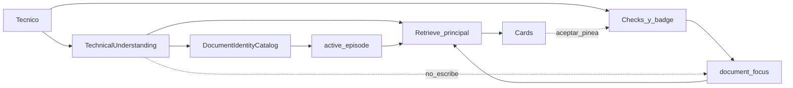

# Field Companion — Document Focus refactor (2026-10-01)

**Estado:** plan refinado. Implementación no empezada.
**Canal:** web autenticado. WhatsApp sigue dormido.
**No reabre:** R1A (`CLOSED — PASS`).
**Refinamiento:** comprensión técnica pre-retrieval. No abre otra compuerta humana.

Este plan separa tres cosas que hoy comparten estado:

```text
Work Context  ≠  Document Focus  ≠  Document Discovery
```

Y, dentro de la búsqueda:

```text
retrieval query  ≠  retrieval scope
```

La query dice qué se está buscando. El scope dice dónde está permitido buscar para esa respuesta. Entender el equipo no cambia los manuales checkeados.

Danebo se comporta como el equipo de ingeniería al que llama un técnico: primero entiende qué equipo y qué problema tiene delante, usando la consulta, lo ya dicho, la foto, los códigos, los designators y el catálogo; después busca en la documentación que corresponde; y sólo pregunta cuando falta un dato que cambiaría la búsqueda o el procedimiento. No le pide al técnico una marca, un modelo o un controlador que ya puede resolver.

El técnico pregunta, ve cuántos manuales tiene seleccionados, y decide él si esa selección cambia. Danebo puede sugerir. No puede cambiar la selección en silencio. La comprensión previa al retrieve puede actualizar el trabajo. No puede pinear, despinear ni reemplazar el focus.

## Cómo se ejecuta

La última vez el comportamiento era consistente con el código y distinto de lo que el técnico esperaba. Este plan no se implementa entero y después se mira en producción.

Hay cinco compuertas. Cada una es un deploy chico y un smoke que una persona hace en [https://danebo.ai](https://danebo.ai) mirando la pantalla. No hace falta abrir logs para decir PASS o FAIL.

| Compuerta | Fases que entran en ese deploy | Qué se comprueba en producción | Si falla |
|---|---|---|---|
| G1 | F1 | Corregir el equipo no cambia los manuales seleccionados | Revertir ese deploy. No se despliega G2 |
| G2 | F2 + F3 + F4 | El número visible es la selección real, y pin/unpin llegan antes de la pregunta | Revertir ese deploy. G1 tiene que seguir pasando |
| G3 | F5 | La respuesta usa exactamente los manuales de ese número | Revertir ese deploy. G1 y G2 siguen pasando |
| G4 | F6 + F7 | Un manual de afuera se ofrece y no se usa hasta que el técnico lo acepta; con badge 0, el manual que ya sostuvo la respuesta se puede ofrecer para seguir | Revertir ese deploy |
| G5 | F8 + F9 + F10 | `NICE3000 E51` busca sin pedir la marca; badge 0 no se mueve solo; el smoke completo sigue pasando | Revertir ese deploy |

Reglas de ejecución:

1. Grok implementa sólo las fases de la compuerta abierta. Una fase, un commit, tests de esa fase, `git diff --check`.
2. Al cerrar la compuerta, se despliega sólo ese corte. No se adelantan fases de la compuerta siguiente en la imagen de producción.
3. Grok se detiene. Una persona hace el smoke de esa compuerta y responde sólo `PASS` o `FAIL`, más lo que vio en pantalla.
4. `FAIL` no abre la compuerta siguiente. Se corrige ese corte o se revierte.
5. Dentro de una fase no hay review de diff como paso rutinario. La revisión humana es el smoke de producto, no el diff.

F2, F3 y F4 viajan juntas porque la columna nueva no se ve sola. F6 y F7 viajan juntas porque una sugerencia que no se puede aceptar no se puede juzgar. La comprensión técnica no es una fase nueva: entra en F8, sobre la llamada Haiku que ya existe y sobre un compositor determinista que corre aunque esa llamada no esté. G4 ya puede ofrecer el manual Monarch desde el catálogo y desde los hits del retrieve. G5 comprueba que la pregunta que llega a buscar ya trae esa identidad, sin pedir la marca y sin mover el badge.

### Handoff de fase

F1–F10 no son recetas congeladas. Al cerrar cada fase, antes de empezar la siguiente:

1. Anotar hallazgos materiales de implementación, tests, producción y del repo real.
2. Compararlos con los supuestos de todas las fases que faltan.
3. Si un supuesto material cambió, actualizar este plan y las fases afectadas. No abrir un plan paralelo.
4. Si ya existe un prompt de ejecución de la fase siguiente, reescribirlo con esos hallazgos.
5. La fase siguiente se ejecuta contra el repo, los commits ya aplicados y los hallazgos. No contra el texto de este archivo tal como estaba antes de F1.
6. No pedir revisión humana por un detalle técnico menor.
7. Parar y pedir revisión sólo si un hallazgo cambia de forma material el comportamiento visible, el ownership de estado, Document Focus, el retrieval scope, la persistencia, el aislamiento de tenant, permisos, el costo o la latencia de forma material, o invalida una fase futura entera.
8. Un ajuste local que conserva estos invariantes se documenta en el plan, se prueba y sigue.

Las compuertas G1–G5 siguen siendo el único stop humano rutinario. El handoff no agrega otra. Un `PASS` de compuerta no se sustituye por este handoff, y un ajuste interno de fase no espera un `PASS` nuevo.

---

## 1. Executive diagnosis

Danebo mezcla en un solo lugar el problema del técnico, los manuales que él ve seleccionados, y la continuidad de la conversación. El lugar es `conversation_sessions.active_entities`, y `ActiveEpisode` lo escribe.

La premisa equivocada está escrita como contrato vigente:

- [docs/ACTIVE_ARCHITECTURE.md](ACTIVE_ARCHITECTURE.md): los pins pertenecen al caso; una corrección de fabricante suelta el pin cuyo nombre contiene la marca vieja.
- [docs/SESSION_AND_RETRIEVAL.md](SESSION_AND_RETRIEVAL.md): “Pins are case state”.
- [app/controllers/pinned_documents_controller.rb](../app/controllers/pinned_documents_controller.rb): los pins se sueltan en un boundary de caso.

Eso produjo el incidente de producción. El técnico tenía Elemont y VF5 seleccionados. Dijo que no era Elemont, que era KONE. El episodio pasó a KONE. R1B sacó el pin Elemont porque el nombre contenía Elemont y no KONE. VF5 no contenía ninguna de las dos palabras, así que quedó. El retrieve siguió en `pin_only` sobre VF5. VF5 es Fermator. La respuesta habló de Fermator.

El fix cumplió el contrato de R1B. El técnico no había pedido soltar Elemont ni quedarse sólo con VF5.

El segundo fallo es de identidad. `config/document_identities.yml` ya tiene el manual Monarch con designators `NICE3000` y `NICE3000new`, confirmado. El ranker de sugerencias sólo arranca si el texto contiene una marca de `ActiveEpisodeTurn::MANUFACTURERS`. Monarch no está en esa lista. La sugerencia no nace. El técnico escribe el controlador que ve en el manual y Danebo no lo conecta con el archivo que ya está en la biblioteca.

El tercer fallo es de comprensión, no de focus. Hay una llamada Haiku antes del retrieve, `Rag::SemanticQueryAnalyzer`, pero no interpreta el problema técnico. Clasifica continuidad (`continue`, `correct`, `switch`, `new`, `unclear`) y devuelve menciones literales. No arma la consulta que Bedrock busca. Con badge `0` el corpus es el correcto y la query puede seguir siendo la frase cruda del técnico. Scope abierto no es lo mismo que query genérica.

Lo que sí está bien y no se tira:

- El episodio como memoria del trabajo: fabricante, modelo, código, objetivo, foto, conflictos, follow-up.
- `expected_episode_id` para que una respuesta o una foto tardía no pisen otro trabajo.
- El piso de historial del episodio.
- R1A: corpus autorizado, `KnowledgeScopePolicy`, un pin que no es un permiso de lectura.
- La sugerencia que no pinea sola, y el aviso de conflicto que hoy dice que el manual sigue enfocado (`rag.pin_conflict`).
- El retrieve con pins no reabre el corpus en silencio cuando no encuentra nada. Eso se conserva. Lo que cambia es quién decide ampliar la selección.

## 2. Current-state evidence

### Quién escribe `active_entities`

| Writer | Dónde | Qué hace |
|---|---|---|
| Click de pin | `PinnedDocumentsController#create` → `ConversationSession#pin_kb_document!` | Alta o refresco de un `user_pin` |
| Click de sugerencia | El mismo `create`, con `document_uid` | Igual, más log `manual_focus_confirmed` |
| Unpin | `destroy` → `unpin_kb_document_id!` | Borra la entrada de esta sesión |
| Upload indexado | `BedrockIngestionJob#auto_pin_document!` | Pinea si `expected_episode_id` sigue siendo el episodio vivo |
| Turno de usuario | `record_user_turn!` mezcla `case_boundary_changes` en el mismo `UPDATE` del episodio | Puede vaciar o filtrar pins |
| Foto sin episodio usable | `ensure_case_for_photo_submission!` | `invalid_state` vacía pins; `expired` aplica el corte de `added_at` |
| Caso nuevo explícito | `start_new_case!` | Vacía pins. No tiene ruta |
| WhatsApp | `SendWhatsappReplyJob` → `EntityExtractorService` | Escribe entidades desde citas. El web no llama a ese servicio |

`case_boundary_changes` en [app/models/conversation_session.rb](../app/models/conversation_session.rb):

- `invalid_state` y decisión `:new_episode`: `active_entities = {}`.
- Episodio expirado: se quedan sólo los pins con `added_at` posterior a `updated_at + 4 horas`.
- Decisión `:corrected`: `pins_after_manufacturer_correction` borra el pin cuyo label contiene el fabricante anterior como palabra y no contiene el nuevo.

Elemont cae en esa última regla. VF5 no. El retrieve de después ve sólo VF5.

### Quién borra pins sin un click

Los cuatro caminos de arriba: `:new_episode`, expiry, `invalid_state`, corrección de fabricante, más `start_new_case!` y el branch de foto. No hay otro delete en el path web.

`FocusNotice` no borra. Lee pins y arma un mensaje.

### Cómo llega el pin de la UI

`rag_chat_controller.js#toggleDocSelection`:

1. Cambia `data-selected` enseguida (optimistic).
2. Mete o saca el nombre del manual en el textarea.
3. `POST /pinned_documents` o `DELETE /pinned_documents/:id`.
4. Si el server falla, revierte check y textarea.

El pin de biblioteca responde `204`. La card responde JSON. Los dos escriben la misma fila de sesión.

La card (`confirmManualFocus`) pinea y cambia el texto del botón. No vuelve a enviar la pregunta.

### Carrera con `/rag/ask`

`sendMessage` no espera el `fetch` del pin. `/rag/ask` lee `active_entities` del servidor. El DOM no viaja en el body.

Secuencias reales:

- Pin y enviar antes de que el POST termine: la UI muestra seleccionado; el ask todavía no lo tiene.
- Unpin y enviar antes del DELETE: la UI ya no lo muestra; el ask todavía lo filtra.
- Corrección de fabricante: el server suelta el pin; la lista en pantalla sigue marcada hasta un reload.
- Auto-pin de upload: el pin existe antes de que `refreshDocuments` vuelva a pintar el check.

### Cómo se mezclan pins, historial y episodio

`SessionContextBuilder.build` arma tres bloques de prompt: Session Focus (los pins), Recent Conversation (piso del episodio si las flags están on), y Session Discipline si hay pins e historial. Después antepone `## Active Field Problem` desde `active_episode`. Ese bloque dice que no es evidencia documental. El filtro de retrieval no lo lee: lo lee `entity_s3_uris`, que saca `source_uri` de `active_entities` sin mirar el episodio.

### Cómo `resolve_retrieval_scope` usa los pins

En [app/controllers/concerns/rag_query_concern.rb](../app/controllers/concerns/rag_query_concern.rb):

- Cero URIs → `reason: open`, sin filtro de documento.
- Una o más → `reason: pin_only`, `force_entity_filter: true`, esas URIs.

Antes de eso, `resolve_pinned_scope` puede dejar una sola URI si `PinnedEntityScopeResolver` encuentra un único ganador entre varios pins. Un badge de 2 puede consultar 1. El técnico no ve ese recorte.

`selection_turn?` es verdadero cuando el texto de la pregunta, normalizado, es igual al nombre o a un alias de un pin. `selection_gate?` entonces no llama al modelo y responde `rag.selection_turn_prompt`. Eso existe porque el toggle escribe el nombre en el textarea.

`inherit_episode_scope` y `auto_scope_uris_from` ya devuelven vacío. El auto-scope viejo de WhatsApp no es el bug actual.

### Paths de auto-pin

1. Upload, `BedrockIngestionJob`, condicionado al episodio.
2. No hay auto-pin desde una cita, una sugerencia, ni un match de `KbDocumentResolver`. El comentario del concern lo dice: un match de catálogo no es un pin.

### Cards, textarea, badge

- Card: `ManualCandidateRanker` sobre `DocumentIdentityCatalog`. No retrieve. No escribe pins. Máximo 3 cards. Si no hay marca en `MANUFACTURERS`, `chat_payload` es nil.
- Textarea: `_updateTextareaWithDocName`.
- Badge: `updateSourcesBadge` cuenta `[data-selected="true"]` únicos. Si el conteo es 0, `display: none` y el texto queda vacío. El único nodo es el tab móvil Archivos en [app/views/home/_chat_box.html.erb](../app/views/home/_chat_box.html.erb). El panel desktop ([app/views/home/_documents_summary_box.html.erb](../app/views/home/_documents_summary_box.html.erb)) no tiene número. El conteo es DOM, no el server. Home pinta el check inicial desde `SessionContextBuilder.entity_s3_uris`.

### Discrepancias posibles

| Lo que ve el técnico | Lo que usa `/rag/ask` | Causa en el código actual |
|---|---|---|
| Seleccionado | No seleccionado | Pin todavía en vuelo; o el server soltó el pin y la lista no se recargó |
| No seleccionado | Seleccionado | Unpin en vuelo; auto-pin de upload antes del refresh |
| Un manual que no ve como filtro | Ese manual en `pin_only` | Corrección que deja VF5; o estrechamiento N→1 que no se dibuja |

### Identidad hardcodeada y catálogo reusable

- `ActiveEpisodeTurn::MANUFACTURERS`: fuji yida, thyssenkrupp, thyssen, tke, otis, kone, schindler, mitsubishi, orona, hyundai, fermator, blt, elemont. Sirve para detectar corrección y para el ranker.
- `KbDocumentResolver::BRANDS`: otis, kone, thyssen, tke, blt, mitsubishi, fuji, yida, schindler, fermator, hyundai, orona. Sirve para no tratar una marca pelada como token específico. No incluye Monarch ni Elemont.
- `DocumentIdentityCatalog`: YAML versionado, no se consulta para armar el filtro. La entrada Monarch ya está: `display_name: Manual_monarch_Español_3000+`, brands `MONARCH`, designators `NICE3000` y `NICE3000new`, `confirmed: true`, `evidence_text: Suzhou MONARCH Control Technology Co., Ltd.`
- `KbDocument` ya tiene `display_name` y `aliases`. El resolver matchea eso en SQL. Hoy ese match no ofrece el manual ni escribe el episodio si la marca no está en la lista.
- `ActiveEpisode` guarda `manufacturer`, `model`, `fault_code`. No hay hecho `controller`.
- `NoHardcodedEquipmentTest` congela los literales. Este plan no agrega Monarch a una lista de código.

### Llamada LLM pre-retrieval (la que ya existe)

No se inventa un servicio nuevo. La llamada es `Rag::SemanticQueryAnalyzer`.

| | Hoy |
|---|---|
| Clase | `Rag::SemanticQueryAnalyzer` |
| Modelo | `global.anthropic.claude-haiku-4-5-20251001-v1:0`, temperature 0, `max_tokens` 300 |
| Prompt | Percepción semántica de un turno. Dice explícitamente que no es autoridad técnica, no responde el procedimiento y no inventa strings |
| Tool | `semantic_perception` |
| Output | `Rag::ConversationalTurnAnalysis`: `relation` (`continue`, `answer_pending`, `correct`, `switch`, `new`, `unclear`), `mentions` (`span` + `role` `equipment` / `component` / `other`), `refers_to`, `ambiguous` |
| Validación | Cada `span` tiene que ser substring literal del turno. Una paráfrasis o un “Monarch” que el técnico no dijo es `hallucinated_spans` y el análisis se tira |
| Flag | `HAIKU_QUERY_ANALYSIS_MODE`. Default del código: `off`. `shadow` observa y no escribe. `conditional` sí puede decidir `switch` y `correct`. `always` parsea y no llama. El valor de producción no está en `config/deploy.yml` |
| Gate | `gated?` exige `episode_id`, `pending_fact` o `active_photo`. El primer mensaje de un chat vacío no llama a Haiku |
| Consumidores | `shadow`: `RagController#observe_semantic_shadow` arma el objeto y `RagQueryConcern#ignore_shadow_analysis` lo descarta. `conditional`: `ActiveEpisodeTurn#apply_owned_slice` vía `observe_ownership`. Sólo aplica `switch` y `correct`. No compone la query |
| Relación con el episodio | El estado que ve el modelo es manufacturer, model, goal y pending. No ve controller, pins ni catálogo |
| Relación con el rewrite | Ninguna. `FollowupQueryRewriter` y `compose_text` no leen este objeto |
| Qué no devuelve | fabricante resuelto, modelo, controlador, código, síntoma, query normalizada, ambigüedad de procedimiento, ni `ready` / `clarify` |

`Rag::QueryEntities.analyze` es otro extractor, determinista, para el selector de evidencia en sombra. Deja `manufacturer`, `model` y `board` en nil. No es la query que va a Bedrock.

### Qué texto llega hoy al retrieve

1. El texto del técnico se queda en `question` para locale, labels de pin y el exclude del episodio.
2. `effective_question`, en `RagQueryConcern`, es lo que siguen el orquestador y `BedrockRagService`.
3. Si el turno del episodio manda (`FieldCompanionTurnFlag` y la decisión no es `:no_episode` ni `:skipped`), `effective_question` es `ActiveEpisodeTurn::Result#composed`, o el texto crudo si `composed` viene vacío.
4. `composed` lo arma Ruby: goal vigente, manufacturer y model ya persistidos, y el turno visible. En una corrección, la frase que niega la marca vieja no se manda. Tope 442 caracteres.
5. Si el episodio no manda, `FollowupQueryRewriter` sólo reescribe un follow-up corto que sea un identificador de catálogo: pega la pregunta anterior y el identificador. Si no, el texto es el del técnico. El menú de hilo puede sustituirlo cuando su flag está on; el chat no publica ese menú.
6. `BedrockRagService#query` manda ese string en `input.text` y en `retrieval_query.text`. El filtro de URIs viaja aparte (`entity_s3_uris`, `force_entity_filter`).
7. `SessionContextBuilder` no es la query. Es un bloque del prompt de generación: problema del episodio, pins y historial. No agrega ni quita URIs.

Partes literales del técnico: el turno, y el goal cuando el turno anterior se guardó como goal. Partes compuestas: manufacturer/model ya escritos en el episodio, y el identificador de un follow-up corto. No hay una query técnica estructurada. Una query enriquecida que diga `KONE` mientras el focus sigue siendo Elemont es válida como texto de búsqueda dentro de Elemont. No puede convertirse en filtro de manuales KONE.

## 3. Product contract

El técnico no tiene que entender sesiones, episodios, scopes ni flags.

**Work Context** es lo que conviene recordar para el próximo turno: fabricante, modelo, controlador, código de falla del trabajo, objetivo, foto. No es un volcado de la consulta. Un síntoma (“no nivela”), un tema (“calibración del encoder”) o la query armada para este retrieve viven sólo en el turno. Cambia cuando el técnico habla o manda una foto, y cuando el catálogo confirma una identidad a partir de un designator que él dijo. Sirve para “¿y después?”, “K1”, “esa placa”. No modifica Document Focus.

**Document Focus** es exactamente los documentos con check en la lista. Cero documentos no significa búsqueda sin contexto. Significa que el técnico no impuso un manual. El scope es todo el KB autorizado. La query puede ser precisa: identidad, código, síntoma, aliases. Uno: sólo ese. N: sólo esos N. Pin y unpin son clicks visibles. No hay pin oculto. Ni un episodio nuevo, ni una corrección, ni un expiry, ni un `invalid_state`, ni la llamada pre-retrieval cambian el focus.

**Document Discovery** ofrece manuales. Con focus `0`, los hits del retrieve principal sí son evidencia, porque ese es el scope, y después pueden ofrecerse para quedar seleccionados. Con focus `N`, un manual de afuera se ofrece y no se cita hasta que el técnico acepta. Si acepta, el check aparece, el número cambia, y Danebo repite sola la misma pregunta con el focus nuevo.

**Technical understanding** es de este turno. Separa identidad (“¿de qué equipo o documentación hablamos?”) y problema (“¿qué pasa o qué quiere hacer?”). Identidad: fabricante, modelo, controlador, familia, alias, designator. Problema: código, síntoma, componente, medición, procedimiento, objetivo. Las dos alimentan el Work Context sólo cuando el dato sirve al turno siguiente, la query, y el discovery. Ninguna escribe el focus.

No es un formulario. No se piden siempre marca, modelo, controlador y falla. Se extrae primero lo que ya está en la frase, el episodio, la foto o el catálogo. Se pregunta sólo el discriminator que cambiaría el procedimiento. `NICE3000 E51` no pregunta la marca si el catálogo resuelve Monarch. `No funciona` puede preguntar. Si la foto ya leyó `KONE / LCE / 0026`, no se vuelve a pedir.

Subir un archivo propio es un acto del técnico. Cuando termina de indexarse puede quedar seleccionado, porque él lo mandó, y el check tiene que verse antes de la siguiente pregunta. Si el refresh de la lista falla, esa pregunta no sale hasta que la selección en pantalla coincida con el server.

## 4. Target architecture

### Work Context

- Responsabilidad: continuidad del trabajo.
- Autoridad: lo que el técnico dijo y lo que se leyó en la foto, con la misma distinción de fuente que ya tiene el episodio.
- Quién lo modifica: `ActiveEpisodeTurn` en el turno web, la observación de foto, el turno del asistente, y el compositor técnico cuando el catálogo confirma un hecho persistible. Los writes tardíos de foto y asistente siguen exigiendo `expected_episode_id`.
- Persistencia: `conversation_sessions.active_episode`. Hechos que se guardan: `manufacturer`, `model`, `controller`, `fault_code`, `goal`, identificadores de catálogo, foto y conflictos. No se guardan síntomas, la query de este turno, ni la lista de discriminators que faltan.
- No puede modificar: `document_focus`, los checks, ni el badge.

### Document Focus

- Responsabilidad: el filtro principal de retrieval y el número que se ve.
- Autoridad: la pantalla. El server persiste lo que el click ya confirmó.
- Quién lo modifica: `PinnedDocumentsController` (lista y card), y el auto-pin de un upload de este técnico, seguido del refresh de la lista.
- Persistencia: columna jsonb nueva `conversation_sessions.document_focus`. Un array de `{ kb_document_id, source_uri, display_name, added_at }`. Tope: el mismo `MAX_ENTITIES` (10).
- No puede modificarlo: `record_user_turn!`, `case_boundary_changes`, expiry, corrección, `start_new_case!`, `ensure_case_for_photo_submission!`, `EntityExtractorService`, `SemanticQueryAnalyzer`, ni el compositor de la query.

### Document Discovery

- Responsabilidad: candidatos fuera del focus, con nombre de manual visible.
- Autoridad: nadie, hasta el click. El click entra por Document Focus.
- Quién lo modifica: nadie lo persiste como selección. El payload de la respuesta trae las cards. Aceptar llama al pin.
- Persistencia: ninguna columna. El episodio no guarda “sugeridos” como si estuvieran seleccionados.
- No puede modificar: la evidencia citada cuando el focus es `N`. Con focus `0` no hay “afuera”: los hits del retrieve principal pueden citarse y, además, ofrecerse como futuro focus.
- No escribe el focus hasta el click.

### Technical understanding

No es un cuarto almacén. Es el paso que ya existe, ampliado, más un compositor en Ruby.

- Responsabilidad: leer el turno y dejar una query técnica y una decisión de si buscar, buscar y preguntar, o preguntar primero.
- Autoridad del lenguaje: `SemanticQueryAnalyzer`. Sigue sin inventar strings. Un span que no está en el turno se descarta.
- Autoridad de la identidad: `DocumentIdentityCatalog` y aliases de `KbDocument`. El modelo no es quien sabe que NICE3000 es Monarch.
- Autoridad del scope: `document_focus`. Este paso no lo lee para escribirlo. Puede leerlo sólo para no contradecir el filtro.
- Quién lo ejecuta: el mismo turno que hoy llama al analyzer, dentro de `record_user_turn!` / `ActiveEpisodeTurn`, antes de armar `composed`. Si el flag está `off`, el gate no deja pasar, o Haiku devuelve nil, el compositor determinista igual corre. `NICE3000 E51` no depende de que el modo Haiku esté encendido.
- Persistencia: ninguna estructura nueva en la base. Los hechos persistibles se escriben en `active_episode` con las reglas de arriba. El resto viaja en el resultado del turno, igual que `composed` hoy, y muere con el request.
- No puede modificar: `document_focus`.

Contrato del turno, un value object de ese request. No hace falta que el JSON sea éste; los campos sí:

```text
identity:        manufacturer, model, controller, designators, aliases
                 cada valor trae source: user | photo | catalog | episode
problem:         fault_code, symptoms, component, procedure
goal:            texto corto del trabajo, el mismo concepto que active_episode.goal
retrieval_query: string que Bedrock recibe en retrieval_query.text
missing:         como mucho un discriminator, o ninguno
decision:        ready | search_and_clarify | clarify_first
```

`source=catalog` sólo aparece si una entrada confirmada del YAML (o un alias unívoco) ata el designator que el técnico dijo. Si hay empate, `manufacturer` queda vacío y `missing` no se rellena con una marca adivinada: se ofrecen hasta 2 manuales.

Decisiones, evaluadas en Ruby después del catálogo, no delegadas al modelo:

- **ready.** Hay señal fuerte para buscar: designator de catálogo, identidad ya guardada en el episodio o en la foto, o código más componente. `NICE3000 E51, ¿qué reviso?` es ready. No se pregunta la marca. Flujo: comprensión, enriquecimiento de catálogo, retrieve. El scope no cambia.
- **search_and_clarify.** Hay un síntoma o un procedimiento con el que el corpus puede ayudar, y falta un discriminator. `No nivela al llegar al piso.` busca en el scope actual, responde sólo con lo encontrado, y cierra con una pregunta corta: “Para llevarte al procedimiento exacto, ¿sabes qué controlador o modelo tiene?”. La pregunta no bloquea la respuesta. No se pide la marca si el controlador ya se resolvió.
- **clarify_first.** No hay parámetro, código, componente, designator, foto, episodio ni manual seleccionado. `¿Cómo ajusto este parámetro?` en frío, con badge `0`. Se pregunta “¿Qué parámetro estás viendo y en qué controlador o equipo?” y no se llama a `RetrieveAndGenerate`. Si en el mismo turno aparece un designator de catálogo, o el badge es mayor que 0, esta decisión no puede ganar: el manual checkeado ya es contexto, y se busca ahí.

La pregunta de clarify usa prosa. Si el hueco es `manufacturer`, `model`, `controller` o `fault_code`, se puede guardar en el `pending_question` que ya existe, ampliado con `controller`. No se abre un formulario de cuatro campos.



`composed` sigue siendo el string de retrieve. Pasa a salir de `retrieval_query`, no de una concatenación ciega de goal + marca. Esa string no agrega URIs.

## 5. State ownership matrix

| State | Source of truth | Writer | Reader | Visible to technician |
|---|---|---|---|---|
| manufacturer | `active_episode.facts.manufacturer` | Turno del técnico o foto | Prompt de Work Context, sugerencias | Sólo si Danebo lo usa para hablar del equipo o para ofrecer manuales. No es un control |
| model | `active_episode.facts.model` | Turno del técnico o foto | Igual | Igual |
| controller | `active_episode.facts.controller` | Turno, cuando el catálogo reconoce un designator de controlador | Sugerencias e identidad | Igual |
| fault_code | `active_episode.facts.fault_code` | Turno del técnico | Follow-up y prompt | En la conversación, no como estado interno |
| goal | `active_episode.goal` | Turno del técnico | Follow-up | La conversación |
| active_photo | `active_episode.active_photo` | Foto con `expected_episode_id` | Respuesta de foto | La foto y el botón de reutilizarla |
| pinned documents | `document_focus` | Pin, unpin, aceptar card, auto-pin de upload propio | Lista, badge, `resolve_retrieval_scope` | Checks |
| suggested documents | Payload de esa respuesta. No se guardan como pins | Ranker / discovery | La burbuja | Cards con nombre del manual |
| recent conversation | `conversation_history` con piso del episodio | Turnos | Prompt | El chat |
| selected count | `document_focus.length` | El mismo writer del focus | Badge desktop y mobile | El número, siempre, incluido 0 |
| retrieval query | Resultado del turno. No se persiste | Compositor técnico | `effective_question` → `retrieval_query.text` | No. El técnico ve la respuesta, no la query |
| decision ready / search_and_clarify / clarify_first | Resultado del turno. No se persiste | Compositor, después del catálogo | Concern: llama o no a Bedrock, y si agrega una pregunta | La pregunta corta, cuando existe. La etiqueta no |
| symptoms, procedure, aliases de este turno | Resultado del turno. No se persiste | Analyzer, sólo spans literales, más términos del catálogo | Query y discovery de este turno | No como estado |

`active_entities` deja de ser el focus del web. La columna puede quedar hasta F9 para no romper el job de WhatsApp dormido. El web no la lee para retrieval ni para pintar checks.

## 6. Human journeys

El número de cada paso es el badge. El texto de Danebo es el copy objetivo, no el copy viejo de `selection_turn_prompt`.

### Journey A — 0 pins, respuesta global, ofrecer focus

1. El técnico abre el chat. No hay checks. Badge `0` en el tab Archivos y en el panel de documentos de desktop.
2. Escribe: “¿Qué reviso si no nivela?” y envía.
3. Danebo busca en el KB autorizado y responde con fuentes. El badge sigue `0`.
4. Si hay manuales claramente más útiles para seguir, Danebo agrega: “Encontré que estos manuales parecen especialmente relevantes para seguir trabajando. ¿Quieres que los deje seleccionados?” y muestra los nombres. Esos manuales no están checkeados.
5. Si acepta uno, ese check aparece, el badge pasa a `1`, y Danebo repite sola “¿Qué reviso si no nivela?” usando ese manual.

### Journey B — N pins, respuesta, y un manual extra

1. Badge `2`. Elemont y otro manual están checkeados.
2. Pregunta: “¿Cómo ajusto estos resortes?”
3. Danebo responde con lo que está en esos dos. Las fuentes son de esos dos.
4. Si afuera hay algo útil: “En los manuales seleccionados encontré X. Además, hay información potencialmente útil en `Manual Y`. ¿Quieres que lo agregue para ampliar?”
5. `Manual Y` no aparece como fuente de esa respuesta. Badge sigue `2` hasta el click.

### Journey C — N pins, no alcanza, discovery, agregar, retry

1. Badge `1`. El manual seleccionado no trae el dato.
2. Danebo dice: “No encontré la respuesta en los manuales seleccionados. Encontré información relacionada en `Manual Y`. ¿Quieres que lo agregue y vuelva a buscar?”
3. No rellena el hueco con `Manual Y` en esa misma respuesta.
4. Si acepta: check de `Manual Y`, badge `2`, y la misma pregunta sale sola. La respuesta nueva puede citar `Manual Y`.

### Journey D — “No es Elemont, es KONE”

1. Badge `2`: Elemont y VF5 checkeados.
2. Escribe: “No, no es Elemont. Es KONE.”
3. Danebo actualiza el trabajo a KONE. Los dos checks siguen. Badge `2`.
4. Puede decir: “Ahora indicas que el equipo es KONE, pero tienes documentos de otro equipo seleccionados. Encontré documentación KONE relevante. ¿Quieres que cambie o amplíe la selección?”
5. Si no toca nada, la siguiente pregunta sigue usando Elemont y VF5.
6. “Cambiar” deja sólo los KONE que aceptó. “Ampliar” los suma. El badge cambia cuando el click terminó, y la pregunta se repite.

### Journey E — Monarch / NICE3000 con Elemont pineado

1. Badge `1`: Elemont checkeado.
2. Escribe: “Es Monarch / NICE3000.”
3. Elemont sigue checkeado. Badge `1`.
4. Danebo reconoce esa identidad porque el catálogo ya tiene brand `MONARCH` y designator `NICE3000` en `Manual_monarch_Español_3000+`. No porque alguien haya agregado Monarch a `MANUFACTURERS`.
5. Ofrece ese manual por su nombre visible: “Encontré un manual de Monarch NICE3000. ¿Quieres que lo agregue para ampliar?”
6. Hasta el click, la respuesta no se apoya en ese manual.

### Journey F — pin y pregunta inmediata

1. Badge `0`.
2. Toca un manual. El check aparece. El textarea no recibe el nombre del archivo.
3. El envío no sale hasta que el POST del pin respondió bien.
4. Escribe “¿Dónde está este parámetro?” y envía. Badge `1` antes de la respuesta.
5. La respuesta usa ese manual. No aparece “Seleccionaste ese documento. ¿Seguimos con tu consulta anterior…?”.

### Journey G — unpin y pregunta inmediata

1. Badge `1`.
2. Toca el mismo manual. El check se va.
3. El envío espera al DELETE.
4. Pregunta enseguida. Badge `0`. La respuesta no filtra por ese manual.

### Journey H — mobile

El mismo pin y unpin, en el tab Archivos. El badge del tab es el mismo número que desktop para la misma sesión. Un pin hecho en el teléfono se ve al recargar en desktop, y al revés.

### Journey I — identidad fuerte, sin pregunta de más

1. Badge `0`. No hay episodio previo.
2. Escribe: “NICE3000 E51, ¿qué reviso?”
3. Danebo no pregunta “¿cuál es la marca?”. El catálogo ata `NICE3000` a Monarch. La query de retrieve lleva ese controlador, el código y el verbo de diagnóstico. El scope sigue siendo todo el KB autorizado.
4. Responde con fuentes. Badge `0`.
5. Si ofrece un manual, es el de NICE3000 / Monarch. Sigue sin check hasta el click.

### Journey J — identidad débil, evidencia global útil

1. Badge `0`. Escribe: “No nivela al llegar al piso.”
2. No inventa un equipo. Busca en el KB autorizado.
3. Responde sólo con lo que encontró. Badge `0`.
4. Puede cerrar con una sola pregunta: “Para llevarte al procedimiento exacto, ¿sabes qué controlador o modelo tiene?”
5. Esa pregunta no reemplaza la respuesta. Si no hay evidencia, lo dice y pregunta. No fabrica un procedimiento.

### Journey K — consulta insuficiente

1. Badge `0`. Chat sin foto, sin equipo y sin parámetro nombrado.
2. Escribe: “¿Cómo ajusto este parámetro?”
3. Danebo pregunta: “¿Qué parámetro estás viendo y en qué controlador o equipo?”
4. No llama al retrieve generativo. Badge `0`. No ofrece un manual adivinado.

### Journey L — la foto ya dio la identidad

1. La foto quedó leída como KONE / LCE. Eso está en el trabajo, no en los checks. Badge `0`.
2. Escribe: “¿Qué reviso ahora?”
3. Danebo no vuelve a pedir marca ni modelo. La query usa KONE y LCE más el problema ya dicho. El scope sigue global si el badge es `0`.
4. Si el técnico tenía Elemont checkeado, el scope sigue siendo Elemont. La query puede nombrar KONE para buscar dentro de ese manual y concluir que ahí no está. Los checks no se mueven.

## 7. Architecture options and chosen approach

### Opción A — seguir en `active_entities` y quitarle el caso

Se borran los writes de `case_boundary_changes`, foto y `start_new_case!`. Los clicks siguen en el hash actual.

- Complejidad baja. El primer incidente se puede corregir en un diff corto.
- Migración nula.
- Tests: hay que invertir los que hoy exigen soltar pins.
- UX correcta mientras nadie vuelva a escribir el hash desde el episodio.
- El riesgo es estructural: `record_user_turn!` ya mete el boundary en el mismo `UPDATE` que el episodio. El bug fue ese método, no la falta de una tabla.
- Multi-usuario futuro: el hash sigue atado a la fila de sesión. Igual que hoy. No mejora ni empeora un hilo nuevo.

### Opción B — `document_focus` jsonb, aparte del episodio

Columna nueva en `conversation_sessions`. El episodio no tiene un argumento para escribirla. Backfill: cada entrada de `active_entities` con `source == "user_pin"` y `kb_document_id`.

- Complejidad media. Una migración, lectores nuevos, el pin deja de escribir el hash viejo.
- Riesgo de migración: un pin sin `kb_document_id` no se copia. Esos pins no se pueden pintar ni filtrar con seguridad; el backfill los deja fuera y el smoke de G2 los cuenta como no seleccionados. No se inventa un id.
- Tests: el focus se asserta en la columna, y un test de arquitectura impide que `case_boundary_changes` asigne esa columna.
- UX: el número, el check y el filtro leen el mismo array.
- Multi-hilo: no hace falta. Una fila de sesión, un focus. Una tabla join sería un segundo modelo sin un segundo hilo que lo use.

### Elección

Opción B.

La opción A corrige el incidente y deja el mismo método que lo causó a un `merge!` de distancia. No hay clientes activos. Una columna jsonb es el corte más chico que hace falso “el caso escribe los pines” sin abrir multi-thread.

F1 igual se hace primero sobre el hash actual, y se despliega sola (G1). Así el incidente se juzga antes de la migración. F2 mueve el almacenamiento. Si G1 falla, no se construye la columna.

## 8. Refactor map

| Archivo | Hoy | Objetivo | Acción |
|---|---|---|---|
| `ConversationSession` | Pins y episodio en el mismo update | `document_focus` sólo por pin/unpin/upload | Cambiar en F1 y F2 |
| `ActiveEpisode` / `ActiveEpisodeTurn` | Hechos manufacturer/model/fault_code; `composed` es goal + marca + turno; `:new_episode` y `:corrected` disparan release | Sigue clasificando continuidad. `composed` pasa a ser `retrieval_query`. `controller` y decisión ready/clarify en F8. No toca focus | Conservar, cambiar en F1 el release y en F8 la query |
| `SessionContextBuilder` | Focus de prompt y URIs desde `active_entities` | URIs y bloque “manuales seleccionados” desde `document_focus`. El bloque de problema sigue saliendo del episodio y no lista pines | Cambiar en F2 y F5 |
| `RagQueryConcern` | `pin_only`, estrechamiento N→1, `selection_gate`; descarta el análisis shadow | Filtro igual al focus. `effective_question` es la retrieval query y no aporta URIs. `clarify_first` no llama a Bedrock | Cambiar en F3, F5 y F8 |
| `RagController` | Arma sugerencia y `pin_conflict` | Sugerencia fuera del focus; copy de ampliar o cambiar; no cita al candidato | Cambiar en F6 y F7 |
| `PinnedDocumentsController` | Escribe `active_entities` | Escribe `document_focus`. Misma autorización | Cambiar en F2 |
| `rag_chat_controller.js` | Optimistic, textarea, badge oculto en 0, card sin retry | Espera al pin, no toca el textarea, badge siempre, retry al aceptar | Cambiar en F3, F4, F7 |
| `home/_chat_box.html.erb`, `_documents_summary_box.html.erb`, filas de docs | Check desde URIs; badge sólo mobile | Mismo número en los dos layouts | Cambiar en F4 |
| `HomeController#pinned_uris_for_current_session` | URIs de `active_entities` | Ids/URIs de `document_focus` | Cambiar en F2 |
| `SemanticQueryAnalyzer` | Tool de relación y spans literales. No arma la query. El primer turno con episodio vacío no llama | Misma llamada y el mismo tope de tokens. El tool puede marcar rol de la mención y un síntoma literal. Sigue sin canonizar marcas. Si el flag está off, no es obligatorio para NICE3000 | Cambiar en F8. No es una segunda llamada |
| `ManualCandidateRanker` | Exige `MANUFACTURERS` | Marcas y designators del catálogo, aliases, y con badge 0 los documentos ya citados en el retrieve principal | Cambiar en F6 |
| `DocumentIdentityCatalog` | Identidad versionada, fuera del filtro | Sigue siendo la fuente de brand/designator. No se duplica en código | Conservar, consultar en F6 y F8 |
| `FocusNotice` | Avisa y no suelta el pin | El aviso ofrece cambiar o ampliar, con el manual encontrado | Cambiar copy en F6 |
| `BedrockIngestionJob` | Auto-pin al episodio | Auto-pin al `document_focus` del upload de este técnico, y la UI lo muestra | Cambiar en F2 |
| `EntityExtractorService`, `SendWhatsappReplyJob` | Escriben `active_entities` | Intactos. El web no los lee | Conservar |
| `QueryOrchestratorService` / `BedrockRagService` | `retrieval_query.text` es el string que les pasan; el filtro de URIs va aparte | Igual. No se les enseña a mezclar query y scope. `clarify_first` no llega a `query` | Conservar contrato, no rehacer |
| `QueryEntities` | Extractor determinista del selector en sombra. No alimenta el retrieve vivo | Sigue en la sombra. No es el contrato de understanding | Conservar |
| `FollowupQueryRewriter` | Follow-up corto de identificador | Sigue para ese shape. No pisa una `retrieval_query` ya armada por el compositor | Conservar, ajustar el orden en F8 |
| Tests de caso, pin, concern, ranker, controller, JS si existen | Varios fijan el release de pins | Fijan el contrato nuevo | Cambiar en la fase que toca el comportamiento |
| `R1B_CASE_PROBE` | Loguea `pins_before` / `pins_after` | Sigue. `pin_release_reason` deja de ocurrir por corrección o boundary | Conservar el log |

`current_procedure` se sigue limpiando con el boundary. No tiene lector de producto. No se usa para focus.

## 9. Removal / deprecation map

| Pieza | Decisión | Por qué |
|---|---|---|
| Release de pins en `:new_episode` | Quitar en F1 | Un trabajo nuevo no es un unpin |
| Release por corrección de fabricante | Quitar en F1 | Es el incidente Elemont / VF5 |
| Release por expiry del episodio | Quitar en F1 | El focus no caduca con las 4 horas. La fila de 30 días, al destruirse, se lleva el focus entero: al volver, badge `0`. Eso es fin de workspace, visible |
| Release por `invalid_state` | Quitar en F1 | Un episodio ilegible no borra checks |
| `start_new_case!` vaciando pins | Dejar de vaciar focus en F1. El método puede seguir abriendo episodio | No tiene UI. Un botón futuro tiene que preguntar |
| `_updateTextareaWithDocName` | Quitar en F3 | El check no es una frase |
| `selection_gate?` / prompt de selección | Quitar en F3 | Existía por el textarea. Nombrar un manual pineado es una pregunta, no un rechazo |
| `resolve_pinned_scope` en el camino principal | Quitar en F5 | N visibles son N en el retrieve |
| `active_entities` como focus web | Dejar de leer y escribir en el web en F2. Columna y writer de WhatsApp se quedan | WhatsApp dormido no se migra en este plan |
| `MANUFACTURERS` como puerta del ranker | Dejar de usarla para sugerir en F6 | El catálogo ya tiene Monarch |
| `MANUFACTURERS` como detector del episodio | En F8 pasa a semilla de respaldo. Las marcas del catálogo también cuentan. No se borra la constante en este plan | Los tests de corrección KONE/Elemont siguen teniendo esas palabras en código. No se agregan marcas nuevas |
| `EntityExtractorService` | Conservar | No corre en el web |
| Auto-pin de upload | Migrar a `document_focus` | El técnico subió ese archivo. Tiene que verse seleccionado |
| `FocusNotice` | Migrar el copy | Sigue sin escribir pins |
| R1A, piso de historial, `expected_episode_id`, foto | Conservar | No son el foco de este plan |

## 10. Discovery design

El retrieve principal obedece al focus. La query puede ir enriquecida en los dos casos. Enriquecer no agrega URIs.

- Badge `0`: corpus autorizado de hoy (`account_filter` / R1A). Las citas de esa respuesta pueden ser de cualquier manual autorizado. Eso no es contaminación: no hay focus. La query no es genérica por eso. “No me nivela y marca E51” con `controller=NICE3000` ya en el trabajo busca algo como “Monarch NICE3000 E51 nivelación”, en todo el KB autorizado.
- Badge `N`: sólo las URIs de `document_focus`. Un miss sigue siendo ausencia en esos manuales. No se reabre el corpus dentro de la misma generación. Si el trabajo dice KONE y el check es Elemont, la query puede nombrar KONE para buscar dentro de Elemont. El filtro sigue siendo Elemont.

De dónde salen las cards:

- Badge `0` y la respuesta citó documentos: los `kb_document_id` de esas citas, autorizados, son la primera señal. No hace falta un segundo `Retrieve`. Copy: “La evidencia más relevante apareció en este manual. ¿Quieres dejarlo seleccionado para seguir trabajando sobre él?” Un caso como “Falla 37, cierra puerta y vuelve a abrir”, sin fabricante, puede ofrecer el manual de fault codes que el propio retrieve trajo, si ese hit es claro. Si los hits se reparten entre manuales distintos sin uno dominante, no se ofrece nada.
- Badge `0` y además el catálogo reconoce un designator en la query: se puede ofrecer ese manual aunque el hit ranking esté empatado, con el mismo tope de 2 cards.
- Badge `N` y la respuesta encontró algo dentro del focus: ranking de catálogo, sin segundo `Retrieve`. Ofrece ampliar sólo si el candidato no está en el focus y el match es designator exacto, o la identidad del trabajo contradice los manuales seleccionados. Esos candidatos no entran a `citations`.
- Badge `N` y la respuesta primaria se abstiene: un `Retrieve` directo, no `RetrieveAndGenerate`, `top_k` 3, filtro de cuenta, excluyendo las URIs del focus. Los hits se traducen a `KbDocument` autorizados y se muestran como cards. Sus chunks no entran al prompt ni a las citas de la respuesta que ya dijo que no alcanzó. Si no hay candidato, se dice que no alcanzó y no se inventa un manual.

`clarify_first` no corre discovery: no hubo retrieve que rankear, y no se inventa un manual para disimular la pregunta.

Cuántos: máximo 2 cards. Un empate muestra las dos y no elige. No hay retry hasta que el técnico toca una.

Dedup: por `kb_document_id`. Lo ya seleccionado no se ofrece.

No sugerir:

- marca genérica cuando el focus ya cubre esa marca y no hay designator;
- un documento que no pasa `KnowledgeScopePolicy`;
- más de un candidato débil para “llenar” la burbuja.

Conflicto entre el trabajo y los checks: el texto ofrece cambiar o ampliar. Cambiar, en la card, reemplaza el focus por el manual aceptado. Ampliar lo agrega. Las dos acciones son botones distintos. Ninguna corre sola.

Costo: el `Retrieve` extra existe sólo en la abstención con focus no vacío. El resto es el ranker que ya corre, sin Bedrock.

## 11. Identity / catalog strategy

Tres pasos, y no se mezclan:

```text
SemanticQueryAnalyzer  → spans literales y el tipo de problema
DocumentIdentityCatalog, aliases, metadata  → identidad
Retrieve  → evidencia
```

El modelo puede decir que en “Tengo un NICE3000 con E51” hay un designator `NICE3000` y un código `E51`, porque esas cadenas están en la frase. No escribe `manufacturer=MONARCH`. Eso lo escribe el catálogo si la entrada confirmada tiene una sola brand. Si Haiku está apagado o el turno es el primero y el gate viejo no llamaría, el mismo orden lo hace el compositor con el designator en el texto. `NICE3000` no espera a que alguien prenda el flag.

No se amplía `MANUFACTURERS` para Monarch.

Orden de grounding, determinista:

1. Designators del `DocumentIdentityCatalog` contra el texto y contra los spans aceptados (`NICE3000` matchea la entrada Monarch).
2. Brands de ese mismo YAML (`MONARCH`), sólo si el técnico las dijo o ya estaban en el episodio o en la foto.
3. `display_name` y `aliases` de `KbDocument` autorizados, vía el resolver que ya existe.

Si un designator apunta a una sola entrada confirmada, eso es controlador o modelo según el designator, y la brand de esa entrada es el fabricante. `NICE3000` escribe `controller` en el episodio. `MONARCH` escribe `manufacturer`. Los dos pueden coexistir. Ninguno escribe `document_focus`.

Si varias entradas empatan, no se elige una identidad. Se muestran hasta 2 manuales. La decisión no pasa a `clarify_first` sólo por ese empate: se puede buscar con el designator y ofrecer las dos cards.

`find_brands` del episodio, en F8, usa las brands del catálogo además de la constante actual. Así “es Monarch” puede corregir el hecho `manufacturer` sin estar en la lista. La constante no crece. `NoHardcodedEquipmentTest` no gana filas. El tool de Haiku tampoco gana literales de marca: el prompt sigue prohibiendo strings que no estén en el turno.

Un manual nuevo con metadata de ingesta (display_name, aliases, y una fila de catálogo cuando el documento es del corpus general) se reconoce sin un deploy de código. Una fila de catálogo sigue siendo necesaria para una brand que no aparece en el nombre ni en los aliases. Eso es dato, no Ruby.

No se reindexa Aurora ni se cambian embeddings para este plan.

## 12. Acceptance contract

Cada regla tiene un test o un paso de smoke. El smoke está en la sección 15.

1. Badge `0`: el retrieve principal no manda filtro de `source_uri`.
2. Badge `2`: el retrieve principal usa esas dos URIs y ninguna otra.
3. Pin y enviar enseguida incluye el manual nuevo.
4. Unpin y enviar enseguida no lo incluye.
5. `ActiveEpisode` no escribe `document_focus`. Un test lee el método de boundary y falla si asigna esa columna o `active_entities`.
6. “No, no es Elemont. Es KONE.” no quita ni agrega pins.
7. Un candidato de discovery no está en `citations` ni en el contexto de generación de esa respuesta.
8. Aceptar una card actualiza check y badge antes de repetir la pregunta.
9. El número desktop y el número mobile son `document_focus.length` después de reload.
10. Reload muestra los mismos checks.
11. `NICE3000` ofrece el manual Monarch ya catalogado sin editar `MANUFACTURERS` ni `BRANDS`.
12. Con varios pins, nombrar uno en la pregunta no reduce el filtro a ese uno.
13. Escribir sólo el nombre de un manual pineado no dispara el prompt “Seleccionaste ese documento…”.
14. El textarea no cambia al pin ni al unpin.
15. Un episodio expirado o inválido no cambia el focus.
16. `:new_episode` no cambia el focus.
17. Subir un archivo y esperar el indexado lo deja checkeado, o la siguiente pregunta no sale si el check no está.
18. Un pin de otro tenant `tenant_private` sigue rechazado.
19. `danebo_general` pineado por la cuenta A no aparece seleccionado en la cuenta B.
20. WhatsApp no se vuelve a cablear al focus web.
21. `NICE3000 E51` produce retrieve sin pedir fabricante cuando el catálogo resuelve esa identidad. El badge no cambia.
22. La identidad que pone el catálogo no escribe `document_focus`.
23. Un código de falla entra en `retrieval_query` aunque este turno no lo persista como hecho.
24. “¿Cómo ajusto este parámetro?” con badge `0`, sin episodio y sin foto, es `clarify_first`: hay pregunta y no hay `RetrieveAndGenerate`. Con un manual seleccionado, esa frase sí busca en ese manual.
25. “No nivela al llegar al piso.” es `search_and_clarify`: hay retrieve y, si falta identidad, una sola pregunta después de la respuesta.
26. Si la foto ya dejó manufacturer o model, el turno siguiente no pide ese dato.
27. Armar `retrieval_query` no agrega URIs ni cambia `force_entity_filter`.
28. Con badge `0`, la query puede nombrar Monarch y NICE3000 mientras el scope sigue sin filtro de documento.
29. Con badge `N`, la query puede nombrar otro equipo y el scope sigue siendo esos N.
30. Con badge `0`, los documentos citados en el retrieve principal pueden salir como cards. Siguen sin quedar checkeados hasta el click.
31. Con badge `N`, un hit de fuera del focus no entra en `citations`.
32. No hay una segunda llamada Haiku para understanding. Si el modo es `off`, el compositor determinista cubre el designator de catálogo.

## 13. Phased implementation plan

Cada fase: tests, `git diff --check`, un commit, rollback = revert de ese commit. Al terminar la compuerta, deploy y stop.

### F1 — El caso ya no toca los pines

**Compuerta:** G1. Se despliega sola.

**Objective.** Corregir el equipo, abrir otro episodio, expirar o invalidar el episodio no cambia `active_entities`.

**Files.** [app/models/conversation_session.rb](../app/models/conversation_session.rb). Tests en `test/models/conversation_session_case_boundary_test.rb`, `test/models/conversation_session_case_ownership_test.rb`, y los de foto que esperen pins vaciados.

**Changes.** `case_boundary_changes` sigue pudiendo limpiar `current_procedure`. Deja de asignar `active_entities`. `ensure_case_for_photo_submission!` y `start_new_case!` igual. El episodio nuevo se sigue escribiendo. `expected_episode_id` no se toca.

**Tests.** Corrección Elemont→KONE conserva Elemont y VF5. `:new_episode`, expiry e `invalid_state` conservan los pins. El episodio sí cambia cuando el test de episodio lo exige.

**Production-safe verification.** G1, abajo. No incluye badge nuevo: en este deploy el badge viejo puede seguir oculto en 0. Se juzgan los checks.

**Exit.** Tests de F1 verdes. G1 `PASS`.

**Commit.** `fix: keep document pins when the field case changes`

### F2 — Columna `document_focus`

**Compuerta:** G2, junto con F3 y F4. No se despliega al cerrar F2.

**Objective.** El focus web vive en la columna nueva. El episodio no la escribe.

**Files.** Migración, `ConversationSession`, `PinnedDocumentsController`, `HomeController`, `SessionContextBuilder`, `BedrockIngestionJob`, lectores de URIs en el concern.

**Changes.** jsonb `document_focus`, default `[]`, null false. Backfill de `user_pin` con `kb_document_id`. Pin/unpin/upload escriben sólo esa columna en el web. Lectores de filtro y de checks leen esa columna. `active_entities` queda para WhatsApp.

**Tests.** Backfill. Pin no cambia `active_episode`. Corrección de F1 sigue sin cambiar el focus, ahora en la columna. Upload auto-pin escribe `document_focus`.

**Production-safe verification.** Antes del deploy de G2, en local: una sesión con dos pins viejos los muestra después de migrar. En producción, el primer paso de G2 es reload sin tocar nada: los checks que había siguen.

**Exit.** Tests de F2 verdes. Sin deploy propio.

**Commit.** `feat: store document focus apart from the field episode`

### F3 — Pin y pregunta sin carrera ni textarea

**Compuerta:** G2.

**Objective.** El ask sale cuando el pin o unpin ya está guardado. El nombre del manual no entra al textarea.

**Files.** [app/javascript/controllers/rag_chat_controller.js](../app/javascript/controllers/rag_chat_controller.js), `RagQueryConcern` (`selection_gate?` y el merge de selection intent).

**Changes.** Una cola de promesas de pin/unpin. `sendMessage` la espera. Si el pin falla, no se envía la pregunta y el check vuelve atrás. Se borra `_updateTextareaWithDocName`. Se borra el gate que respondía con `selection_turn_prompt`.

**Tests.** Concern: una pregunta que es sólo el nombre del pin llama al orquestador, no al gate. Si hay test de sistema del JS, pin pendiente bloquea el POST de ask; si no hay harness JS, el test de servidor cubre el gate y el smoke G2 cubre la carrera.

**Production-safe verification.** G2, pasos de pin inmediato y unpin inmediato.

**Exit.** Tests verdes. Sin deploy propio.

**Commit.** `fix: apply document pin before the next question`

### F4 — Badge único

**Compuerta:** G2. Este deploy es el de G2.

**Objective.** Desktop y mobile muestran siempre el entero `document_focus.length`, incluido 0.

**Files.** `_chat_box.html.erb`, `_documents_summary_box.html.erb` o el header del panel desktop, `rag_chat_controller.js#updateSourcesBadge`, el partial de filas si hace falta un `data-focus-count` server-rendered.

**Changes.** El 0 no se oculta. Un solo método actualiza los dos nodos. Después de `refreshDocuments`, se recalcula. El número no es un cálculo distinto por layout.

**Tests.** El HTML de home con 0 pins contiene el texto `0` en mobile y en desktop. Con 2 pins, ambos nodos dicen `2`.

**Production-safe verification.** G2 completo.

**Exit.** G2 `PASS`. Si falla, revert de F2+F3+F4 en producción. F1 permanece.

**Commit.** `feat: show the selected document count on desktop and mobile`

### F5 — El retrieve principal es el focus

**Compuerta:** G3. Deploy propio.

**Objective.** Cero URIs: abierto. N URIs: esas N. Sin recorte silencioso. La query, aunque nombre otro equipo, no es un filtro.

**Files.** `RagQueryConcern`, `PinnedEntityScopeResolver` (deja de ser llamado por el camino principal; el archivo se queda hasta que no tenga callers), tests del concern.

**Changes.** `resolve_retrieval_scope` lee `document_focus` y no el texto de la pregunta. Se quita la llamada a `resolve_pinned_scope` antes del scope. El prompt de “manuales seleccionados” lista los mismos nombres que el filtro. F5 no implementa el compositor: G3 tiene que juzgar el scope solo. El test deja escrito el invariante que F8 no puede romper.

**Tests.** 0 pins → `reason: open` y URIs vacías, aunque la pregunta diga `NICE3000`. 2 pins y una pregunta que nombra sólo uno → las dos URIs y `force_entity_filter: true`. 1 pin Elemont y una pregunta que dice KONE → la URI de Elemont, no una URI KONE.

**Production-safe verification.** G3.

**Exit.** G3 `PASS`.

**Commit.** `fix: retrieve only the documents selected on screen`

### F6 — Discovery fuera del focus

**Compuerta:** G4, junto con F7.

**Objective.** Sugerir manuales que no están seleccionados. Con badge `0`, la sugerencia sale de los documentos que el retrieve principal ya citó. Con badge `N`, un manual de afuera no se cita. Monarch / NICE3000 sale del YAML. Esta fase no cambia la query ni llama a Haiku.

**Files.** `ManualCandidateRanker`, `RagController#attach_manual_suggestion`, `FocusNotice`, locales `rag.es.yml` / `rag.en.yml`, un servicio chico de discovery si el `Retrieve` de abstención no cabe en el controller. El controller sigue delgado.

**Changes.** El ranker matchea brands y designators del catálogo y, si no hay marca de lista, igual puede puntuar un designator único. Con badge `0`, después del retrieve, rankea los `kb_document_id` citados y ofrece dejar seleccionado el dominante. No hay segundo `Retrieve` en ese camino. Con badge `N`, cards sólo si el documento no está en el focus, y esas cards no se agregan a `citations`. Copy de ampliar, y de cambiar cuando el trabajo contradice los checks. Abstención con focus: un `Retrieve` acotado, resultados como cards, chunks fuera del prompt. Tope 2.

**Tests.** Texto “Monarch NICE3000” con el YAML actual produce la card de ese `document_id`, sin modificar `MANUFACTURERS`. Una respuesta con badge `0` y una cita de ese documento ofrece la card y no lo deja pineado. Una card de afuera no aparece en las citas cuando el focus tiene otro id. Elemont pineado + texto KONE no vacía el focus y sí puede ofrecer un manual KONE del catálogo de test.

**Production-safe verification.** Se juzga en G4, no en un deploy de F6 solo.

**Exit.** Tests verdes. Sin deploy propio.

**Commit.** `feat: suggest manuals outside the selected set`

### F7 — Aceptar, ver el check, repetir la pregunta

**Compuerta:** G4. Deploy de F6+F7.

**Objective.** Aceptar pinea, mueve badge y checks, y reenvía la última pregunta del técnico.

**Files.** `rag_chat_controller.js` (`confirmManualFocus` y el render de las dos acciones), `PinnedDocumentsController` si cambiar vs ampliar necesita un parámetro `mode`.

**Changes.** “Ampliar” hace POST pin. “Cambiar” reemplaza el focus por ese documento en una sola escritura (transacción: los ids nuevos quedan, los viejos salen) y responde cuando ya está guardado. Después el cliente repite el texto de la última burbuja de usuario. Si el pin falla, no hay retry y el badge no cambia.

**Tests.** Mode ampliar agrega un id. Mode cambiar deja sólo ese id. El JSON de ask puede incluir la card; el test de controller no marca el documento como pin hasta el POST.

**Production-safe verification.** G4.

**Exit.** G4 `PASS`.

**Commit.** `feat: retry the question after the technician adds a manual`

### F8 — Comprensión técnica sobre la llamada que ya existe

**Compuerta:** G5, junto con F9 y F10. No es una fase aparte: el cambio vive en `SemanticQueryAnalyzer` y en el `composed` que el concern ya usa como `effective_question`. Una fase nueva sería un segundo Haiku.

**Objective.** Antes del retrieve, el turno separa identidad y problema, arma `retrieval_query`, y decide `ready`, `search_and_clarify` o `clarify_first`. El catálogo pone la marca. El focus no se toca. Funciona con el flag Haiku en `off`.

**Files.** `SemanticQueryAnalyzer` (mismo tool, mismos 300 tokens; spans siguen siendo literales), `ActiveEpisodeTurn` (`composed` sale del compositor; `FACT_KEYS` suma `controller`), `PendingQuestion` (suma `controller` si hace falta guardar el hueco), `RagQueryConcern` (`clarify_first` vuelve sin Bedrock; si hay `retrieval_query`, no la pisa el rewriter), `SessionContextBuilder` (una línea Controller si el hecho existe), `no_hardcoded_equipment_test.rb` (el techo no sube).

**Changes.**

- Compositor determinista en el turno de texto, también cuando el episodio está vacío y cuando Haiku no corre. Designator único confirmado escribe `controller`. La brand única de esa entrada escribe `manufacturer`. Lo que no es hecho persistible no entra al JSON del episodio.
- Si el modo es `conditional`, el tool puede agregar el rol del span y un síntoma que sea substring del turno. Un “Monarch” que el técnico no dijo sigue siendo inválido. El compositor ignora ese output si el schema falla, igual que hoy devuelve nil.
- `ready` llama al retrieve con la query armada y las URIs del focus, que pueden ser vacías.
- `search_and_clarify` llama igual y agrega una pregunta corta al final de la respuesta. No pide un dato que la foto, el episodio o el catálogo ya tengan.
- `clarify_first` no llama a `RetrieveAndGenerate`. No corre discovery.
- “No, no es Elemont. Es KONE.” actualiza `manufacturer` y no `document_focus`.

**Tests.** “NICE3000 E51, ¿qué reviso?” con el YAML actual, flag `off`, episodio vacío: decisión `ready`, query contiene `NICE3000` y `E51`, `manufacturer` persistido `MONARCH`, `document_focus` intacto, scope sin URIs si el badge es 0. “¿Cómo ajusto este parámetro?” sin episodio, sin foto y sin focus: `clarify_first` y el orquestador no se instancia. La misma frase con un pin: no es `clarify_first`; el scope es ese pin. “No nivela al llegar al piso.”: retrieve permitido y como máximo una pregunta. Foto con manufacturer KONE: el turno “¿Qué reviso ahora?” no pide la marca. Focus Elemont + trabajo KONE: la query puede contener KONE y las URIs siguen siendo las de Elemont. El techo de literales no sube.

**Production-safe verification.** G5, pasos de `NICE3000 E51` y de “No nivela”. G4 ya exigió la card; G5 exige que la búsqueda no pida la marca y que el badge quede en 0 hasta un click.

**Exit.** Tests verdes. Sin deploy propio.

**Commit.** `feat: build the retrieval query from catalog-grounded technical understanding`

### F9 — Quitar lo muerto y alinear docs de arquitectura

**Compuerta:** G5.

**Objective.** Borrar métodos de release de pins que ya no se llaman. Corregir los docs que todavía dicen que el pin es estado del caso.

**Files.** Métodos muertos en `ConversationSession` (`pins_after_manufacturer_correction`, `pins_after_expiry` si quedó sin caller, helpers de label sólo usados por eso). [docs/ACTIVE_ARCHITECTURE.md](ACTIVE_ARCHITECTURE.md), [docs/SESSION_AND_RETRIEVAL.md](SESSION_AND_RETRIEVAL.md), una nota corta al frente de [docs/PLAN_FIELD_COMPANION_RECOVERY_2026-09-30.md](PLAN_FIELD_COMPANION_RECOVERY_2026-09-30.md) y de [docs/PLAN_R1B_SESSION_CORRECTNESS_2026-09-30.md](PLAN_R1B_SESSION_CORRECTNESS_2026-09-30.md): la parte de pins quedó superada por este plan; el resto de R1B sigue. [docs/README.md](README.md): este archivo pasa a ser el plan vigente de focus. No se reescribe la historia dentro de R1B.

**Tests.** El test de arquitectura de la regla 5 sigue verde. La suite de sesión no referencia los métodos borrados.

**Exit.** Sin deploy propio.

**Commit.** `docs: record document focus as independent of the field case`

### F10 — Regresión de los journeys

**Compuerta:** G5. Deploy de F8+F9+F10.

**Objective.** Un test de integración por journey A–L en lo que el server puede fijar, más el smoke humano. Al empezar F10, releer el handoff de F8 y F9 y corregir este plan si el compositor real no coincide con el contrato.

**Files.** `test/controllers` o `test/integration` nuevo, mínimo, sin fixtures enormes. Dobles de Bedrock donde el proyecto ya los use.

**Tests.** Ver sección 14.

**Production-safe verification.** G5, que repite G1–G4 en corto y agrega Monarch.

**Exit.** G5 `PASS`.

**Commit.** `test: cover field companion document focus journeys`

## 14. Automated verification plan

Por fase, la suite enfocada de los archivos tocados. Al cerrar cada compuerta, la suite de sesión + concern + ranker + controller de pin.

Comandos de cierre de compuerta:

```text
bin/rails test test/models/conversation_session_case_boundary_test.rb test/models/conversation_session_case_ownership_test.rb test/controllers/pinned_documents_controller_test.rb test/controllers/concerns/rag_query_concern_test.rb test/services/rag/manual_candidate_ranker_test.rb test/services/session_context_builder_test.rb test/architecture/no_hardcoded_equipment_test.rb
git diff --check
```

F10 agrega los journeys de servidor:

- A: focus vacío, scope `open`, card opcional, focus intacto.
- B: dos ids en el filtro, card de un tercero que no está en citas.
- C: abstención no agrega el candidato al filtro.
- D: corrección KONE, los dos ids siguen.
- E: texto Monarch / NICE3000, card del document_id del YAML, focus de Elemont sigue.
- F y G: el scope que el controller calcularía después de pin y después de unpin.
- H: el HTML trae el mismo número en los dos nodos.
- I: `NICE3000 E51` es `ready`, query con designator y código, focus vacío, sin pregunta de marca.
- J: “No nivela al llegar al piso.” no es `clarify_first`.
- K: “¿Cómo ajusto este parámetro?” en frío es `clarify_first`.
- L: un hecho `manufacturer` con `source=photo` no genera una pregunta de marca en el turno siguiente.

No se exige system test de browser en CI. La carrera y el retry se ven en G2 y G4.

## 15. Production smoke

La persona no abre logs. Anota badge, checks y si la respuesta citó un manual que no estaba checkeado. Host: la web de producción que ya usa el piloto. Misma cuenta antes y después del deploy.

Si un paso falla, la compuerta es `FAIL`. No se “arregla a ojo” siguiendo con la compuerta siguiente.

### G1 — después de desplegar F1

Preparación: dos manuales checkeados. Uno con Elemont en el nombre. Otro que no sea KONE ni Elemont (VF5 / Fermator si está en la lista). Anotar los dos nombres.

1. Escribir: `No, no es Elemont. Es KONE.`
2. PASS si los dos checks siguen. FAIL si Elemont se fue o si sólo queda el otro.
3. Escribir: `¿Qué reviso si no nivela?`
4. PASS si la respuesta se apoya en lo que sigue checkeado, o dice que ahí no está. FAIL si habla de un solo manual de los dos como si el otro se hubiera soltado solo.
5. Recargar.
6. PASS si los mismos dos siguen checkeados.

El badge puede seguir desapareciendo en 0. No es un fallo de G1.

### G2 — después de desplegar F2+F3+F4

Hacerlo en el teléfono y, si hay una pantalla ancha, repetir el badge en desktop.

1. Recargar sin pinchar nada. PASS si los checks de antes del deploy siguen, y el badge es ese número en mobile y en desktop. FAIL si el deploy soltó pines.
2. Dejar la selección en cero, recargar. Badge `0` visible. No hace falta adivinar: el número está en pantalla.
3. Pinchar un manual. El textarea no gana el nombre. Badge `1`. Escribir `¿Dónde está este parámetro?` y enviar enseguida. PASS si las fuentes son de ese manual. FAIL si responde como si no hubiera ninguno, o si pide “¿seguimos con tu consulta anterior o querés un resumen?”.
4. Despinchar. Badge `0`. Enviar enseguida `¿Qué significa K1?`. PASS si no queda limitado al manual que se acaba de quitar. El síntoma de fallo es una respuesta que sólo existe en ese manual y el badge ya es 0, presentada como si siguiera seleccionado.
5. Repetir el paso 1–2 de G1. Los checks no se mueven solos.

### G3 — después de desplegar F5

1. Badge `0`. Preguntar algo que se sepa que está en un manual concreto de la biblioteca. PASS si puede citar ese manual. El badge sigue `0`.
2. Pinchar un manual distinto, que no sea ese. Badge `1`. Hacer la misma pregunta. PASS si dice que en el manual seleccionado no está, y no cita el otro. FAIL si la respuesta trae el manual no seleccionado como fuente.
3. Pinchar un segundo manual. Badge `2`. Preguntar usando el nombre de uno solo. PASS si el badge sigue `2` y los dos checks siguen. FAIL si uno se apaga solo o si entra un tercero como fuente.

### G4 — después de desplegar F6+F7

1. Dejar sólo Elemont. Badge `1`. Escribir: `Es Monarch / NICE3000.`
2. PASS si Elemont sigue checkeado y aparece una card con el manual Monarch NICE3000 (el nombre que se ve en la lista, aunque el archivo se llame `Manual_monarch_...`). FAIL si no hay card, o si esa respuesta ya cita ese manual.
3. Elegir ampliar. PASS si el badge pasa a `2`, los dos checks están, y Danebo hace sola la misma pregunta. La respuesta nueva puede citar el manual Monarch.
4. Si se ofrece cambiar, probarlo en otra pasada: el badge queda en `1` y el check de Elemont se va sólo porque se tocó Cambiar.
5. Volver a badge `0`. Escribir: `Falla 37, cierra puerta y vuelve a abrir.` PASS si la respuesta puede citar un manual y, si ofrece dejar uno seleccionado, el badge sigue `0` hasta el click. FAIL si el badge cambia solo o si inventa un equipo que la respuesta no cita. Si no hay un manual dominante, no ofrecer card también es PASS.

### G5 — después de desplegar F8+F9+F10

Smoke corto, en orden. Es el guion que tiene que poder hacer alguien sin acceso a logs.

1. Badge `0`.
2. Preguntar `¿Qué reviso si no nivela?`
3. Pinchar un manual. Badge `1` antes de la siguiente pregunta.
4. Preguntar `¿Dónde está este parámetro?`
5. Despinchar. Badge `0`.
6. Preguntar `¿Qué significa K1?`
7. Pinchar Elemont y otro manual que no sea KONE. Badge `2`.
8. Escribir `No, no es Elemont. Es KONE.`
9. PASS si el badge sigue `2` y los mismos checks siguen.
10. Aceptar una sugerencia KONE, ampliar o cambiar, lo que la pantalla ofrezca.
11. PASS si el badge y los checks coinciden con esa elección y la pregunta se repite sola.
12. Recargar. PASS si badge y checks son los de después del click, no los de antes.

Repetir 3 y 5 en el teléfono (Journey H). El número tiene que ser el mismo al recargar en desktop.

Monarch, si G4 ya pasó en esta misma cuenta, no hace falta repetir el catálogo con Elemont pineado: `Es Monarch / NICE3000` no mueve el check, y la card sigue apareciendo.

Dos pasos más, en badge `0`, para ver que la búsqueda entendió la identidad y no sólo la card:

13. Badge `0`. Escribir: `NICE3000 E51, ¿qué reviso?` PASS si no pregunta la marca, responde con algo citado o dice que no está en los manuales, y el badge sigue `0`. Si ofrece un manual, el nombre es el de NICE3000 / Monarch. FAIL si pregunta “¿cuál es la marca?” o si el badge pasa a `1` solo.
14. Badge `0`, chat nuevo o sin equipo dicho. Escribir: `No nivela`. PASS si da ayuda citada o dice que no encontró un procedimiento único, y si pregunta, pregunta una sola cosa útil (controlador o modelo), sin inventar un equipo. FAIL si nombra un fabricante que el técnico no dijo y que la respuesta no cita.

## 16. Rollback strategy

Cada compuerta es un grupo de commits reversible.

- G1 falla: revert del commit de F1. Producción vuelve al release de pins de R1B. Incómodo, pero conocido.
- G2 falla: revert de F4, F3 y F2, en ese orden. La migración `document_focus` se revierte con su `down` (drop column). `active_entities` no se borró en F2, así que los pins de clicks hechos después de G2 que sólo vivían en `document_focus` se pierden al volver atrás. Por eso G2 se prueba enseguida y no se acumulan días de pins nuevos antes de decidir. Si el backfill estuvo mal y G2 suelta pins viejos, el revert restaura la lectura de `active_entities`.
- G3 falla: revert de F5. El focus y el badge de G2 quedan.
- G4 falla: revert de F7 y F6. El retrieve de G3 queda.
- G5 falla: revert de F10, F9 y F8. G4 queda.

No hay feature flag nuevo. El corte de deploy es la compuerta. Un flag escondido volvería a crear comportamiento que la pantalla no explica.

`kamal app rollback` de la imagen anterior es el revert operativo si el revert de git todavía no está buildeado. La migración de F2, si ya corrió, necesita el `down` antes de arrancar la imagen vieja, porque la imagen vieja ignora la columna pero el `down` sólo hace falta si se quiere dejar el schema igual. La imagen de F1 puede convivir con la columna sobrante. No hace falta bajarla para volver a G1.

## 17. Risks

- **G1 se siente igual que antes** si en esa cuenta el pin de Elemont no tiene la palabra en el nombre y el bug no se reproduce. Elegir a propósito un manual cuyo nombre visible contiene Elemont.
- **Backfill incompleto** en G2. Mitigación: el primer paso del smoke es reload, antes de pinchar.
- **Dos writes** durante G2 si un cliente viejo cacheado sigue pegándole al pin mientras el server ya escribe la columna. El deploy de web es un corte. No hay app nativa vieja.
- **El `Retrieve` de abstención** agrega latencia sólo en el caso “no está en lo seleccionado”. Si se dispara de más, G4 se siente lento y se baja a catálogo-only en un commit de corrección de G4, sin tocar G3.
- **Catálogo YAML incompleto** para una marca que no está ni en el nombre. El plan no promete adivinarla. Promete usar la metadata que ya existe, Monarch incluido.
- **Follow-up compuesto** puede meter “KONE” en la pregunta de retrieval aunque el focus siga siendo Elemont. Eso es Work Context ayudando a buscar dentro de los manuales seleccionados, no un cambio de filtro. Si en G1 la respuesta ignora los manuales checkeados por culpa del texto compuesto, es `FAIL` de producto y se ajusta la composición en un fix de G1, sin adelantar F5.
- **Haiku puede no estar prendido**, y el primer turno ni siquiera pasa el gate actual. El plan no asume lo contrario. F8 tiene que cumplir `NICE3000 E51` con el flag en `off`. Si alguien “arregla” el journey I prendiendo el flag o dejando que el modelo escriba Monarch sin el YAML, es un fallo del contrato, no un atajo.
- **`clarify_first` de más** dejaría al técnico sin respuesta en una pregunta que sí se podía buscar. G5 paso 14 lo ve. Si “No nivela” no busca, es `FAIL` y se corrige el umbral en F8, sin nueva compuerta.
- **Upload auto-pin** puede seleccionar un archivo que el técnico ya no quiere. Sigue siendo visible. G2 no lo exige; si molesta, se anota y no se esconde.

## 18. Explicit non-goals

- Rehacer el pipeline RAG, los embeddings, Aurora o el modelo de Bedrock.
- Rediseñar la UI más allá del número y de las dos acciones de la card.
- Implementar R2 o R3 que no sean este focus.
- Multi-hilo, multi-usuario sobre el mismo focus, o un botón “nuevo trabajo”.
- Migrar WhatsApp.
- Borrar `active_entities` o `MANUFACTURERS` en este plan.
- Agregar fabricantes al código para pasar un caso.
- Una segunda llamada LLM de understanding, un modo Haiku nuevo, o un JSON de episodio con síntomas y query persistidos.
- Convertir `clarify_first` en un formulario de marca, modelo, controlador y falla.

## 19. Definition of Done

Hecho cuando:

1. G1–G5 están en `PASS`, anotados con fecha y con lo que se vio en pantalla.
2. Las 20 reglas de la sección 12 tienen test o paso de smoke que las cubre.
3. `ACTIVE_ARCHITECTURE.md`, `SESSION_AND_RETRIEVAL.md` y `docs/README.md` describen `document_focus` como la selección visible, y dicen que el episodio no la escribe.
4. R1B y el recovery siguen en el repo como historia. Su sección de pins apunta a este plan en una nota al frente, sin reescribir el resto.
5. Ningún path web escribe el focus salvo pin, unpin, aceptar card, y auto-pin de upload.
6. `NICE3000 E51` con badge `0` busca sin pedir la marca, y el badge sigue `0` hasta un click. La query y el scope quedan separados en un test.

Hasta que G1 exista en producción, el contrato vigente de pins sigue siendo el de R1B. Este archivo no cambia producción por el hecho de estar mergeado.

## Document status

| Documento | Después de este plan | Cuándo se edita |
|---|---|---|
| Este archivo | Plan vigente del focus | Ahora. El estado de cada compuerta se anota al hacer el smoke |
| [ACTIVE_ARCHITECTURE.md](ACTIVE_ARCHITECTURE.md) | Sigue vigente hasta F9. Los párrafos de “pins belong to the case” quedan superados cuando F9 los reemplace | F9 |
| [SESSION_AND_RETRIEVAL.md](SESSION_AND_RETRIEVAL.md) | Igual | F9 |
| [docs/README.md](README.md) | Igual. F9 agrega la fila de este plan | F9 |
| [PLAN_R1B_SESSION_CORRECTNESS_2026-09-30.md](PLAN_R1B_SESSION_CORRECTNESS_2026-09-30.md) | Histórico en lo que dice de soltar pines. Sigue vigente en episodio, `expected_episode_id`, piso de historial, foto y observabilidad | Nota al frente en F9. No se reescribe |
| [PLAN_FIELD_COMPANION_RECOVERY_2026-09-30.md](PLAN_FIELD_COMPANION_RECOVERY_2026-09-30.md) | Sigue siendo el mapa del recovery. La premisa de pins de R1B queda apuntando aquí | Nota al frente en F9 |
| [PLAN_FIELD_COMPANION_DISCOVERY_2026-09-29.md](PLAN_FIELD_COMPANION_DISCOVERY_2026-09-29.md) | Cerrado. Histórico | No |
| R1A y docs de corpus | Vigentes | No |

## Implementation

NOT STARTED.
