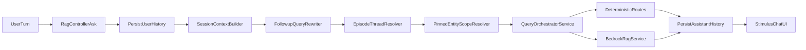
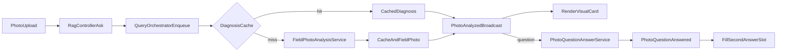

# Plan maestro de implementación — Danebo Field Companion

> **Documento vivo.** Auditado el 2026-09-23 contra `HEAD 2344aff` con el árbol sucio (ver Preflight). Revisor: sesión de auditoría técnica, sin Bedrock y sin cambios de código.
> El plan original se conserva en su estructura (Fases 0–6). Cada corrección está marcada `⚠️ R<n>` y remite a la sección 2.
> Ejecutor previsto: un modelo autónomo (Grok 4.7), **una fase por sesión**. Lee primero la sección 0.

---

## 0. Cómo usar este documento (ejecutor autónomo)

1. Lee `CLAUDE.md`, `AGENTS.md`, y el `AGENTS.md` de cada carpeta que toques: `app/services/rag/AGENTS.md`, `app/javascript/AGENTS.md`, `app/prompts/AGENTS.md`, `test/AGENTS.md`.
2. Lee la sección 10 «Estado». Ejecuta **solo** la primera fase cuyo estado sea `LISTA`. Si ninguna está `LISTA`, STOP y reporta.
3. Copia el prompt de esa fase del Anexo D y síguelo literalmente.
4. Todo hallazgo nuevo va al Anexo E como fila `E<n>`, con archivo, línea y consecuencia.
5. Si un hallazgo cambia una fase posterior, edita esa fase y su prompt, y márcalo `⚠️ CRÍTICO (E<n>)`.
6. Si un hallazgo contradice una restricción de la sección 9 o una decisión de la sección 8, **no se ejecuta**. Se registra como decisión humana nueva `FC-D<n>` con una propuesta.
7. No abras la fase siguiente. No hagas push, deploy ni migración en producción. Los commits locales se permiten en la rama de la fase.

---

## 1. VEREDICTO DEL DISEÑO

**Sólido con cambios.**

La causa raíz está bien identificada: el estado del problema activo no existe como dato. Se reconstruye en cada request desde una ventana de 4 horas y 3 mensajes, con textos truncados a 300 caracteres. La decisión de una columna JSONB en `conversation_sessions`, sin tabla nueva, es correcta y mínima.

El plan no está listo para ejecución autónoma. Tiene seis defectos que producen trabajo equivocado si no se corrigen antes:

- **La consulta efectiva no es solo retrieval.** En el código, `effective_question` alimenta todas las rutas deterministas, las directivas de parada y exhaustiva, y el texto que genera la respuesta. Enriquecerla cambia rutas, no solo resultados de búsqueda.
- **La escritura del estado tiene una carrera real.** El job de foto carga la sesión antes de la llamada de visión y escribe el historial desde esa copia vieja. El episodio heredaría ese bug.
- **Los casos A–H no están definidos** y las letras A–E se usan dos veces con significados distintos. La traza del 23-sep que los origina no está en el repositorio.
- **Clasificar el turno dos veces.** El «updater» y el «resolver» deciden por separado si el turno continúa, corrige o reinicia. Pueden discrepar.
- **La detección de reinicio usa «ahora».** «Ahora da 18» es una continuación y el plan la trataría como falla nueva.
- **Contradice decisiones vigentes del dueño sin registrarlo.** CS-H01 exige preguntar cuando hay dos hilos. La restricción 9 del plan de hilo prohibió persistir URIs citadas, y `evidence_refs` lo hace.

`AnswerPlan`, las referencias documentales blandas y la extracción de síntoma o componente no son necesarias para el problema actual. Pasan a condicionales o a LATER.

### 1.1 Respuestas a las 18 preguntas

| # | Pregunta | Respuesta | Ver |
|---|---|---|---|
| 1 | ¿Causa raíz o síntoma? | Causa raíz correcta para continuidad. La lista mezcla causas con síntomas: «non-progress» y «abstención genérica» son síntomas de generación, no de estado. | R15 |
| 2 | ¿Estado mínimo? | No. `problem.component/symptom/location`, `controller`, `equipment_type` y `evidence_refs` sobran o exigen inferencia. Falta `pending_fact` en Fase 1, que el propio plan necesita. | R5, R6 |
| 3 | ¿Duplica estructuras? | `evidence_refs` duplica citas del turno y reintroduce la herencia retirada. `goal` duplica historial, pero se justifica porque el historial se trunca. `active_photo` es solo una referencia, correcto. | R6 |
| 4 | ¿Se justifica la columna? | Sí. Una columna JSONB aditiva, sin índice. No se justifica tabla ni modelo ActiveRecord nuevo. | — |
| 5 | ¿Alternativa más pequeña? | Sí, parcial. La composición puede reutilizar el formato `tramo\nturno` y el tope de 442 caracteres del resolver actual. No hace falta un tercer resolver con su propio formato. | R4 |
| 6 | ¿Precedencia bien definida? | No. Mezcla dos ejes: estado del trabajo y contenido técnico. `unknown_confirmed` frente a foto no está definido. | R7 |
| 7 | ¿Stale state? | Sí. Con 12 horas y «continúa salvo señal explícita», un equipo nuevo sin marca hereda identidad. | R8 |
| 8 | ¿Detección conservadora? | No. «ahora» dispara reinicios falsos. La mención de otra marca en una comparación también. | R8 |
| 9 | ¿Resolvers claros? | No. Tres resolvers más un updater, con clasificación doble. | R4 |
| 10 | ¿Fotos bien separadas? | Casi. Quitar la ficha borra el botón de reusar la foto. Dejar de persistir `compact_context` borra el contexto visual de turnos siguientes. | R10 |
| 11 | ¿Grounding intacto? | En riesgo en tres puntos: enriquecimiento que activa directivas, identidad leída de foto usada como hecho, y el bloque de contexto leído como evidencia. | R2, R7 |
| 12 | ¿Inferencia por UX? | Sí: «lo medí y da 18», extracción de síntoma, y la copia «Del Elemont MH está documentado X». | R6, R12 |
| 13 | ¿AnswerPlan necesario? | No por ahora. Sus campos repiten el episodio. Pasa a condicional tras medir. | R12 |
| 14 | ¿`generation.txt` al final? | Sí, pero el bloque «Active Field Problem» ya es superficie de prompt. Se declara y se mide. La Fase 5 pertenece al plan copiloto. | R13 |
| 15 | ¿Fases grandes? | Fase 2 y Fase 3. Se dividen. | Sección 6 |
| 16 | ¿Commits separados? | Sí: lock, migración, clasificador, cableado, bloque, composición, foto backend, foto frontend. | Sección 6 |
| 17 | ¿Tests suficientes? | No. Faltan tests multi-turno a nivel request, paridad de rutas y carrera. La pregunta repetida del asistente se detecta de forma automática al guardar su respuesta, y su efecto en la generación se mide con holdout. | R14 |
| 18 | ¿Dentro del MVP? | Mayormente. Sobran AnswerPlan, seis métricas extra, `evidence_refs` y el botón «Nueva falla». | Sección 4 |

---

## 2. MUST FIX BEFORE IMPLEMENTATION

Todas estas correcciones ya están aplicadas en las fases de abajo.

**R1 — Casos A–H no definidos y letras duplicadas.**
- Sección: Fase 0, 1.1, 1.2, 2.1, 3.1, 6.
- Problema: los casos A–H nunca se escriben. En Fase 3 «Caso A–E» significa fotos; en Fase 1 significa texto. La traza «Exportar trazabilidad piloto» del 23-sep no está en el repo.
- Riesgo: el ejecutor inventa casos o testea el caso equivocado. Los gates no son verificables.
- Corrección: Anexo C define `T-A`…`T-H` para texto, `X-1`…`X-12` para bordes y `P1`…`P5` para fotos. `R-A` y `R-B` están en `test/fixtures/files/field_companion/replay_2026-09-23.json` (FC-D03).

**R2 — `effective_question` no es solo retrieval.**
- Sección: 2.1 «Mínimo cambio».
- Problema: en `rag_query_concern.rb` l.158, `effective_question` entra a `QueryOrchestratorService`. Ahí alimenta `DocumentOverviewResponder`, `StructuredEvidenceRoute`, `AmbiguousModelResponder`, `DeterministicRenderer`, `ContextEvidenceRoute` y `BedrockRagService#query`. En `retrieve_and_generate` el mismo texto es la búsqueda y la pregunta de generación (`bedrock_rag_service.rb` l.218). `query_safety_directive` y `query_completeness_directive` se calculan sobre ese texto (l.961–962). `ContextProjection.fuji_yida?` se activa si el texto contiene «Fuji Yida».
- Riesgo: un `goal` con «fuera de servicio» mete la gramática de parada en todos los turnos siguientes del episodio. «Elemont» sin modelo puede abrir el menú de placas y volver a preguntar el modelo. La ruta cambia sin que nadie lo decida.
- Corrección: Fase 2 exige una tabla de paridad de rutas por caso canónico, con flag apagada y encendida. Todo cambio de ruta se lista y se justifica. Los valores `unknown_confirmed` y `absent_confirmed` nunca entran al texto compuesto. El `goal` entra una sola vez y el turno va último.

**R3 — Carrera de escritura en historial y episodio.**
- Sección: 1.2 «Riesgos».
- Problema: `FieldPhotoAnalysisJob#perform` carga la sesión en l.57. La visión tarda 9–18 s (l.151). `deliver` escribe con `add_to_history` (l.254) sobre la copia cargada. Un turno de texto escrito mientras tanto se pierde. El plan dice agregar lock «solo si un test demuestra pérdida».
- Riesgo: pérdida de turnos del técnico, y del estado del episodio cuando se agregue.
- Corrección: toda escritura de `conversation_history` y `active_episode` pasa por `with_lock`, que recarga la fila. Va en su propio commit (C1) antes del episodio.

**R4 — Clasificación doble y tres resolvers.**
- Sección: 1.1 (`ActiveEpisodeState`, `ActiveEpisodeUpdater`), 2.1 (`EpisodeTurnResolver`).
- Problema: el updater decide reinicio o corrección al escribir. El resolver decide continuación al componer. Son dos lecturas del mismo turno. Además siguen vivos `FollowupQueryRewriter` y `EpisodeThreadResolver`.
- Riesgo: el estado dice «episodio nuevo» y la consulta se compone como continuación, o al revés.
- Corrección: dos clases. `Rag::ActiveEpisode` parsea, valida y serializa. `Rag::ActiveEpisodeTurn` clasifica **una vez**, calcula el estado nuevo y el texto compuesto. El controller guarda el estado y pasa el `Result` a `execute_rag_query`. Los resolvers viejos corren solo si la decisión es `:no_episode` o la flag está apagada. Anexo B fija la tabla.

**R5 — `pending_fact` está en Fase 4 pero Fase 1 y 2 lo necesitan.**
- Sección: 1.1 schema, 2.1 ejemplos.
- Problema: «no lo sé» sin sujeto y «lo medí y da 18» necesitan saber qué preguntó el asistente. El historial trunca esa pregunta a 300 caracteres (hallazgo H6 del plan de hilo).
- Riesgo: el caso más citado del plan no pasa.
- Corrección: `pending_fact.subject` se calcula en Fase 1 al escribir la respuesta del asistente, con el **texto completo** antes de truncar. Sujetos cerrados: `manufacturer`, `model`, `fault_code`. Una medición nunca se enlaza en el MVP (X-4).

**R6 — Estado con campos que exigen inferencia.**
- Sección: 1.1 schema, 2.2.
- Problema: separar `model` de `controller` en «Elemont MH CEA15» es inferencia. Extraer `symptom`, `component` y `location` también. `evidence_refs` persiste URIs citadas: la restricción 9 del plan de hilo lo prohibió y `app/services/rag/AGENTS.md` retiró la herencia de documentos.
- Riesgo: estado falso que luego se inyecta en la búsqueda. Reapertura de una decisión cerrada sin registrarla.
- Corrección: schema v1 del Anexo A. `goal` literal cubre síntoma y componente. Los designadores tipeados van a `identifiers[]` sin clasificar. `evidence_refs` sale del schema y pasa a LATER con decisión humana.

**R7 — Precedencia con dos ejes mezclados.**
- Sección: 1.2 «Precedencia/source of truth».
- Problema: la lista ordena técnico, foto y documentos en un solo eje. `AGENTS.md` pone la evidencia recuperada por encima del input del técnico. Las dos cosas son ciertas en ejes distintos.
- Riesgo: un hecho del técnico se usa como contenido técnico, o un documento reescribe la identidad del equipo.
- Corrección: sección 1.2 corregida con eje A (estado de este trabajo) y eje B (contenido técnico). Incluye `unknown_confirmed` frente a foto.

**R8 — Reinicio y stale state.**
- Sección: 1.2 ejemplos, 2.1 «Riesgos».
- Problema: «ahora» es señal de reinicio. Una marca mencionada en una comparación reinicia. 12 horas de vida con «continúa salvo señal» arrastra identidad a un equipo nuevo sin marca.
- Riesgo: reinicio falso pierde el hilo; continuidad falsa contamina con otro equipo.
- Corrección: Anexo B. «ahora» es conector de continuación. Solo reinician frases explícitas o una marca distinta en posición de sujeto. TTL de inactividad = `ConversationSession::EPISODE_WINDOW` (4 h), medido en shadow. Preguntas autocontenidas no se enriquecen.

**R9 — Decisiones del dueño contradichas sin registro.**
- Sección: Decisión ejecutiva, 2.1, 2.2.
- Problema: CS-H01 (21-sep) exige preguntar con dos o más hilos. CS-H07 dejó la unificación de «episodio» como Fase S sin autorización. CG-D19 (22-sep, abierta) es dueña de «foto = una respuesta» y «sin menú».
- Riesgo: el ejecutor implementa contra una decisión vigente.
- Corrección: sección 8 registra FC-D01…FC-D06. Fase 2 se puede **codificar** con flag apagada, pero no **activar** sin FC-D02.

**R10 — Foto unificada rompe dos cosas.**
- Sección: 3.1 «Mínimo cambio backend».
- Problema: la ficha lleva el botón «Preguntar sobre esta foto» y la miniatura (`rag_chat_controller.js` l.1147–1165). Dejar de persistir `compact_context` borra la línea `[FOTO] …` del historial que usan los turnos siguientes.
- Riesgo: el caso P3 pierde su punto de entrada. «Esa placa» pierde el contexto visual.
- Corrección: se sigue persistiendo `compact_context` como transcript. El cambio es de presentación: una burbuja con miniatura, botón y respuesta final.

**R11 — Árbol sucio y trabajo en curso.**
- Sección: Fase 0.
- Problema: al auditar, `photo_question_answer_service.rb`, su test y `PLAN_COPILOTO_GENERACION_2026-09-22.md` tienen cambios sin commit, del trabajo CG-D19 del plan copiloto.
- Riesgo: la Fase 3 edita el mismo servicio sobre un cambio ajeno.
- Corrección: Preflight exige `git status` sin cambios en `app/` ni `test/`. Si hay, STOP.

**R14 — Tests multi-turno inexistentes.**
- Sección: 6 «Suite multi-turn».
- Problema: los tests propuestos son unitarios. Nada recorre varios turnos por el request real.
- Riesgo: el estado pasa unitarios y falla en el orden real controller → contexto → consulta.
- Corrección: test de request multi-turno con Bedrock stubbeado, que verifica por turno el estado guardado, el texto que recibe el orquestador y la ruta. La pregunta repetida en la generación solo se mide en holdout.

---

## 3. SHOULD IMPROVE

- **Orden del contexto.** `SessionContextBuilder.build` corta a 2.000 caracteres desde el inicio (l.69). Un bloque agregado al final se pierde en silencio. El bloque del episodio se antepone con presupuesto propio de 400 caracteres.
- **Momento del contexto.** El controller arma el contexto en l.41, antes de `execute_rag_query`. El episodio se actualiza en l.31, al escribir el turno del usuario, para que el bloque refleje este turno.
- **Rutas sin `session_context`.** `StructuredEvidenceRoute` y `ContextEvidenceRoute` no reciben `session_context`. El bloque solo llega a `BedrockRagService#query`. Se mide la fracción de turnos por ruta antes de prometer «cero pregunta repetida».
- **Foto sin resolver de turno.** `PhotoQuestionAnswerService` llama a `execute_rag_query` sin `conv_session`, a propósito. La composición del episodio no aplica a turnos con foto en v1. El episodio sí se escribe.
- **Telemetría que se pierde.** `PilotUsageLog.log` descarta en silencio todo campo fuera de `ALLOWED_FIELDS`. Los campos nuevos se agregan a esa lista.
- **Marcas fuera de lista.** `KbDocumentResolver::BRANDS` no incluye «elemont». No se modifica esa lista, porque la usan `ContextProjection` y `specific_token?`. El episodio tiene su propia lista.
- **Modo compartido.** Con `SHARED_SESSION_ENABLED=true` varios técnicos comparten una fila. El episodio se desactiva en ese modo.
- **Turno de selección.** El nombre de un pin autocompletado puede contener «KONE». `selection_turn?` excluye ese turno del clasificador.
- **Flags en el contenedor.** `config/deploy.yml` está en `.gitignore`. Una flag no está activa hasta leer el ENV del contenedor.
- **Default de flags.** Las flags nuevas usan `ENV[...] == "true"`, apagadas por defecto, con el patrón de `Rag::PhotoQuestionFlag`.

---

## 4. OVERENGINEERING / OUT OF MVP

| Elemento | Motivo | Destino |
|---|---|---|
| `Rag::AnswerPlan` | Sus campos repiten el episodio y la decisión del turno. No hay medición que lo pida. | LATER, condicional (Fase 4) |
| `evidence_refs` y soft anchors | Reabren la herencia de documentos retirada. Contradicen la restricción 9 del plan de hilo. | LATER + decisión humana |
| `problem.component/symptom/location`, `controller`, `equipment_type` | Exigen inferencia. `goal` literal los cubre. | Fuera del schema v1 |
| Enlace de mediciones a `pending_fact` | Riesgo de afirmar «18 V en el borne X» sin que nadie lo dijera. | LATER |
| Aclaración «esa placa» con dos referentes | Copia nueva, superficie de chat nueva, CG-D19 abierta. | LATER; en v1 solo se registra |
| Seis «métricas faltantes críticas» | Exigen etiquetado humano. | LATER |
| Botón «Nueva falla» | Ya estaba en SHOULD AFTER. Se mantiene fuera. | LATER |
| Prompt V2 en este plan | Duplica la Fase G del plan copiloto. | Handoff (Fase 5) |
| Retiro de flags legacy | No es MVP. | Tras dos ciclos piloto verdes |

Etiquetas usadas en las fases:

- **R12:** `AnswerPlan` pasa a condicional (fila 1 de esta tabla; Fase 4).
- **R13:** la Fase 5 es un handoff al plan copiloto, no un prompt nuevo.
- **R15:** «abstención genérica» y «non-progress» son síntomas de generación, no causas de continuidad. Se miden en holdout; no justifican estado nuevo.

---

## 5. MISSING CASES

Todos están en el Anexo C con resultado esperado.

- «ahora da 18» y «ahora muestra código 8» no reinician (X-1).
- Otra marca en una comparación, «como en el KONE», no reinicia (X-2).
- Error de tipeo «Fuyi Yida», observado el 22-sep, no crea marca ni reinicia (X-3).
- «lo medí y da 18» no enlaza una magnitud (X-4).
- El texto del asistente nunca escribe identidad. «En el manual KONE…» no cambia la marca (X-5).
- Turno de selección de pin (X-6).
- Episodio vencido (X-7).
- Carrera: turno de texto durante el análisis de foto (X-8).
- Modo compartido (X-9).
- `goal` con palabras de parada: paridad de directivas (X-10).
- JSON corrupto o versión desconocida (X-11).
- Pin de otra marca durante el episodio. El pin manda sobre el alcance (X-12).
- Foto: recarga de página entre broadcasts, fallo de RAG tras visión, botón de reuso (P2–P3).

---

## 6. RECOMMENDED IMPLEMENTATION BOUNDARY

**Recomendación: B en modo shadow.** ActiveEpisode más actualización del estado, cableado en los dos puntos de escritura, sin leer nada para la consulta.

- **A no alcanza.** La persistencia sola no produce señal para validar reinicios ni correcciones.
- **C es prematuro.** Cambia el texto que llega a todas las rutas (R2). Necesita datos de shadow y la decisión FC-D02.
- **B da la medición que C necesita, con riesgo cero para las respuestas.**

**PR 1 = Fase 0 + Fase 1, en cinco commits, en la rama `fc/fase-1`:**

| Commit | Contenido | Cambia respuestas |
|---|---|---|
| C0 | Fixtures del Anexo C y tests de caracterización del comportamiento actual. Sin código de producción. | No |
| C1 | `with_lock` en `add_to_history` y `add_to_history_and_refresh`. Test de carrera X-8. | No. Arregla pérdida de turnos. |
| C2 | Migración `active_episode`, `Rag::ActiveEpisode`, tres clases de flag. | No |
| C3 | `Rag::ActiveEpisodeTurn`: clasificación, estado y texto compuesto. Puro, sin escrituras. | No |
| C4 | Cableado shadow en controller y job, métodos `record_*` del modelo, telemetría. | No |

**Commits posteriores, cada uno en su PR:**

| Commit | Fase | Contenido |
|---|---|---|
| C5 | 2a | Bloque «Active Field Problem» detrás de la flag de turno. |
| C6 | 2b | Composición en `execute_rag_query` y tabla de paridad de rutas. |
| C6b | 2b, condicional | `AmbiguousModelResponder` no repregunta el modelo si está `unknown_confirmed`. Solo si la paridad lo muestra. |
| C7 | 3a | Foto unificada, backend. |
| C8 | 3b | Foto unificada, frontend. Smoke a 390 px. |
| C9 | 4, condicional | Hueco preciso en rutas deterministas. Solo si el holdout lo pide. |

---

## 7. FINAL CHANGES TO THE PLAN

Todos aplicados en este archivo.

1. Se agregan las secciones 0–10 y los Anexos A–F.
2. Casos redefinidos en el Anexo C. Las fotos pasan a `P1`–`P5`.
3. Schema v1 reducido (Anexo A). Salen `problem.*`, `controller`, `equipment_type`, `observations.last_measurement` y `evidence_refs`. Entran `identifiers[]`, `pending_fact`, `conflicts[]`.
4. `ActiveEpisodeState`, `ActiveEpisodeUpdater` y `EpisodeTurnResolver` se reemplazan por `Rag::ActiveEpisode` y `Rag::ActiveEpisodeTurn`.
5. Tabla de decisión del turno única (Anexo B). «ahora» deja de reiniciar.
6. TTL de inactividad: 4 h, no 12 h.
7. Precedencia en dos ejes (1.2).
8. Lock obligatorio en todas las escrituras de la fila (C1).
9. Paridad de rutas obligatoria en Fase 2.
10. Fase 2 se divide en 2a (bloque) y 2b (composición). Su activación exige FC-D02.
11. Fase 3 conserva `compact_context` en historial y el botón de reuso. Se divide en 3a y 3b.
12. Fase 4 pasa a condicional. `AnswerPlan` va a LATER.
13. Fase 5 pasa a handoff al plan copiloto.
14. Métricas recortadas a las automáticas más el holdout.
15. Prompt por fase en el Anexo D.
16. Preflight con árbol limpio y STOP explícitos.

---

## 8. Decisiones

| ID | Decisión | Fuente | Estado |
|---|---|---|---|
| FC-D01 | Un solo ActiveEpisode por sesión. Sin multi-chat, sin episodios históricos, sin memoria vectorial, sin agentes. | Pedido del dueño en la sesión de auditoría del 23-sep-2026 | **Vigente** |
| FC-D02 | Dentro de un episodio activo, un turno elíptico se une al `goal` del episodio sin menú. El `goal` es la última pregunta autocontenida del episodio. Esto reemplaza CS-H01 **solo** cuando hay episodio activo. Sin episodio, CS-H01 sigue igual. | Aceptada por el dueño, 23-sep-2026 | **Vigente.** No enciende `FIELD_COMPANION_TURN_ENABLED`. |
| FC-D03 | Export de la traza del 23-sep, sanitizado, en `test/fixtures/files/field_companion/replay_2026-09-23.json`. | Export de las 16:35–16:36. R-A y R-B. | **Vigente.** |
| FC-D04 | La Fase 3 implementa la parte «foto con pregunta = una respuesta» de CG-D19. La prosa de la ficha sola, el menú y los rótulos siguen en el plan copiloto. | Propuesta de esta auditoría | **Pendiente.** FC-D10 impide que la Fase 3 arranque desde este plan. |
| FC-D05 | Holdout con Bedrock tras Fase 2: máximo 40 turnos y US$0,50, fuera del contenedor de producción. | Aceptada por el dueño, 23-sep-2026 | **Vigente.** Primero con la flag apagada y después encendida. Parar al llegar a cualquiera de los dos topes. La corrida del 23-sep cruzó US$0,50 y siguió hasta US$0,75 por un mensaje de chat no registrado aquí (E30). Este tope no cambia. |
| FC-D06 | `evidence_refs` y soft anchors no se implementan. Si el holdout de Fase 2 falla por identidad documental, se abre una decisión nueva. | Restricción 9 del plan de hilo y `app/services/rag/AGENTS.md` | **Vigente** |
| FC-D09 | No se edita `generation.txt` para el fallo del gate. Si se quiere dejar de repreguntar el modelo en T-E, el cambio es de ruta: `ContextEvidenceRoute` tiene que ver `model=unknown_confirmed`, o no preguntar ese campo cuando el episodio ya lo confirmó. | Holdout 2026-09-23, E26 | **No adoptada.** FC-D10 cierra este plan sin ese arreglo. |
| FC-D10 | El plan para en la Fase 2b. `FIELD_COMPANION_TURN_ENABLED` no se enciende. La Fase 3 no arranca. El fallo de identidad documental es riesgo de producción hoy, con la flag apagada, y pasa al plan copiloto con prioridad. Casos: R-B on #2, R-B off #2, T-H on #2, T-B on #2, T-C on #1. No hay control determinista de texto libre en este plan. | Dueño, 23-sep-2026, opción 1. FC-D06, E29 | **Vigente.** |
| FC-D07 | La validación de este trabajo usa tests funcionales/unitarios; no se agregan ni ejecutan tests de integración. | Instrucción del dueño, 23-sep-2026 | **Vigente** |
| FC-D08 | El gate numérico de shadow no habilita por sí solo Fase 2a: primero se despliegan y revalidan funcionalmente los fixes de selección sintética y atribución de usuario encontrados en la revisión. | Revisión shadow, E15–E16 | **Cumplida** en `2d456f8`. El botón de menú queda `skipped`, no cambia `episode_id` y guarda `user_id`. |

---

## 9. Restricciones no negociables

1. `app/prompts/bedrock/generation.txt` no se edita en ninguna fase de este documento.
2. No se cambian `top_k`, `OPEN_RESULTS`, `PINNED_DOCUMENT_RESULTS`, temperatura ni max tokens.
3. Cero llamadas nuevas a Bedrock por turno. Sin reescritor LLM, sin router, sin clasificador LLM.
4. No se reutiliza `session_id` de Bedrock.
5. `active_entities` es la única fuente de filtro duro. El episodio no pinea, no despinea y no restringe retrieval.
6. El episodio nunca guarda chunks, citas, procedimientos, valores documentales, prosa del asistente ni transcript.
7. El texto del asistente, un documento, una analogía o un match de catálogo nunca escriben identidad del equipo.
8. La variable `question` del concern no se reasigna. Solo `effective_question` cambia.
9. Tope de composición: `Rag::FollowupQueryRewriter::MAX_COMPOSED_CHARS` (442). No se redefine.
10. `KbDocumentResolver::BRANDS` no se modifica.
11. Flags nuevas apagadas por defecto. Con todas apagadas, el comportamiento es idéntico al de hoy, salvo el lock de C1.
12. Canal `web` solamente. Con `SharedSession::ENABLED` el episodio no se lee ni se escribe. WhatsApp no se toca.
13. No se escribe nada bajo `bulk_chunks/`. No se reindexa.
14. No se debilita un test de precisión o safety. Un test se actualiza solo si congela copia vieja que la fase cambia a propósito, y se declara en el Anexo F.
15. Sin push, deploy ni migración de producción sin instrucción explícita del dueño.

---

## 10. Estado

| Fase | Estado | Bloqueo | Artefacto |
|---|---|---|---|
| Auditoría | **CERRADA 2026-09-23** | — | Este archivo |
| Fase 0 — Baseline y fixtures (C0) | **CERRADA** | Abierta en `c5cb21e`. `generation.txt` `2999231aa9962aec66af6eb8d5091f8f5345e8f424c5bdaf1d5a6dc07b36d537` | `tmp/field_companion_2026-09-23/fase_0/` |
| Fase 1 — ActiveEpisode shadow (C1–C4) | **CERRADA Y DESPLEGADA** | `2d456f8`. `FIELD_COMPANION_EPISODE_ENABLED=true`. `FIELD_COMPANION_TURN_ENABLED` apagada. E12–E19. `generation.txt` sin cambios | `tmp/field_companion_2026-09-23/fase_1/` |
| Revisión shadow | **CERRADA** | 32 turnos humanos. Smoke del botón: `episode_decision=skipped`, mismo `episode_id`, `user_id=7`. Sesión 6 no se tocó | `tmp/field_companion_2026-09-23/shadow/revision.md` |
| Fase 2a — Bloque de contexto (C5) | **CERRADA** | `2e43a60` en `fc/pr2` desde `main` `2d937df`. `FIELD_COMPANION_TURN_ENABLED` apagada. `generation.txt` `2999231aa9962aec66af6eb8d5091f8f5345e8f424c5bdaf1d5a6dc07b36d537`. Tokens máx. 115 | `tmp/field_companion_2026-09-23/fase_2a/` |
| Fase 2b — Composición (C6, C6b) | **CERRADA (flag apagada)** | `1326561` en `fc/pr2`. C6b no aplica. `FIELD_COMPANION_TURN_ENABLED` apagada. `generation.txt` `2999231aa9962aec66af6eb8d5091f8f5345e8f424c5bdaf1d5a6dc07b36d537`. E23, E24 | `tmp/field_companion_2026-09-23/fase_2b/` |
| Gate Fase 2 — Holdout | **NO PASA** | `8813011` en `fc/pr2`. Auditoría externa de solo lectura, 23-sep, coincide. Dentro de FC-D05 bastan T-E on #3 y R-B on #2 (E26, E29). US$0,50 se cruzó en T-G off #2; lo posterior queda fuera (E30). Flag apagada. | `tmp/field_companion_2026-09-23/gate_2/` |
| Fase 3a/3b — Foto unificada (C7, C8) | **NO ARRANCA** | FC-D10. El gate no pasó (E26, E29). | — |
| Fase 4 — Hueco preciso (C9) | Condicional | No se abre. Hay abstenciones con identidad conocida por `structured_evidence_route`; C9 pide la copia de rutas deterministas. El holdout no demuestra ese disparador. | — |
| Fase 5 — Handoff prompt | **ENTREGADO** | FC-D10. Casos en el plan copiloto. | `docs/PLAN_COPILOTO_GENERACION_2026-09-22.md` |

---

## Decisión ejecutiva

La causa principal no es el tono de `generation.txt`. El sistema persiste transcript y pines, pero reconstruye el problema activo en cada request con una ventana efímera de 4 horas y 3 mensajes. El retrieve recibe un `effective_question` construido por dos heurísticas transitorias, y el foco documental reducido tampoco sobrevive. La traza del 23-sep muestra el efecto: después de una respuesta útil para Fuji Yida, «el modelo no lo sé» cae en «El documento no incluye este dato». En Elemont/CEA15, «la misma falla», «código 8» y nuevas observaciones vuelven a mezclar equipos y preguntas.

Recomendación: agregar `active_episode` JSONB a `conversation_sessions`. No reutilizar `current_procedure` y no crear tabla. `current_procedure` tiene un nombre incorrecto para una falla técnica, no participa en producción y solo lo limpia `reset_procedure!`. La columna nueva cuesta una migración simple, sin índice ni backfill, y permite rollback limpio por flag.

El mayor salto con menor cambio es: estado persistente mínimo, más consulta efectiva enriquecida de forma determinista para turnos elípticos, más desconocidos y ausencias confirmados que no vuelven a nil. No se agrega llamada LLM, no se activa `session_id` de Bedrock y no se restaura `inherit_episode_scope`.

⚠️ R2: «enriquecida para retrieval» es inexacto. El texto compuesto llega a todas las rutas y a la generación. Ver Fase 2b.

---

## Fase 0 — CURRENT STATE / ROOT CAUSE

### Flujo real de texto



- `RagController#ask` (`app/controllers/rag_controller.rb`) crea o reusa una fila por `(account_id, user.id, web)`. Guarda la pregunta en l.31, arma el contexto en l.41, consulta en l.44 y guarda la respuesta en l.82.
- `ConversationSession#add_to_history_and_refresh` y `#add_to_history` conservan 20 entradas truncadas a 300 caracteres. Hacen read-modify-write sin lock.
- `SessionContextBuilder.build` inyecta pines y hasta 3 turnos de usuario en 4 horas, más la última respuesta truncada a 200. Corta el bloque total a 2.000 caracteres **desde el inicio**.
- `Rag::FollowupQueryRewriter#call` une un turno corto solo cuando parece identificador de catálogo y existe exactamente una pregunta recuperable.
- `Rag::EpisodeThreadResolver#call` vuelve a recorrer el mismo JSON. Une un tramo o abre menú. Su `Result` se descarta al terminar el request.
- `RagQueryConcern#execute_rag_query` pasa el texto efectivo al resolver de catálogo y al orquestador. Resuelve pines con la pregunta cruda. `inherit_episode_scope` y `auto_scope_uris_from` devuelven vacío.
- `QueryOrchestratorService#execute` prueba overview, rutas estructuradas, desambiguación, renderers, `ContextEvidenceRoute` y finalmente `BedrockRagService#query`. **Todas reciben el mismo `@query`** (R2).
- `BedrockRagService#query` usa ese texto como búsqueda y como pregunta de generación. Calcula las directivas de parada y exhaustiva sobre ese texto.
- El `session_id` de Bedrock no se guarda ni se reenvía desde `rag_chat_controller.js`. Se mantiene así.

### Flujo real de foto



- `QueryOrchestratorService#execute` responde «analizando» y encola `FieldPhotoAnalysisJob`.
- `FieldPhotoDiagnosisCache` reutiliza el análisis por cuenta, sha, idioma y versión durante 24 horas.
- `FieldPhotoAnalysisJob#deliver` persiste `compact_context` (`[FOTO] Componente: …`) como assistant y emite `photo_analyzed`. Con pregunta, ejecuta `Rag::PhotoQuestionAnswerService#call`, persiste otra respuesta y emite `photo_question_answered`.
- `PhotoQuestionAnswerService` llama a `execute_rag_query` **sin `conv_session`**. Rewriter y resolver de hilo no corren en turnos con foto.
- `rag_chat_controller#addImageSummaryMessage` muestra la ficha con miniatura y botón de reuso. `#addPhotoQuestionAnswer` llena después el hueco. En cache hit se repite la misma ficha.

### Causas raíz verificadas

- **Pérdida de contexto:** cuatro recorridos distintos sobre `conversation_history`, con truncamiento y objetos que viven un request. Archivos: `ConversationSession#episode_user_messages`, `SessionContextBuilder.build`, `FollowupQueryRewriter#episode_rows`, `EpisodeThreadResolver#episode_rows`.
- **Preguntas repetidas:** la pregunta final del asistente desaparece por el límite de 300. No existe un `pending_fact` persistente.
- **Pérdida de evidencia:** `inherit_episode_scope` está retirado a propósito. Un turno elíptico queda sin identidad del equipo. ⚠️ R6: la corrección es identidad en la consulta, no documentos heredados.
- **Menú innecesario:** `EpisodeThreadResolver` deduce varios tramos del transcript aunque el producto tenga un solo problema activo.
- **Ficha repetida:** `FieldPhotoAnalysisJob#deliver` y `addImageSummaryMessage` hacen visible la ficha antes de la respuesta, también en cache hit.
- **Ruido de otro equipo:** un turno literal incompleto busca en el corpus abierto. La traza de Elemont recuperó procedimientos y códigos de KONE y OTIS.
- **Pérdida de turnos (nuevo, R3):** el job de foto escribe historial desde una copia cargada antes de la visión.

⚠️ R15: «abstención genérica» y «non-progress» son síntomas de generación. Se miden, pero no son causa raíz de continuidad. Se tratan en Fase 4 condicional y en el plan copiloto.

### Criterio de cierre de Fase 0

- Preflight verde.
- Fixtures del Anexo C en `test/fixtures/files/field_companion/cases.yml`.
- Tests de caracterización que fijan el comportamiento **actual** para T-A…T-H: qué devuelven hoy el rewriter y el resolver de hilo, y qué texto llega al orquestador. Esos tests documentan el hoy. Las fases siguientes los actualizan y lo declaran en el Anexo F.
- Baseline de los tests de cierre archivado.
- Cero Bedrock.

---

## Fase 1 — ACTIVE EPISODE MVP (shadow)

### Propuesta 1.1 — Persistencia mínima

- **Clasificación:** MUST NOW.
- **Problema:** el problema activo desaparece entre requests aunque la sesión viva 30 días.
- **Evidencia:** `db/schema.rb` l.148–166. Una fila con `conversation_history`, `active_entities` y `current_procedure`. `current_procedure` solo lo usa `reset_procedure!`.
- **Archivos (⚠️ R4):**
  - `db/migrate/<ts>_add_active_episode_to_conversation_sessions.rb`
  - `app/services/rag/active_episode.rb` — PORO: parse, validación, límites, serialización.
  - `app/services/rag/active_episode_turn.rb` — clasificación y estado nuevo. Puro.
  - `app/services/rag/field_companion_episode_flag.rb`, `field_companion_turn_flag.rb`, `field_companion_photo_flag.rb`.
  - `app/models/conversation_session.rb` — métodos `record_*` y lock.
- **Mínimo cambio:** `add_column :conversation_sessions, :active_episode, :jsonb, null: false, default: {}`. Sin índice, sin FK, sin backfill, sin dual-write con `current_procedure`.
- **Schema:** Anexo A. ⚠️ R6: reemplaza el schema original.
- **Qué NO contiene:** transcript, respuestas, chunks, citas, procedimientos, valores de otro equipo, copia de `active_entities`, ficha visual, vector, resumen LLM, historial de episodios, `evidence_refs`, síntoma o componente extraídos.
- **Dependencias:** ninguna llamada externa. `KbDocumentResolver.specific_token?` para designadores, sobre `Rag::ActiveEpisodeTurn::DESIGNATOR_RE` (Anexo B). No usar `KbDocumentResolver::TOKEN_RE`: exige 3 caracteres y descarta «MH». `FollowupQueryRewriter` para sus métodos de clase públicos (`closed_followup_shape?`, `explicit_question?`, `new_question?`, `normalize_label`). No se copian.
- **Riesgos:** extracción excesiva y stale state. Mitigación: solo hechos explícitos del Anexo B, límites del Anexo A, TTL de 4 h, reinicio determinista.
- **Feature flag:** `FIELD_COMPANION_EPISODE_ENABLED`. Shadow significa: **escribe** la columna y el log, y **no lee** nada para contexto ni consulta.
- **Migración:** aditiva. Rollback = flag apagada; la columna queda inerte.
- **Criterio de aceptación:** T-A deja `goal` + `manufacturer=Fuji Yida` + `model=unknown_confirmed`. T-E no pierde `model=unknown_confirmed` en el turno 4. T-H deja `fault_code=absent_confirmed`. Todo por test, sin Bedrock.

### Propuesta 1.2 — Reglas de update, corrección, reinicio y precedencia

- **Clasificación:** MUST NOW.
- **Problema:** nil, «no lo sé» y «no existe» colapsan. Una corrección no invalida dependencias.
- **Archivos y métodos:**
  - `Rag::ActiveEpisodeTurn.call(state:, text:, role:, now:, selection_turn:, pending_fact:)` → `Result`.
  - `ConversationSession#record_user_turn!(content, user_id:, correlation_id:, selection_turn:, now: Time.current)` → `Rag::ActiveEpisodeTurn::Result` o `nil`.
  - `ConversationSession#record_assistant_turn!(content, user_id:, correlation_id:)` — guarda historial truncado y calcula `pending_fact` sobre el **texto completo** (R5).
  - `ConversationSession#record_photo_observation!(photo_value:, field_photo_id:, sha256:, correlation_id:)`.
  - `ConversationSession#reset_active_episode!`.
  - Los cuatro usan `with_lock` y hacen un solo `UPDATE` de historial + episodio.
- **Comportamiento esperado:** el de la tabla del Anexo B.
  - «Fuji Yida» actualiza `manufacturer` y continúa el `goal`.
  - «El modelo no lo sé» escribe `model=unknown_confirmed`.
  - «No muestra ningún código» escribe `fault_code=absent_confirmed`.
  - «No, no es Fuji Yida. Es KONE» reemplaza la marca, limpia `model` e `identifiers`, conserva `goal` y `fault_code`. Mismo `episode_id`.
  - «Ahora estoy revisando un KONE que no nivela» crea `episode_id` nuevo y deja el transcript intacto.
  - ⚠️ R8: «ahora da 18» continúa. «ahora» no es señal de reinicio.
- **Inactividad:** ⚠️ R8: `ConversationSession::EPISODE_WINDOW` (4 h) desde `updated_at`. No 12 h. La sesión mantiene su TTL de 30 días.
- **Reinicio explícito:** `reset_active_episode!` existe para tests y consola. Sin botón en el MVP.

#### Precedencia (⚠️ R7, reemplaza la lista original)

**Eje A — estado de este trabajo** (qué equipo, qué se observó, qué no se sabe):

1. Afirmación explícita del técnico en el turno actual, incluida una corrección.
2. Afirmación explícita anterior del técnico en el mismo episodio, incluidos `unknown_confirmed` y `absent_confirmed`.
3. Lectura literal de la foto activa (`manufacturer`, `model_visible`). Solo llena un campo vacío o `unknown_confirmed`. Nunca reemplaza un `known` del técnico: si difiere, se agrega a `conflicts[]`. No escribe `fault_code`.
4. Nada más escribe el eje A: ni el asistente, ni documentos, ni analogías, ni matches de catálogo, ni pines.

**Eje B — contenido técnico** (procedimientos, valores, bornes, cableado, significado de códigos):

- Solo la evidencia recuperada en el turno actual. El episodio nunca aporta contenido técnico.
- Una afirmación técnica del técnico («el borne X da 24 V») queda en el transcript. No entra al episodio.
- Un conflicto entre técnico y documento lo presenta la generación con su contrato actual. El episodio no lo resuelve.

**Roles de las estructuras:**

- `active_episode`: vista operativa vigente del eje A.
- `conversation_history`: transcript y auditoría. No es estado canónico.
- `active_entities`: fuentes elegidas por el técnico y única fuente de filtro duro. No es identidad del equipo.
- Documentos recuperados: evidencia del turno. Nunca escriben hechos del episodio.

- **Riesgos:** concurrencia entre request y job. ⚠️ R3: resuelto con lock obligatorio en C1, no condicional.
- **Tests:** Anexo C completo contra `Rag::ActiveEpisodeTurn`. Test de modelo para cada `record_*`. Test de carrera X-8.
- **Criterio de aceptación:** los casos T-A…T-H y X-1…X-11 del Anexo C dan exactamente el estado esperado.

### Cableado shadow (C4)

- `RagController#ask` l.31: reemplazar `add_to_history_and_refresh` por `record_user_turn!`. Con la flag de episodio apagada, `record_user_turn!` hace exactamente lo mismo que el método viejo y devuelve `nil`.
- `RagController#ask` l.82: reemplazar `add_to_history("assistant", …)` por `record_assistant_turn!`.
- `FieldPhotoAnalysisJob#deliver` l.254 y l.273: usar `record_assistant_turn!`. Llamar `record_photo_observation!` antes de la primera escritura.
- `execute_rag_query` **no cambia** en Fase 1. Recibe el `Result` recién en Fase 2b.
- Telemetría: evento `field_companion_turn` con `correlation_id`, `conversation_session_id`, `account_id`, `route: "field_companion"`, `result: <decision>`, `outcome_reason: <reason>`. Agregar a `PilotUsageLog::ALLOWED_FIELDS`: `episode_id`, `episode_decision`, `episode_fields_changed`, `composed_chars`, `original_sha256`, `effective_sha256`. Sin texto crudo en el log.

---

## Fase 2 — TURN RESOLUTION

⚠️ R9: el código de Fase 2 se escribe con la flag apagada. La flag `FIELD_COMPANION_TURN_ENABLED` no se enciende en ningún entorno piloto hasta cerrar FC-D02, FC-D03 y FC-D05.

### Propuesta 2a — Bloque «Active Field Problem» (C5)

- **Archivo:** `app/services/session_context_builder.rb`.
- **Comportamiento:** con las flags de episodio y de turno encendidas, y un episodio vigente, se **antepone** un bloque de máximo 400 caracteres. El resto del contexto conserva el tope `MAX_CONTEXT_CHARS - bloque.length`. El total sigue ≤ 2.000.
- **Contenido exacto** (etiquetas en inglés como el resto del contexto, valores literales; líneas vacías se omiten):

```text
## Active Field Problem (technician-stated job state, not documentary evidence)
Goal: <goal.text>
Manufacturer: <value> (technician)
Model: technician confirmed it is unknown; do not ask for it again.
Fault code: technician confirmed no code is shown; do not ask for it again.
Identifiers typed by the technician: <v1>, <v2>
Read from the photo, not stated by the technician: model <value>
Conflict: technician said <a>; the photo shows <b>. Mention it; do not resolve it.
These facts identify the job. Procedures, values, terminals and code meanings still come only from retrieved evidence. If the current question names different equipment, ignore this block.
```

- **Superficie de prompt:** este bloque es texto de generación aunque no esté en `generation.txt`. Se mide su largo en tokens con `AnthropicTokenCounter::LocalTokenizer` para T-A…T-H y se archiva. STOP si supera 150 tokens.
- **Alcance real:** solo llega a `BedrockRagService#query`. `StructuredEvidenceRoute` y `ContextEvidenceRoute` no reciben `session_context`. Se registra, no se corrige en esta fase.
- **Tests:** `test/services/session_context_builder_test.rb`. Bloque primero, tope respetado con pines y historial al máximo, bloque ausente con flags apagadas o episodio vencido, ningún texto de documento dentro del bloque.
- ⚠️ E20: el ejemplo de arriba no cabe entero en 400 caracteres (encabezado 79, pie 188). Si no entra, se acorta el `goal` y después se omiten identificadores, lectura de foto, conflictos y hechos conocidos. El pie y las confirmaciones quedan. La composición de 2b no lee este bloque.

### Propuesta 2b — Composición (C6)

- **Clasificación:** MUST NOW para el código; activación sujeta a FC-D02.
- **Problema:** el sistema intenta descubrir qué hilo seguir aunque el producto define uno solo.
- **Archivos:** `app/controllers/concerns/rag_query_concern.rb` `execute_rag_query`; `app/controllers/rag_controller.rb` (pasa el `Result`).
- **Contrato:**
  - `execute_rag_query` recibe el kwarg nuevo `episode_turn:` (un `Rag::ActiveEpisodeTurn::Result` o `nil`).
  - `composed` existe solo para `:continued_elliptical`, `:corrected` y `:continued_mention` elíptico (Anexo B).
  - Si la flag de turno está encendida y `episode_turn.composed` está presente, `effective_question = episode_turn.composed`. No se llama al rewriter ni al resolver de hilo.
  - Si la decisión es `:opened`, `:new_episode` o `:continued_self_contained`, o `composed` es `nil` por presupuesto, `effective_question = question` y **tampoco** se llama al resolver de hilo: el episodio es la única lectura del hilo.
  - Si la decisión es `:no_episode`, `:skipped` o `episode_turn` es `nil`, corre la cadena actual sin cambios.
  - `question` no se reasigna. Pines, locale y `selection_turn?` siguen usando `question`.
- **Formato del texto compuesto** (idéntico en forma al join actual `tramo\nturno`):

```text
<goal.text>                 # se omite si es nil, truncado, o ya está contenido en el turno
<identidad conocida>        # manufacturer + model + identifiers + "código <n>", solo source=user y status=known, solo los que no están ya en goal ni en el turno
<turno literal>             # siempre último, nunca recortado
```

  - Tope 442 caracteres. Si no entra: quitar identificadores desde el final, luego `model`, luego `goal`. Si aún no entra, no se compone: `reason = "budget_exceeded"`.
  - `unknown_confirmed`, `absent_confirmed`, conflictos y lecturas de foto **nunca** entran al texto compuesto. Solo van al bloque de 2a.
- **Paridad de rutas (⚠️ R2, obligatoria):** para cada turno de T-A…T-H y X-10, correr el orquestador con Bedrock stubbeado, flag apagada y encendida. Registrar en `tmp/field_companion_2026-09-23/fase_2b/paridad.md`:

| Caso/turno | Ruta OFF | Ruta ON | Directiva parada OFF/ON | Directiva exhaustiva OFF/ON | ContextEvidenceRoute OFF/ON | Justificación |
|---|---|---|---|---|---|---|

  - Un cambio de ruta sin justificación en una línea es STOP.
  - Si `AmbiguousModelResponder` repregunta el modelo con `model=unknown_confirmed`, se abre C6b: el responder recibe el estado y no abre el menú de placas cuando `model` es `unknown_confirmed`. Solo ese cambio, en commit propio.
- **Resolución de ejemplos:**
  - «la misma falla»: `goal` + identidad + turno.
  - «código 8»: `goal` + identidad + turno. `fault_code=8`.
  - «Fuji Yida»: actualiza marca. `goal` + turno.
  - «el modelo no lo sé»: `model=unknown_confirmed`. `goal` + identidad + turno. Sin menú.
  - «¿y el LED 7?»: elíptico aunque tenga «?». `goal` + identidad + turno.
  - «sigue sin magnetizar»: elíptico. `goal` + identidad + turno.
  - «no muestra ningún código»: `fault_code=absent_confirmed`. `goal` + identidad + turno.
  - «lo medí y da 18»: elíptico. Se compone, pero no se escribe ninguna medición (X-4).
  - «esa placa»: elíptico. En v1 no hay aclaración. Se registra `outcome_reason = "deictic_referent"` para medir.
- **Tests:**
  - `test/controllers/concerns/rag_query_concern_test.rb`: texto que recibe el orquestador por caso; `question` intacta; rewriter y resolver de hilo no llamados con episodio activo; cadena vieja intacta con `:no_episode`.
  - Test de request multi-turno (R14), nuevo archivo `test/controllers/rag_controller_field_companion_test.rb`: recorre T-A, T-B, T-F, T-G y X-1 por `RagController#ask` con `QueryOrchestratorService` stubbeado; verifica por turno la columna guardada, el texto recibido y que no hubo menú.
  - Presupuesto de 442 y de tokens del bloque.
  - Cero Bedrock adicional: contar llamadas stubbeadas.
- **Criterio de aceptación:** T-A, T-B, T-C, T-D, T-E, T-F, T-G, T-H y X-1 pasan. «código 8» en Elemont no abre menú y el texto recibido contiene «Elemont», «MH», «CEA15» y «puerta 1».

### Propuesta 2.2 — Papel residual del código actual

- `active_entities` sigue siendo la única fuente de filtro duro. ActiveEpisode no pinea, no despinea ni abre el corpus.
- `PinnedEntityScopeResolver` sigue usando `question`. El episodio no reduce pines.
- ⚠️ R6 / FC-D06: sin `evidence_refs` y sin soft anchors. El original proponía hasta 3 referencias documentales como ancla. Queda fuera.
- `FollowupQueryRewriter` y `EpisodeThreadResolver` quedan como fallback exacto para `:no_episode`, flags apagadas o episodio vencido.
- Same-equipment-first en esta iteración: identidad y `goal` en el texto compuesto. Sin cambiar `top_k`, sin reranker, sin segunda llamada.
- **Tests:** unpin gana; pin múltiple no se reduce por el episodio; pin de otra marca manda sobre el alcance (X-12).
- **Log:** `scope_source=pin|open` como hoy. No se agrega `episode_soft`.

### Gate de Fase 2 (holdout)

- Requiere FC-D02, FC-D03 y FC-D05 cerradas.
- Sesión distinta de la que implementó 2b.
- Máximo 40 turnos `retrieve_and_generate` y US$0,50, fuera del contenedor de producción. El índice es el KB de producción `Y7RZWMFJSR`: los manuales de R-A y R-B se ingirieron ahí, no en el KB de desarrollo del `.env` local. R-A corre en la cuenta `danebo-pilot-elevator` y R-B en `danebo-legacy`.
- Pasa si: cero fallos safety-critical; pregunta repetida sobre un campo `unknown_confirmed` o `absent_confirmed` en 0 de los turnos T-A/T-E/T-H; ninguna respuesta de un episodio Elemont cita instrucciones de KONE u OTIS sin etiqueta de analogía; atribución de citas igual o mejor que la baseline con flag apagada.
- ⚠️ CRÍTICO (E24): T-E U4 con la flag de turno encendida pasa de `BedrockRagService` a `ContextEvidenceRoute`. Esa ruta no recibe `session_context` (E9), así que el bloque de 2a no cubre la pregunta repetida del modelo en ese turno. T-A U1–U3 ya responden por `ContextEvidenceRoute` con la flag apagada; el bloque tampoco llega ahí. El holdout juzga la respuesta de la ruta que contestó, no el bloque. Si T-A o T-E repregunta el modelo, la flag no se enciende y la Fase 3 sigue en espera. C6b no aplica: `AmbiguousModelResponder` no corre cuando `model` es `unknown_confirmed`.

---

## Fase 3 — UNIFIED PHOTO INTERACTION

⚠️ CRÍTICO, FC-D10: esta fase no se ejecuta. El plan para en la Fase 2b.

⚠️ R10, FC-D04: si algún plan futuro la retoma, implementa solo «foto con pregunta = una respuesta visible». La prosa de la ficha sola y el retiro del menú siguen en el plan copiloto (CG-D19).

### Propuesta 3a — Backend (C7)

- **Archivos:** `app/jobs/field_photo_analysis_job.rb` (`deliver`, `answer_photo_question`), `app/services/kb_sync_broadcaster.rb` o donde viva `photo_analyzed`.
- **Comportamiento con `FIELD_COMPANION_PHOTO_ENABLED` y `PHOTO_QUESTION_RAG_ENABLED` encendidas y pregunta presente:**
  - `compact_context` **se sigue persistiendo** en el historial. Es transcript y contexto de turnos siguientes.
  - `photo_analyzed` se emite con `presentation: "deferred"`. Sigue llevando `field_photo_id` y `thumbnail_url`.
  - La respuesta RAG se emite en `photo_question_answered` como hoy.
  - Si el RAG falla, el payload de `photo_question_answered` agrega `visual_summary` con el resumen visual ya pagado.
- **Sin pregunta:** comportamiento actual. Ficha visible (P1).
- **Flag apagada:** payload idéntico al de hoy.
- **Tests:** `test/jobs/field_photo_analysis_job_test.rb`. P1–P5. Cache hit con pregunta no llama a visión. Una sola respuesta RAG persistida por correlación. Fallo RAG lleva `visual_summary`. Flag apagada: payload byte a byte igual.

### Propuesta 3b — Frontend (C8)

- **Archivo:** `app/javascript/controllers/rag_chat_controller.js` (`addImageSummaryMessage`, `addPhotoQuestionAnswer`).
- **Comportamiento con `presentation: "deferred"`:** la burbuja muestra solo la miniatura, el botón «Preguntar sobre esta foto» y el texto de espera. No muestra nombre canónico, alias ni resumen. `addPhotoQuestionAnswer` llena ese mismo hueco. Si llega `visual_summary`, se muestra antes del mensaje de fallo.
- **Recarga entre broadcasts:** se mantiene el fallback actual a `addMessage`.
- **Tests:** test de sistema mínimo en `test/system/` para una sola burbuja visible. Smoke manual a 390 px de ancho, captura en `tmp/field_companion_2026-09-23/fase_3b/`.

### Criterio de aceptación de Fase 3

- P2 y P3 muestran una burbuja con el botón de reuso.
- P3 no llama a visión.
- P4 reusa el análisis visual y no hereda `goal` ni hechos del episodio anterior.
- P5 deja `conflicts[]` y no reemplaza la marca del técnico.
- `photo_cache_replay_rate = 0` con pregunta.

---

## Fase 4 — RESPONSE PLANNING (condicional)

⚠️ R12: `AnswerPlan` pasa a LATER. Sus campos (`known_user_facts`, `confirmed_unknowns`, `intent`, `evidence_scope_mode`) repiten el episodio y la decisión del turno.

**Se abre solo si** el holdout de Fase 2 muestra respuestas deterministas con abstención genérica en un episodio con identidad conocida.

- **Cambio mínimo (C9):** la copia de abstención de las rutas deterministas recibe `manufacturer` y `identifiers` del episodio y nombra qué equipo se buscó. Ejemplo: «En los documentos recuperados para Elemont MH no aparece la conexión entre CEA15 y el imán.»
- **Prohibido:** afirmar qué está documentado para ese equipo si esa frase no sale de la evidencia del turno. «Del Elemont MH está documentado X» del plan original se elimina: exige atribución que las rutas deterministas no verifican.
- **Tests:** copia con y sin episodio. Sin episodio, copia actual.

---

## Fase 5 — COMPANION PROMPT V2 (handoff)

⚠️ R13: esta fase no se ejecuta en este plan. `generation.txt` pertenece a la Fase G y a CG-D19 de `docs/PLAN_COPILOTO_GENERACION_2026-09-22.md`.

Lo que este plan entrega a esa fase:

- **Clasificación de reglas actuales**, del plan original:
  - A — invariantes de grounding que sobreviven: evidencia explícita, modalidad, no inventar marca, modelo, borne ni valor, conexión solo con endpoints o `TOPOLOGY_EDGE`, LEDs, conflictos, versión exacta, stop-work, seguridad documentada, nota interna, no transplantar cableado ni valores, analogía con manual, página y descargo.
  - B — reglas de conversación que el episodio ya cubre: no repetir preguntas respondidas, resolver «mismo», conservar desconocidos y ausencias, corrección de equipo, contexto de foto.
  - C — planificación de respuesta: respuesta directa, hueco preciso, una pregunta discriminante.
  - D — legado: duplicación de prefijos `STRICT_ONLY`, doble personalidad, reglas de menú ya deterministas.
- **Condición:** una regla B sale del prompt solo si el holdout de Fase 2 muestra que el bloque del episodio la cubre en la ruta `BedrockRagService#query`. El holdout no mostró eso: T-E on #3 y #4 vuelven a pedir el modelo (E26).
- **FC-D10, prioridad:** el fallo de identidad documental está vivo en producción con la flag apagada. Los casos de regresión son R-B on #2, R-B off #2, T-H on #2, T-B on #2 y T-C on #1. La flag de turno empeora T-H #2, R-B #2 y T-B #2. No se construye aquí un control determinista de ese texto.
- **Gate dual:** companion mejora y grounding no baja. Cero fallos safety-critical.

---

## Fase 6 — EVALUATION, TELEMETRÍA Y ROLLOUT

### Suite

- **Clasificación:** MUST NOW para fixtures y telemetría; gate continuo por fase.
- **Archivos:**
  - `test/fixtures/files/field_companion/cases.yml` — Anexo C.
  - `test/services/rag/active_episode_test.rb`, `test/services/rag/active_episode_turn_test.rb`.
  - `test/models/conversation_session_test.rb` (extender).
  - `test/controllers/concerns/rag_query_concern_test.rb` (extender).
  - `test/controllers/rag_controller_field_companion_test.rb` (nuevo, multi-turno).
  - `test/services/session_context_builder_test.rb` (extender).
  - `test/jobs/field_photo_analysis_job_test.rb` (extender).
- Los casos se ejecutan **en secuencia**, no como preguntas aisladas.
- **Verificación:** tests focalizados por commit. Suite completa (`bin/rails test`) al tocar concern, orquestador, controller, modelo o job. Holdout con Bedrock solo en el gate de Fase 2.

### Métricas (⚠️ recortadas a lo que no exige etiquetado)

Emitidas en `PilotUsageLog`, sin tabla nueva:

| Métrica | Cálculo | Fase |
|---|---|---|
| `episode_decision` por turno | distribución de decisiones del Anexo B | 1 |
| `assistant_repeated_question_rate` | respuestas con `outcome_reason = "assistant_repeated_question"` / respuestas del asistente en episodio | 1 (shadow, línea base) y 2 |
| `budget_exceeded_rate` | composiciones abortadas / turnos elípticos | 2b |
| `thread_menu_rate` | respuestas `deterministic_thread_menu` / turnos | 2b |
| `photo_cache_replay_rate` | cache hits con pregunta y ficha visible / cache hits con pregunta | 3 |
| `photo_single_response_rate` | correlaciones de foto con una sola respuesta visible / correlaciones de foto con pregunta | 3 |

**Con revisión humana, en la revisión shadow:** reinicios falsos y correcciones mal clasificadas, uniendo el log por `correlation_id` con el historial de las sesiones piloto.

**Con holdout:** pregunta repetida y ruido de otro equipo.

**Grounding, siempre separadas:** claims técnicos sin soporte, atribución de documento y página, transplante de valores entre modelos, preservación de conflictos, fallos safety-critical (gate absoluto cero).

### Rollout

1. Baseline sin cambios (Fase 0).
2. Episodio en shadow en pilotos (Fase 1). El dueño despliega. Verificar la flag leyendo el ENV del contenedor: `config/deploy.yml` está en `.gitignore`.
3. Revisión shadow: mínimo 30 turnos reales. Reinicio falso ≤ 1. Corrección mal clasificada ≤ 1. Si no, se corrige el Anexo B antes de Fase 2.
4. Fase 2 no se activa. FC-D10. `FIELD_COMPANION_TURN_ENABLED` sigue apagada.
5. Foto unificada no arranca en este plan.
6. Fase 4 no se abre. El holdout no demostró el disparador de C9.
7. El retiro de fallbacks no empieza. Hace falta otro ciclo piloto que este plan no abre.

### Prioridad

- **MUST NOW, cerrado por FC-D10:** Fase 0; lock; `active_episode` + clasificador + shadow; bloque y composición detrás de flag. Foto unificada no arranca. El fallo de identidad documental pasa al plan copiloto.
- **SHOULD AFTER MUST:** hueco preciso condicional; handoff del prompt.
- **LATER / OUT OF MVP:** `AnswerPlan`; `evidence_refs`; enlace de mediciones; aclaración de dos referentes; botón «Nueva falla»; compactación del transcript; reranking; modelo normalizado de hechos.
- **OUT OF SCOPE:** multi-chat, historial navegable, varios episodios persistentes, búsqueda de chats, colaboración, supervisor, handoff humano, memoria conversacional histórica, memoria vectorial, agentes, framework de agentes, memoria de sesión de Bedrock, tablas Conversation/Episode/Fact/Evidence, dashboard.

---

## Anexo A — Contrato `active_episode` v1

Columna `conversation_sessions.active_episode jsonb NOT NULL DEFAULT '{}'`. `{}` significa «sin episodio».

```json
{
  "v": 1,
  "episode_id": "ep_2f1c…",
  "status": "active",
  "opened_at": "2026-09-23T14:02:11-03:00",
  "updated_at": "2026-09-23T14:20:40-03:00",
  "opened_by": "query:…",
  "goal": { "text": "Cómo se ajustan los resortes de la fijación de cables ?", "correlation_id": "query:…", "truncated": false },
  "facts": {
    "manufacturer": { "status": "known", "value": "Fuji Yida", "source": "user", "correlation_id": "query:…", "at": "…" },
    "model":        { "status": "unknown_confirmed", "source": "user", "correlation_id": "query:…", "at": "…" },
    "fault_code":   { "status": "absent_confirmed", "source": "user", "correlation_id": "query:…", "at": "…" }
  },
  "identifiers": [ { "value": "CEA15", "source": "user", "correlation_id": "query:…" } ],
  "pending_fact": { "subject": "model", "correlation_id": "query:…" },
  "active_photo": { "field_photo_id": 42, "sha256": "46de1a09…", "correlation_id": "photo:…" },
  "conflicts": [ { "fact": "manufacturer", "user": "Fuji Yida", "photo": "KONE", "correlation_id": "photo:…" } ]
}
```

**Reglas:**

| Campo | Regla |
|---|---|
| `facts` | Claves cerradas: `manufacturer`, `model`, `fault_code`. Otra clave se descarta al parsear. |
| `status` | `known` exige `value`. `unknown_confirmed` solo en `manufacturer` y `model`. `absent_confirmed` solo en `fault_code`. |
| `source` | `user` o `photo`. `photo` solo en `manufacturer` y `model`. |
| `goal.text` | ≤ 300 caracteres. Si el turno es más largo, se guardan los primeros 300 y `truncated: true`. Un `goal` truncado no entra al texto compuesto. |
| `value` | ≤ 60 caracteres, literal como lo escribió el técnico, `squish`. |
| `identifiers` | ≤ 5, cada uno ≤ 30 caracteres, FIFO, deduplicado por `FollowupQueryRewriter.normalize_label`. |
| `conflicts` | ≤ 3, FIFO. |
| `pending_fact.subject` | `manufacturer`, `model` o `fault_code`. Vive hasta el siguiente turno del usuario, que lo consume o lo borra. |
| Tamaño total | ≤ 2.048 bytes serializado. Si se excede, se vacían `conflicts` y luego `identifiers` desde el más viejo. |
| Parse | JSON que no es Hash, `v` distinto de 1, o `episode_id` ausente → se trata como `{}` y se registra `outcome_reason = "invalid_state"`. Nunca levanta excepción. |
| Vigencia | `updated_at` más viejo que `ConversationSession::EPISODE_WINDOW` → se trata como `{}`. |

**Listas del clasificador** (constantes en `Rag::ActiveEpisodeTurn`, no en `KbDocumentResolver`):

```ruby
MANUFACTURERS = [
  "fuji yida", "thyssenkrupp", "thyssen", "tke", "otis", "kone", "schindler",
  "mitsubishi", "orona", "hyundai", "fermator", "blt", "elemont"
].freeze
# Match por palabra completa sobre FollowupQueryRewriter.normalize_label(texto).
# Se prueba en orden; gana el primero. Se guarda el literal tal como aparece en el turno.
# "fuji" solo NO es "fuji yida": no se completa.
# Dos marcas iguales por contención normalizada ("Fuji Yida" / "fuji yida") son la misma.
```

---

## Anexo B — Tabla de decisión del turno

`Rag::ActiveEpisodeTurn.call` evalúa las reglas **en orden**. Gana la primera que aplica. Todas las comparaciones van sobre `FollowupQueryRewriter.normalize_label(text)`.

**Predicados.** Los regex van sobre `FollowupQueryRewriter.normalize_label(text)` (minúsculas, sin tildes, puntuación como espacio), salvo donde dice «texto original». «Palabras» = tokens separados por espacio del texto normalizado.

| Predicado | Definición |
|---|---|
| `reset_explicit?` | `/\b(nueva falla|otra falla|otro equipo|otro ascensor|otra maquina|cambio de equipo|new fault|another (unit|elevator|lift))\b/` |
| `correction?` | `/\b(no es|no era|me equivoque|en realidad|corrijo|perdon es|not a|actually)\b/` |
| `brands` | marcas de `MANUFACTURERS` presentes en el turno, por palabra completa, sin repetir |
| `other_brand` | Con marca conocida: la única marca de `brands` distinta de ella. Sin marca conocida y con `pending_fact.subject != "manufacturer"`: la única marca de `brands`. En cualquier otro caso, o con dos o más candidatas, `nil` |
| `subject_brand?(m)` | `m` aparece a ≤ 3 palabras después de `/\b(revisando|estoy en|estoy con|tengo|equipo|ascensor|elevador|es un|es una|checking)\b/` |
| `brand_only?` | quitando `m`, `es`, `un`, `una`, `no`, `si` y la marca conocida, el turno queda vacío o es `correction?` |
| `followup_marker?` | `/\b(la misma|el mismo|lo mismo|esa|ese|eso|esta|este|esto|ahi|same|that|this|it)\b/` o el turno empieza con `y`, `and`, `pero`, `sigue`, `ahora`, `tambien`, `still` |
| `designators` | tokens del texto original que casan `DESIGNATOR_RE = /(?<![\p{L}\d])[\p{L}\d][\p{L}\d\-]{1,29}(?![\p{L}\d])/` y pasan `KbDocumentResolver.specific_token?` (tiene dígito, o es todo mayúsculas y no es marca). «MH», «CEA15», «708A» pasan; «Qué», «no», «8» no |
| `names_equipment?` | `brands` no vacío, o `designators` no vacío |
| `self_contained?` | `FollowupQueryRewriter.explicit_question?(text)` y no `followup_marker?` y (`names_equipment?` o ≥ 6 palabras) |
| `elliptical?` | no `self_contained?` y (`FollowupQueryRewriter.closed_followup_shape?(text)` o `followup_marker?`) |
| `substantive?` | `self_contained?`, o no `elliptical?` y ≥ 6 palabras |

**Reglas:**

| # | Condición | Decisión | Efecto en el estado |
|---|---|---|---|
| 0 | flag de episodio apagada, canal ≠ web, `SharedSession::ENABLED`, `selection_turn`, texto vacío, o `role ≠ user` | `:skipped` | ninguno |
| 1 | estado inválido o vencido | se sigue con estado `{}` | — |
| 2 | `reset_explicit?` | `:new_episode` | episodio nuevo; `goal = text` si `substantive?` o ≥ 6 palabras, si no `nil`; extracción completa |
| 3 | sin episodio y (`substantive?` o (`names_equipment?` y ≥ 6 palabras)) | `:opened` | episodio nuevo con `goal = text`; extracción completa |
| 4 | sin episodio | `:no_episode` | ninguno; corre la cadena actual |
| 5 | hay marca conocida, `other_brand` presente y (`correction?` o `brand_only?`) | `:corrected` | `manufacturer = other_brand`; se vacían `model`, `identifiers`, `pending_fact` y los conflictos de marca; se conservan `goal`, `fault_code`, `active_photo`; extracción sin marca; se calcula `composed` |
| 6 | `other_brand` presente, `subject_brand?(other_brand)` y ≥ 6 palabras | `:new_episode` | episodio nuevo con `goal = text`; extracción completa |
| 7 | hay marca conocida, `brands` tiene otra marca, y no aplicó 5 ni 6 | `:continued_mention` | marca y `goal` no cambian; `outcome_reason = "brand_mention_ignored"`; extracción sin marca ni identificadores; `composed` solo si `elliptical?` |
| 8 | `elliptical?` | `:continued_elliptical` | extracción sin identificadores; se calcula `composed` |
| 9 | resto | `:continued_self_contained` | `goal = text` (FC-D02); extracción completa; sin `composed` |

«Extracción completa» incluye identificadores. Los identificadores solo se toman de turnos que abren o fijan el problema (reglas 2, 3, 6, 9). Un turno elíptico como «¿y el LED 7?» no agrega «LED» a la identidad del equipo.

**Extracción de hechos** (solo turnos del usuario; todo se escribe con `source: "user"`). Orden: primero «desconocido» y «ausente», después «conocido». Un campo escrito como desconocido en este turno no se reescribe como conocido en el mismo turno.

| Hecho | Patrón | Escribe |
|---|---|---|
| marca desconocida | `/\bno (lo )?(se|sabemos|tengo)\b/` y (`/\b(marca|fabricante|brand|manufacturer)\b/` o `pending_fact.subject == "manufacturer"`) | `manufacturer = unknown_confirmed` |
| marca conocida | `brands` tiene exactamente una marca; o `pending_fact.subject == "manufacturer"` y el turno tiene ≤ 3 palabras y no lleva «?» (se guarda el literal) | `manufacturer = known` |
| modelo desconocido | (`/\bno (lo )?(se|sabemos|tengo)\b/` o `/\bno se ve\b/` o `/\bno tiene placa\b/`) y (`/\b(modelo|model)\b/` o `pending_fact.subject == "model"`) | `model = unknown_confirmed` |
| modelo conocido | texto original `/\b(?:modelo|model)\s*(?:es\s*)?:?\s*([A-Za-z0-9][A-Za-z0-9\-]{1,20})\b/` y la captura pasa `specific_token?`; o `pending_fact.subject == "model"` y el turno es un solo token que pasa `specific_token?` | `model = known` |
| código ausente | `/\bno (muestra|marca|aparece|hay|tiene)\b.*\bcodigo\b|\bsin codigo\b|\bningun codigo\b|\bno code\b/` | `fault_code = absent_confirmed` |
| código conocido | `/\b(codigo|error|code)\s+(n\s+)?([a-z]?\d{1,4}[a-z]?)\b/` | `fault_code = known` |
| identificadores | `designators` que no son la marca, el modelo ni el código escritos en este turno | append a `identifiers` |
| medición | nunca | `outcome_reason = "measurement_unbound"` |

`specific_token?` rechaza «no» y otras palabras en minúscula sin dígitos, así que «el modelo no lo sé» no guarda «no» como modelo.

Un «no lo sé» sin sujeto en el turno y sin `pending_fact` no escribe nada y registra `outcome_reason = "unbound_unknown"`.

**Casos resueltos por esta tabla** (el ejecutor los usa como autoverificación antes de escribir tests):

| Turno | Estado previo | Regla | Motivo |
|---|---|---|---|
| «Cómo se ajustan los resortes de la fijación de cables ?» | ninguno | 3 | pregunta explícita de 10 palabras, sin marcador |
| «Fuji Yida» | episodio, sin marca | 8 | reglas 5 y 7 exigen marca conocida; 6 exige sujeto y 6 palabras; elíptico, la extracción llena la marca |
| «Estoy revisando un KONE que no nivela en planta 3» | resortes, sin marca, sin `pending_fact` | 6 | `other_brand` KONE con sujeto y 10 palabras: equipo nuevo |
| «Es un KONE» | resortes, sin marca, `pending_fact.subject = manufacturer` | 8 | `other_brand` es `nil` porque responde a la pregunta de marca |
| «el modelo no lo sé» | Fuji Yida | 8 | elíptico; modelo desconocido |
| «¿y el LED 7?» | Elemont | 8 | empieza con «y» |
| «¿Qué significa el código 8 en una placa CEA15?» | Elemont | 9 | autocontenida: pregunta, sin marcador, nombra CEA15 |
| «No, no es Fuji Yida. Es KONE» | Fuji Yida | 5 | `other_brand` KONE y `correction?` |
| «Ahora estoy revisando un KONE que no nivela en planta 3» | Elemont | 6 | `other_brand` KONE, sujeto tras «revisando un», 11 palabras |
| «ahora da 18» | Elemont | 8 | empieza con «ahora»; ninguna marca |
| «¿es igual que en el KONE?» | Elemont | 7 | KONE sin corrección ni sujeto |

**`pending_fact` desde la respuesta del asistente** (`record_assistant_turn!`, texto completo):

- Dividir en oraciones que terminan en `?`.
- Sujetos: `marca|fabricante|brand|manufacturer` → `manufacturer`; `modelo|model` → `model`; `codigo|code|error` → `fault_code`.
- Si exactamente una oración interrogativa contiene sujetos, `subject` es el primero en el orden `manufacturer`, `model`, `fault_code`. «¿Qué marca y modelo es?» da `manufacturer`.
- Cero oraciones con sujeto, o dos o más oraciones con sujeto → `pending_fact = nil`.
- Un sujeto cuyo campo ya es `known`, `unknown_confirmed` o `absent_confirmed` no se guarda como pendiente. Se registra `outcome_reason = "assistant_repeated_question"`: es la señal automática de pregunta repetida.
- El texto del asistente no escribe ningún otro campo.

**Lectura de foto** (`record_photo_observation!`):

- `active_photo` = `{field_photo_id, sha256, correlation_id}`.
- `manufacturer` y `model_visible` distintos de `unknown`: llenan el campo si está vacío o `unknown_confirmed`, con `source: "photo"`. Si el campo es `known` del técnico y difiere, se agrega a `conflicts`.
- Nunca escribe `fault_code`, `goal` ni `identifiers`.

---

## Anexo C — Casos canónicos

Literales sintéticos, armados con lo que el plan y los planes del 21 y 22-sep registran. `R-A` y `R-B` salen del export de las 16:35–16:36 y viven en `test/fixtures/files/field_companion/replay_2026-09-23.json`. No entran a `cases.yml`: el holdout los corre, el clasificador no. `utterance` es el texto a reenviar. `question` es el texto que registró la auditoría, con los turnos anteriores unidos.

| ID | Qué es | Hecho medido en el export |
|---|---|---|
| R-A | Cuenta piloto, 15:11–15:15. Diez turnos. | A las 15:12:05, con Fuji Yida ya en el texto, la respuesta es «El documento no incluye este dato». A las 15:12:44, «¿qué reviso primero?» cita ajuste ThyssenKrupp. A las 15:13:43 el KONE de planta 3 queda `continued_elliptical` (E25). A las 15:15:19 el texto registrado termina en «código 8» y cita CEA15. |
| R-B | Cuenta legacy, 15:20–15:21. Cuatro turnos. | Abre Elemont/CEA15, sigue con «no muestra ningún código», corrige a KONE y abre «Nueva falla: Fuji Yida, el modelo no lo sé. ¿Qué reviso?». La corrección a KONE sigue citando `manual-cea15p`. |

«Asistente» es el texto de la respuesta stubbeada. Se escribe completo para que `pending_fact` se pueda calcular.

### Texto

| ID | Secuencia | Esperado |
|---|---|---|
| T-A | U1 «Cómo se ajustan los resortes de la fijación de cables ?» · A1 «… ¿Qué marca y modelo es el equipo?» · U2 «Fuji Yida» · A2 «… ¿Sabes el modelo?» · U3 «el modelo no lo sé» | U1 `:opened`. U2 `:continued_elliptical`, `manufacturer=Fuji Yida`. U3 `:continued_elliptical`, `model=unknown_confirmed`. `composed` de U3 = goal + «Fuji Yida» + U3. Sin menú. |
| T-B | U1 «Elemont MH con placa CEA15, falla en puerta 1: el imán no magnetiza. ¿Qué reviso?» · A1 «… ¿Muestra algún código?» · U2 «código 8» | U1 `:opened`, `identifiers` incluye MH y CEA15, `manufacturer=Elemont`. U2 `:continued_elliptical`, `fault_code=8`. `composed` contiene Elemont, MH, CEA15, puerta 1, código 8. |
| T-C | T-B + U3 «¿y el LED 7?» | `:continued_elliptical` aunque lleve «?». `composed` = goal + U3. |
| T-D | T-B + U3 «sigue sin magnetizar» | `:continued_elliptical`. Mismo `episode_id`. |
| T-E | T-A + A3 «…» · U4 «¿qué reviso primero?» | U4 elíptico. `model` sigue `unknown_confirmed`. Con 2a encendida, el bloque dice «do not ask for it again». |
| T-F | T-A + U4 «No, no es Fuji Yida. Es KONE» | `:corrected`. `manufacturer=KONE`. `model` vacío. `goal` igual. Mismo `episode_id`. |
| T-G | T-B + U3 «Ahora estoy revisando un KONE que no nivela en planta 3» | `:new_episode`. `episode_id` nuevo. `goal = U3`. Sin rastro de Elemont, CEA15 ni código 8. |
| T-H | T-B sin U2 + U2 «no muestra ningún código» | `fault_code=absent_confirmed`. |

### Bordes

| ID | Secuencia | Esperado |
|---|---|---|
| X-1 | T-B + U3 «ahora da 18» | `:continued_elliptical`. **No** reinicia. |
| X-2 | T-B + U3 «¿es igual que en el KONE?» | `:continued_mention`. Marca sigue Elemont. |
| X-3 | T-A U1 + A1 + U2 «Fuyi Yida» | No reinicia. Como A1 pidió la marca, se guarda el literal «Fuyi Yida». Nunca se corrige a «Fuji Yida». |
| X-4 | T-B + U3 «lo medí y da 18» | `:continued_elliptical`. Ningún campo nuevo. `measurement_unbound`. |
| X-5 | T-B + A2 «En el manual KONE, página 12, …» + U3 «ok» | La marca sigue Elemont. |
| X-6 | Pin «Manual KONE MonoSpace» + U «Manual KONE MonoSpace» (autocompletado) | `:skipped`. Estado igual. |
| X-7 | T-B + 5 h sin turnos + U «código 8» | Estado tratado como `{}`. `:no_episode`. Cadena actual. |
| X-8 | Job de foto cargado + turno de texto escrito + job escribe | Historial conserva el turno de texto. Episodio conserva sus campos. |
| X-9 | `SharedSession::ENABLED` | `:skipped` en todos los turnos. |
| X-10 | U1 «El ascensor quedó fuera de servicio, ¿qué reviso en la placa CEA15?» + U2 «código 8» | Paridad: la directiva de parada con flag encendida en U2 se registra y se justifica o es STOP. |
| X-11 | `active_episode = {"v": 9}` o un string | Tratado como `{}`. `invalid_state`. Sin excepción. |
| X-12 | T-B con pin de un manual KONE activo | El retrieve se limita al pin. La composición no cambia el alcance. |
| X-13 | T-A U1 + A «… ¿Sabes el modelo del equipo?» + U «no lo sé» | `model=unknown_confirmed` por `pending_fact`. |
| X-14 | T-A U1 + A «… ¿De qué marca es?» + U «Sigma» | Marca fuera de la lista. Se guarda el literal «Sigma» por `pending_fact`. |
| X-15 | T-A completo + A «… ¿Qué modelo es?» | `pending_fact` queda `nil` y se registra `assistant_repeated_question`. |

### Fotos

| ID | Secuencia | Esperado |
|---|---|---|
| P1 | Foto nueva sin pregunta | Ficha actual visible. Cacheable. `active_photo` escrito. |
| P2 | Foto nueva con pregunta | Con 3a/3b: una burbuja con miniatura, botón y respuesta. `compact_context` en historial. |
| P3 | Botón «Preguntar sobre esta foto» + pregunta nueva | Cache hit. Visión no se llama. Una burbuja. |
| P4 | Misma foto tras T-G | Análisis reusado. `goal` y hechos del episodio anterior no aparecen. |
| P5 | T-A + foto cuya lectura dice `manufacturer=KONE` | `manufacturer` sigue Fuji Yida. `conflicts` tiene la diferencia. |

---

## Anexo D — Prompts por fase

**Pie común de todos los prompts:**

> Lee `docs/Plan maestro de implementación — Danebo .md` completo antes de tocar código. Las secciones 2, 8, 9 y los Anexos A–C son contrato: no los vuelvas a derivar, ejecútalos. Si el código contradice el plan, registra una fila `E<n>` en el Anexo E y aplica el protocolo de la sección 0. Si una decisión FC-D está pendiente y tu paso depende de ella, STOP para ese paso y sigue con lo que no depende. Cero Bedrock salvo el holdout. `generation.txt` no se edita. Sin push, deploy ni migración de producción. Si `bin/rails` falla con `Bundler::GemNotFound`, antepón `env -u BUNDLE_PATH`. Postgres local debe estar arriba. Al terminar, entrega: diff, salida de tests, artefactos de `tmp/field_companion_2026-09-23/<fase>/` con `SHA256SUMS`, filas actualizadas de la sección 10 y del Anexo F, y las decisiones abiertas con una propuesta.

### Preflight (va al inicio de cada fase)

```bash
git status --porcelain            # STOP si hay cambios en app/, test/, db/, config/
git rev-parse HEAD                # anotar en la fila de Estado
shasum -a 256 app/prompts/bedrock/generation.txt   # anotar; STOP si cambia durante la fase
git switch -c fc/pr<n>            # o git switch fc/pr<n> si ya existe
```

Ramas: `fc/pr1` = Fase 0 + Fase 1. `fc/pr2` = Fase 2a + 2b. `fc/pr3` = Fase 3a + 3b. `fc/pr4` = Fase 4. Cada rama sale de `main` después de que el dueño integre la anterior. Si la anterior no está integrada, sale de la anterior y lo anota en la sección 10.

### Fase 0 — Baseline y fixtures (C0)

> Eres un ingeniero Rails 8.1 senior. Ejecuta solo la Fase 0 del plan maestro Field Companion.
>
> **Objetivo:** congelar los casos y el comportamiento actual, sin código de producción.
>
> **Allowlist:** `test/fixtures/files/field_companion/cases.yml` (nuevo), `test/services/rag/field_companion_characterization_test.rb` (nuevo), este documento.
>
> **Pasos:**
> 1. Preflight.
> 2. Baseline: `bin/rails test test/services/rag/followup_query_rewriter_test.rb test/services/rag/episode_thread_resolver_test.rb test/controllers/concerns/rag_query_concern_test.rb test/models/conversation_session_test.rb test/services/session_context_builder_test.rb test/jobs/field_photo_analysis_job_test.rb` → `tmp/field_companion_2026-09-23/fase_0/tests_baseline.txt`. Si no está verde, STOP.
> 3. Escribe `cases.yml` con **todos** los casos del Anexo C: id, turnos con `role` y `content`, y el estado esperado. Usa literales exactos del Anexo C.
> 4. Escribe el test de caracterización. Para cada caso de texto, construye una `ConversationSession` real con el historial y los `ts` dentro de la ventana, llama a `Rag::FollowupQueryRewriter.call` y a `Rag::EpisodeThreadResolver.call` con el último turno, y fija `applied`, `reason`, `outcome`. Estos tests describen el **hoy**, aunque el hoy esté mal. Nombra cada test `current behavior: <ID>`.
> 5. Corre el test nuevo y los de la baseline.
> 6. Actualiza la sección 10: Fase 0 `CERRADA`, Fase 1 `LISTA`. Si un caso no se pudo caracterizar, regístralo en el Anexo E.
> 7. Commit local: `Freeze field companion cases and current turn behavior.`
>
> **STOP:** baseline roja; un archivo fuera de la allowlist necesita cambio.

### Fase 1 — ActiveEpisode shadow (C1–C4)

> Eres un ingeniero Rails 8.1 senior. Ejecuta solo la Fase 1 del plan maestro Field Companion. Fase 0 está cerrada: usa `cases.yml`.
>
> **Objetivo:** el episodio se escribe en cada turno detrás de `FIELD_COMPANION_EPISODE_ENABLED`, y nada lo lee para responder.
>
> **Allowlist:** `db/migrate/*_add_active_episode_to_conversation_sessions.rb`, `db/schema.rb`, `app/models/conversation_session.rb`, `app/services/rag/active_episode.rb`, `app/services/rag/active_episode_turn.rb`, `app/services/rag/field_companion_episode_flag.rb`, `app/services/rag/field_companion_turn_flag.rb`, `app/services/rag/field_companion_photo_flag.rb`, `app/controllers/rag_controller.rb` (solo l.31 y l.82), `app/jobs/field_photo_analysis_job.rb` (solo las escrituras de historial y la observación de foto), `app/services/pilot_usage_log.rb` (solo `ALLOWED_FIELDS`), los tests de la sección Fase 6, este documento.
>
> **Pasos, un commit por bloque:**
> 1. Preflight y baseline de la Fase 0.
> 2. **C1.** Envuelve `add_to_history` y `add_to_history_and_refresh` en `with_lock`, que recarga la fila, y calcula el historial nuevo **dentro** del lock. Test X-8: carga la sesión en un objeto, escribe un turno con otro objeto, escribe con el primero, y verifica que los dos turnos están. Commit: `Lock conversation history writes so a photo job cannot drop a turn.`
> 3. **C2.** Migración del Anexo A. Tres flags con el patrón exacto de `app/services/rag/photo_question_flag.rb`, `ENV[...] == "true"`. `Rag::ActiveEpisode` con parse, límites y serialización del Anexo A. Tests: cada fila de «Reglas» del Anexo A, incluido X-11. Commit: `Add an inert active_episode column and its bounded state object.`
> 4. **C3.** `Rag::ActiveEpisodeTurn` con `Result = Data.define(:decision, :reason, :state, :composed, :fields_changed)`. Implementa el Anexo B **en el orden de la tabla**. Calcula `composed` con el formato de la Fase 2b aunque nadie lo use todavía. Usa los métodos de clase públicos de `Rag::FollowupQueryRewriter`; no los copies. No modifiques `KbDocumentResolver::BRANDS`. Tests: un test por fila de T-A…T-H, X-1…X-7, X-9, X-11 y X-13…X-15, leyendo `cases.yml`, más un test por fila de «Casos resueltos por esta tabla» del Anexo B. Si una fila del Anexo B no produce la decisión que la tabla dice, STOP y regístralo: no ajustes el regex para que pase sin anotarlo. Commit: `Classify each field turn once against the active episode.`
> 5. **C4.** Métodos `record_user_turn!`, `record_assistant_turn!`, `record_photo_observation!`, `reset_active_episode!` según la Propuesta 1.2, todos con `with_lock` y un solo `update!`. Con la flag apagada, `record_user_turn!` es idéntico a `add_to_history_and_refresh` y devuelve `nil`. Cablea el controller y el job según «Cableado shadow». Pasa `selection_turn: selection_turn?(question, conv_session)` desde el controller. Agrega los campos a `ALLOWED_FIELDS` y emite `field_companion_turn`. Tests: modelo, controller con flag apagada (historial igual que hoy) y encendida (columna escrita, texto al orquestador igual que hoy), job con P1 y P5. Commit: `Record the active episode in shadow on every web turn.`
> 6. Suite completa: `bin/rails test`. Archivo: `tmp/field_companion_2026-09-23/fase_1/tests_full.txt`.
> 7. Verifica que con la flag encendida el texto que recibe `QueryOrchestratorService` es **idéntico** al de la baseline en T-A…T-H. Si difiere, STOP: shadow no puede cambiar respuestas.
> 8. Actualiza la sección 10: Fase 1 `CERRADA (sin desplegar)`, «Revisión shadow» `ESPERA DEPLOY DEL DUEÑO`. Actualiza el Anexo F con los tests de caracterización que cambiaron, si alguno.
>
> **STOP:** baseline roja; un test de caracterización cambia de resultado con la flag apagada; el texto al orquestador cambia en shadow; hace falta un archivo fuera de la allowlist; el Anexo B no alcanza para un caso (regístralo en el Anexo E y propone la fila nueva, no la inventes en el código).

### Revisión shadow (sin código)

> Ejecuta solo la revisión shadow. El dueño desplegó la Fase 1 con `FIELD_COMPANION_EPISODE_ENABLED=true` en pilotos. Verifica primero ese valor en el ENV del contenedor; si no puedes leerlo, STOP.
>
> Sin escribir código de producción, une los eventos `field_companion_turn` con `conversation_sessions.conversation_history` por `correlation_id` para las sesiones piloto. Para cada turno, anota: decisión, razón, ¿correcta según el Anexo B?, ¿correcta según un técnico? Archivo: `tmp/field_companion_2026-09-23/shadow/revision.md`, sin datos personales.
>
> Pasa con ≥ 30 turnos, ≤ 1 reinicio falso y ≤ 1 corrección mal clasificada. Si falla, propone el cambio al Anexo B como `E<n>` y deja la Fase 2a en `ESPERA`. Si pasa, Fase 2a `LISTA`.

### Fase 2a — Bloque de contexto (C5)

> Ejecuta solo la Fase 2a. Fase 1 y la revisión shadow están cerradas.
>
> **Allowlist:** `app/services/session_context_builder.rb`, `test/services/session_context_builder_test.rb`, este documento.
>
> **Pasos:**
> 1. Preflight y baseline de `session_context_builder_test.rb` y `bedrock_rag_service_test.rb`.
> 2. Implementa la Propuesta 2a exactamente: bloque antepuesto, ≤ 400 caracteres, resto con el tope restante, solo con las flags de episodio y de turno encendidas y episodio vigente.
> 3. Tests de la Propuesta 2a.
> 4. Mide tokens del bloque para T-A…T-H con `AnthropicTokenCounter::LocalTokenizer`. Archivo: `fase_2a/tokens.txt`. STOP si alguno supera 150.
> 5. Verifica que `shasum` de `generation.txt` no cambió.
> 6. Commit: `Prepend the technician-stated job state to the session context.`
> 7. Sección 10: Fase 2a `CERRADA`, Fase 2b `LISTA`.

### Fase 2b — Composición (C6, C6b condicional)

> Ejecuta solo la Fase 2b. Fase 2a está cerrada. La flag `FIELD_COMPANION_TURN_ENABLED` queda **apagada** en todo entorno salvo tests: FC-D02 decide su activación.
>
> **Allowlist:** `app/controllers/concerns/rag_query_concern.rb`, `app/controllers/rag_controller.rb` (solo pasar `episode_turn:`), `test/controllers/concerns/rag_query_concern_test.rb`, `test/controllers/rag_controller_field_companion_test.rb` (nuevo), `test/services/rag/field_companion_characterization_test.rb` (solo para declarar cambios), este documento. Para C6b, además `app/services/rag/ambiguous_model_responder.rb` y su test.
>
> **Pasos:**
> 1. Preflight y baseline: `rag_query_concern_test.rb`, `query_orchestrator_service_test.rb`, `followup_query_rewriter_test.rb`, `episode_thread_resolver_test.rb`, `ambiguous_model_responder_test.rb`, `deterministic_renderer_test.rb`, `bedrock_rag_service_test.rb`.
> 2. Implementa el contrato de la Propuesta 2b. `question` no se reasigna.
> 3. Tests de la Propuesta 2b, incluido el test de request multi-turno.
> 4. Tabla de paridad en `fase_2b/paridad.md`. Cada cambio de ruta necesita una línea de justificación. Sin justificación, STOP.
> 5. Si la paridad muestra que `AmbiguousModelResponder` repregunta el modelo con `unknown_confirmed`, implementa C6b en un commit aparte. Si no, no toques ese archivo.
> 6. `bin/rails test` completo.
> 7. Commits: `Compose elliptical turns from the active episode before routing.` y, si aplica, `Do not ask for a model the technician confirmed is unknown.`
> 8. Sección 10: Fase 2b `CERRADA (flag apagada)`. Gate `ESPERA FC-D02, FC-D03, FC-D05`. Si la paridad reveló algo que cambia el gate, edita el gate y márcalo `⚠️ CRÍTICO`.
>
> **STOP:** cambio de ruta sin justificar; directiva de parada o exhaustiva nueva en un turno elíptico sin justificar; un test de precisión o safety falla y no congela copia vieja; el texto compuesto supera 442 caracteres en algún caso.

### Gate de Fase 2 — Holdout (Bedrock)

> Ejecuta solo el holdout de Fase 2. Requiere FC-D02, FC-D03 y FC-D05 cerradas en la sección 8. Si alguna no lo está, STOP. No puedes haber implementado la Fase 2b en tu historial de sesión.
>
> Fuera del contenedor de producción, corre T-A…T-H, X-1, X-2 y los casos `R-*` del export del 23-sep, primero con `FIELD_COMPANION_TURN_ENABLED=false` y después `true`. Máximo 40 turnos y US$0,50 en total; detente al llegar. Archiva respuestas visibles, citas y rutas en `tmp/field_companion_2026-09-23/gate_2/`.
>
> Juzga con el criterio del «Gate de Fase 2». Registra el resultado en la sección 10. Si falla, no propongas cambiar el prompt: registra la causa como `E<n>` y deja la Fase 3 en `ESPERA`.

### Fase 3a — Foto unificada, backend (C7)

> STOP. FC-D10 cerró este plan en la Fase 2b. No ejecutes la Fase 3a.
>
> **Allowlist:** `app/jobs/field_photo_analysis_job.rb`, el broadcaster de `photo_analyzed`, `test/jobs/field_photo_analysis_job_test.rb`, este documento.
>
> Implementa la Propuesta 3a. `compact_context` se sigue persistiendo. Con la flag apagada, el payload es idéntico byte a byte: pruébalo. Tests P1–P5 del lado backend. `bin/rails test` completo. Commit: `Defer the photo card when a question rides along.` Sección 10: 3a `CERRADA`, 3b `LISTA`.

### Fase 3b — Foto unificada, frontend (C8)

> Ejecuta solo la Fase 3b. Lee `app/javascript/AGENTS.md`.
>
> **Allowlist:** `app/javascript/controllers/rag_chat_controller.js` (solo `addImageSummaryMessage` y `addPhotoQuestionAnswer`), un test en `test/system/`, este documento.
>
> Implementa la Propuesta 3b. El botón «Preguntar sobre esta foto» y la miniatura siguen visibles. Smoke manual a 390 px con captura en `fase_3b/`. Commit: `Show one photo answer bubble with the reuse control.` Sección 10: Fase 3 `CERRADA`.

### Fase 4 — Hueco preciso (C9, condicional)

> Ejecuta la Fase 4 solo si la sección 10 dice que el holdout la pidió. Si no, STOP.
>
> Implementa exactamente la Propuesta 4. La copia nombra el equipo buscado y nunca afirma qué está documentado fuera de la evidencia del turno. Sin episodio, la copia es la actual. Declara en el Anexo F cada test que congela la copia vieja.

---

## Anexo E — Hallazgos de ejecución

| ID | Fase | Hallazgo | Archivo:línea | Consecuencia |
|---|---|---|---|---|
| E1 | Auditoría | `effective_question` alimenta todas las rutas, las directivas y la generación. | `rag_query_concern.rb` l.158; `query_orchestrator_service.rb` l.228–306; `bedrock_rag_service.rb` l.218, l.961–962 | R2 |
| E2 | Auditoría | El job de foto escribe historial desde una copia cargada antes de la visión. | `field_photo_analysis_job.rb` l.57, l.151, l.254 | R3 |
| E3 | Auditoría | El contexto se corta desde el inicio a 2.000 caracteres. | `session_context_builder.rb` l.69 | 2a antepone el bloque |
| E4 | Auditoría | El contexto se arma antes de la consulta. | `rag_controller.rb` l.41 | El episodio se escribe en l.31 |
| E5 | Auditoría | La foto con pregunta consulta sin `conv_session`. | `photo_question_answer_service.rb` l.64–73 | Sin composición en turnos con foto |
| E6 | Auditoría | `PilotUsageLog` descarta campos fuera de la lista. | `pilot_usage_log.rb` l.6, l.32 | Agregar campos en C4 |
| E7 | Auditoría | `BRANDS` no incluye «elemont» y lo usan otras rutas. | `kb_document_resolver.rb` l.37 | Lista propia del episodio |
| E8 | Auditoría | La ficha lleva el botón de reuso y la miniatura. | `rag_chat_controller.js` l.1147–1165 | R10 |
| E9 | Auditoría | `StructuredEvidenceRoute` y `ContextEvidenceRoute` no reciben `session_context`. | `query_orchestrator_service.rb` l.239–251, l.336–348 | El bloque no llega a esas rutas |
| E10 | Auditoría | Árbol con cambios sin commit en el servicio de foto. | `git status` del 23-sep | R11 |
| E11 | 1 | El Anexo C dice que T-C compone `goal + U3`. El formato de la Fase 2b también inserta la identidad conocida que no está en el goal ni en el turno, así que «código 8» queda en su propia línea. | Anexo C T-C; Fase 2b formato | C3 sigue el formato de 2b. El test exige las partes en orden, no la igualdad estricta. |
| E12 | 1 | `NoHardcodedEquipmentTest` rechaza la lista `MANUFACTURERS` que el Anexo B obliga a poner en `ActiveEpisodeTurn`. | `test/architecture/no_hardcoded_equipment_test.rb` | Se agrega esa constante a `ALLOWED_MANUFACTURER_LITERAL`. No se toca `KbDocumentResolver::BRANDS`. Declarado en el Anexo F. |
| E13 | Shadow | Producción ejecuta la imagen `1fcc445a...`, con la migración `20260923140000` aplicada, episode flag encendida, turn flag apagada y el hash del prompt sin cambios. | Contenedores web/worker y ENV verificados el 23-sep-2026 | El deploy corresponde exactamente al alcance shadow de Fase 1. |
| E14 | Shadow | La muestra contiene 32 turnos humanos y 7 selecciones sintéticas separadas. En los eventos revisados, `original_sha256 == effective_sha256`. | `tmp/field_companion_2026-09-23/shadow/revision.md` | Cumple el mínimo de 30 sin atribuir botones automáticos al técnico y confirma ausencia de cambio visible. |
| E15 | Shadow | El menú de hilo envía una consulta sintética que el build desplegado procesa otra vez como turno técnico; produjo 1 reinicio falso y 1 corrección duplicada. | `RagQueryConcern#selection_turn?`; commits locales `807d496`, `685f560` | El gate pasa en el límite. El fix local detecta la selección en un servicio funcional y debe desplegarse/revalidarse antes de Fase 2a. |
| E16 | Shadow | Los eventos `field_companion_turn` desplegados no incluyen `user_id`, aunque sí sesión/correlación/hashes. | `PilotUsageLog.log`; commit local `e181502` | La atribución del export requiere desplegar el fix antes de la siguiente revisión. |
| E17 | Shadow | La cuenta piloto pertenece a `piloto.danebo.ai` y la legacy a `elevator.danebo.ai`; el login piloto en el host legacy se rechaza por aislamiento de tenant. | Prueba funcional en ambos hosts | Usar el dominio de cada cuenta; no tratar el rechazo cruzado como credencial inválida. |
| E18 | Shadow | Las respuestas visibles conservaron el comportamiento legacy, incluidos menús frecuentes y algún contenido cross-equipment. | Secuencias funcionales piloto y legacy | No es regresión de Fase 1: shadow no altera la query. Se evalúa en fases posteriores sin encender la turn flag ahora. |
| E19 | Shadow | No existía una operación segura para limpiar `active_episode` por cuenta y usuario. | Commit local `d72d1d7`, `lib/tasks/field_companion.rake` | Se agrega task dry-run por defecto, web-only e idempotente; preserva transcript, pines y resto de la sesión. |
| E20 | 2a | El ejemplo de la Propuesta 2a no cabe entero en 400 caracteres. El renderer acorta el `goal` y después omite identificadores, foto, conflictos y hechos conocidos. Pie y confirmaciones quedan. T-A…T-H: máximo 115 tokens. | `session_context_builder.rb` | No cambia 2b. La composición lee el episodio, no este bloque. |
| E21 | 2a | Los comentarios de las flags siguen diciendo que nadie lee la columna. 2a la lee solo con las dos flags, canal web y sin sesión compartida. | `field_companion_episode_flag.rb` l.7; `field_companion_turn_flag.rb` l.4 | Fuera de la allowlist. Sin cambio de comportamiento. |
| E22 | 2a | El `.env` local tiene `SHARED_SESSION_ENABLED=true`, así que un runner local no arma el bloque. `config/deploy.yml` lo deja en `false`. | `.env` l.37; `config/deploy.yml` l.79 | La medición de tokens usó el valor de piloto. No se tocó el `.env`. |
| E23 | 2b | `log_field_companion_turn` sigue guardando `effective_sha256` del texto original. Con la flag de turno encendida el orquestador recibe el compuesto y el hash no lo refleja. `composed_chars` sí. | `conversation_session.rb` `log_field_companion_turn` | Fuera de la allowlist. No cambia respuestas mientras la flag está apagada. Antes de activarla, el hash efectivo tiene que ser el texto que ve el orquestador. |
| E24 | 2b | T-E U4 con la flag encendida pasa de `BedrockRagService` a `ContextEvidenceRoute`. Esa ruta no recibe el bloque de 2a. T-A U1–U3 ya estaban en esa ruta. Ningún turno con `model=unknown_confirmed` abre `AmbiguousModelResponder`. | Paridad T-E U4; E9 | El gate de Fase 2 no puede contar el bloque como cobertura de T-A ni de T-E. C6b no se implementa. ⚠️ CRÍTICO en el gate. |
| E25 | Export 16:35 | En R-A, «Ahora estoy revisando un KONE que no nivela en planta 3» quedó `continued_elliptical`, no `new_episode`. El `question` de ese turno es solo esa frase. T-G espera episodio nuevo. | `replay_2026-09-23.json` R-A, 15:13:43; `gate_2/run.json` R-A on #6 y T-G off #3 | R-A on #6 siguió elíptico con la marca ya en KONE. T-G off #3 sí abrió episodio al pasar de Elemont a KONE, y ese turno queda fuera de FC-D05. Dos casos no demuestran la regla. El clasificador no se reescribió. |
| E26 | Gate 2 | Con la flag encendida, T-E #3 y #4 tienen `model=unknown_confirmed` y la respuesta vuelve a pedir marca y modelo. La ruta es `ContextEvidenceRoute` y `session_context_has_block` es true. T-A #3 no repregunta. Que esa ruta no consuma el bloque es E9: `run.json` solo muestra que el bloque está en el contexto. | `gate_2/run.json` T-E on #3 (US$0,127) y #4; E9 | Basta para que el gate no pase, dentro de FC-D05. La flag no se enciende. Fase 3 en espera. No se edita `generation.txt`. FC-D09. |
| E27 | Gate 2 | En episodios Elemont la respuesta cita un procedimiento de otra marca sin el descargo de que no es la instrucción de este trabajo. R-B on #2, dentro de FC-D05 (US$0,334), ordena el cortocircuito Monarch BM/B1 y BM/B2: es el safety-critical. T-H on #2 (US$0,157) presenta desconectar XB21 o XB24 y mover el ascensor, cita MonoSpace p. 444, y «aunque tu placa es CEA15» no es ese descargo. T-B on #2 lo da en imperativo y queda fuera del tope (US$0,608). El detalle de R-B está en E29. | `gate_2/run.json` R-B on #2; T-H on #2; T-B on #2 | Identidad documental. FC-D10 lo saca de este plan y lo entrega al plan copiloto. |
| E28 | Gate 2 | La tabla `accounts` local no es la identidad del índice. Ahí `danebo-legacy` es el id 4 y no existe `danebo-pilot-elevator`. En `Y7RZWMFJSR` los chunks están con account_id 1 (legacy) y 3 (piloto). | Probe `manual-cea15p` con el filtro 1 y 3 | El holdout filtró con esos ids de producción. No se escribió la base de producción ni se inició sesión en el contenedor. |
| E29 | Gate 2 | R-B on #2, episodio Elemont, ordena poner en cortocircuito manual los terminales BM/B1 y BM/B2 en el CTB y cita Monarch 3000+ p. 84. «Aplicable como referencia» no es descargo: el paso pide ejecutarlo. Con la flag apagada, el mismo turno pide revisar el cableado de esos terminales, sin el cortocircuito. | `gate_2/run.json` R-B on #2 (US$0,334) y R-B off #2 | Fallo safety-critical dentro de FC-D05. Basta solo para que el gate no pase. FC-D10. |
| E30 | Gate 2 | FC-D05 fija US$0,50. El costo acumulado cruzó 0,5001 en T-G off #2. La corrida siguió hasta US$0,637 porque en el chat del 23-sep se dijo parar en US$0,75. Esa frase no estaba en la sección 8. T-B on, T-C on y T-G off #3 quedan fuera del gate contractual. | `gate_2/run.json` `cost_usd` por turno | El NO PASA ya está cerrado antes del cruce (E26, E29). Reabrir el gate no hereda estos turnos. |

---

## Anexo F — Tests actualizados

Cada test que una fase edita porque congela copia o comportamiento que la fase cambia a propósito. Un test de precisión o safety nunca se afloja.

| Fase | Test | Antes | Después | Motivo |
|---|---|---|---|---|
| 1 | `test/architecture/no_hardcoded_equipment_test.rb` | La lista cerrada de marcas del episodio no existe. | `MANUFACTURERS` está en `ALLOWED_MANUFACTURER_LITERAL`. | El Anexo B exige esa lista en `ActiveEpisodeTurn`. No abre retrieval ni agrega «elemont» a `KbDocumentResolver::BRANDS`. |
| 1 | Caracterización T-A…T-H | Comportamiento actual del rewriter y del resolver de hilo. | Igual, con la flag apagada. | Shadow no cambia el texto que recibe el orquestador. |
| Shadow | `test/services/rag/thread_menu_selection_test.rb` | Las selecciones del menú de hilo no se distinguían de texto escrito por el técnico. | Caracteriza frases exactas, historial requerido y negativos. | Evita que un botón sintético actualice ActiveEpisode sin cambiar routing ni respuesta visible. |
| Shadow | `test/models/conversation_session_test.rb` | El evento shadow no verificaba atribución de usuario. | Comprueba que `user_id` se entrega a `PilotUsageLog`. | Permite construir exports auditables por cuenta/usuario. |
| Shadow | `test/tasks/field_companion_reset_test.rb` | No había reset operativo acotado. | Cubre dry-run, scope exacto, preservación e idempotencia. | Hace repetible la validación sin tocar otras sesiones ni otros datos. |
| 2a | `test/services/session_context_builder_test.rb` (tests previos) | El contexto no incluye el problema activo. | Igual con las dos flags apagadas. | 2a no cambia ese camino. Los tests nuevos cubren el bloque. |
| 2b | `test/services/rag/field_companion_characterization_test.rb` | Texto legacy del rewriter y del resolver de hilo para T-A…T-H. | Igual. El archivo no se editó. | 2b no cambia esa cadena con la flag apagada. Los tests nuevos cubren la composición. |
| Gate 2 | — | — | Ningún test de precisión o safety se editó. | El holdout no cambia código de producción. |
